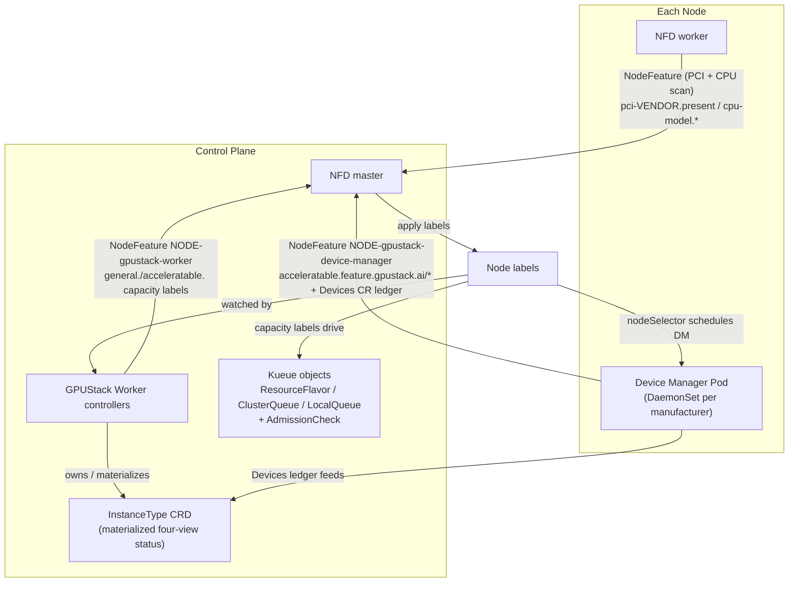

# Architecture

> **Purpose** — what GPUStack Operator builds, in one pass: the four-stage chain, the life of one
> sliced-GPU request, and the vocabulary the rest of the docs assume.
> **Audience** everyone · **Prerequisites** none · **Read time** ~8 min

GPUStack Operator turns raw node hardware into a Kueue-based scheduling chain. It builds on two
well-known Kubernetes projects:

- [Node Feature Discovery (NFD)](https://github.com/kubernetes-sigs/node-feature-discovery): detects
  hardware features and system configuration, and publishes them as Node labels.
- [Kueue](https://github.com/kubernetes-sigs/kueue): a Kubernetes-native job queueing system that
  manages workload admission and queuing across ClusterQueues, and — through its AdmissionCheck
  extension point — lets an external controller gate admission on per-accelerator feasibility.

Nothing else has to be deployed: NFD, Kueue and the two CSI drivers are vendored subcharts of the
operator's own chart.

## Contents

- [One binary, three subcommands](#one-binary-three-subcommands)
- [How it works: four stages](#how-it-works-four-stages)
- [Life of a sliced-GPU request](#life-of-a-sliced-gpu-request)
- [Vocabulary](#vocabulary)
- [Where to go next](#where-to-go-next)

## One binary, three subcommands

| Subcommand | Package | Deployed by | Job |
|---|---|---|---|
| `worker` (alias `w`) | `pkg/worker` | this chart, as a control-plane Deployment | aggregated extension API server + the scheduling-chain controllers |
| `worker-gateway` | `pkg/workergateway` | not this chart — run it yourself, wherever the fleet view belongs | aggregates InstanceTypes and capacity across upstream clusters |
| `device-manager` | `pkg/devicemanager` | this chart, as one DaemonSet per manufacturer | detects accelerators, maintains the `Devices` ledger, serves the device plugin |

Details, and the startup ordering the worker must keep, are in [Internals](architecture/internals.md).

## How it works: four stages

1. **Bootstrap** — deploy NFD and the Device Manager DaemonSets (see [Two install
   modes](architecture/install-modes.md)).
2. **Device discovery** — the Device Manager detects accelerators, reports per-device feature labels,
   and maintains the `Devices` CR ledger.
3. **Capacity profiling** — the Worker derives per-node capacity labels (CPU cores + the four
   `.sliced.*` logical-slicing capacities and the `.partitioned.*` hardware-partitioning capacities).
4. **Queue construction & admission** — Worker controllers materialize the labels into Kueue
   `ResourceFlavor` → `ClusterQueue` (one isolated queue per pool, **no Cohort**) and a materialized
   `InstanceType` CRD, and gate admission with a per-accelerator `AdmissionCheck` read from the
   `Devices` ledger.

Stages 1–2 are detailed in [Device Discovery](architecture/discovery.md), stages 3–4 in [Scheduling
Chain](architecture/scheduling-chain.md).

## Life of a sliced-GPU request

What actually happens when a workload asks for half a GPU — five admission gates, each seeing something
the previous one cannot:

1. **Submit.** A Pod (or a GPUStack `Instance`, which renders one) carries the pool's entrance label
   `kueue.x-k8s.io/queue-name: gpustack-fnv64-…` and requests
   `nvidia.com/gpu.sliced: 1` + `nvidia.com/gpu.sliced.memory-percentage: 50`.
   → [Accelerator Requests](accelerator-requests.md)
2. **Gate 1 — Pod webhook.** Validates the seven request rules and folds the memory budget into
   `nvidia.com/gpu.sliced.units`, the credit input, using the pool `InstanceType`'s per-accelerator VRAM.
   → [Admission](architecture/admission.md#gate-1--the-pod-webhook)
3. **Gate 2 — Kueue.** Scores the pool ClusterQueue's `credits.gpustack.ai/nvidia` quota and reserves.
   A scalar total, so it can over-admit a fragmented pool.
   → [Admission](architecture/admission.md#gate-2--kueue-credits)
4. **Gate 3 — AdmissionCheck.** Reads the assigned pool's `Devices` ledger and asks whether any single
   accelerator can really host the slice; holds the workload with `Retry` if not.
   → [Admission](architecture/admission.md#gate-3--the-per-accelerator-admissioncheck)
5. **Gate 4 — scheduler / kubelet.** Picks a node whose `.sliced.*` capacity keys still fit; the
   kubelet then picks an accelerator-bound token — *which is* the accelerator — guided by the plugin's
   preference for the most-occupied accelerator that still has room.
   → [Device Discovery](architecture/discovery.md#placement-is-a-preference-not-a-decision)
6. **Gate 5 — allocator.** Refuses an accelerator another mode holds, injects the manufacturer's
   runtime isolation (preload library, compute/VRAM quota), and records the allocation in the `Devices`
   ledger. Only the partitioned family's fungible tokens let it choose the accelerator itself.
   → [Device Discovery](architecture/discovery.md#the-device-plugin-allocator)
7. **Observe.** The `InstanceType.status` four-view moves; `kubectl get instancetype -w` shows the
   capacity change as the pod allocates, and back again when it exits.
   → [Admission](architecture/admission.md#four-view-status)

## Vocabulary

The three hardware words — **Device**, **Accelerator**, **Resource** — and the layering between them
are in [Device Discovery](architecture/discovery.md#device-accelerator-resource). The rest:

| Term | Meaning |
|---|---|
| **pool** | one `(CPU key, [accelerator key,] os, arch)` group — one isolated `ClusterQueue` + one `InstanceType`, no Cohort and no borrowing |
| **`gKey` / `aKey`** | the general(CPU) node key (e.g. `amd-epyc-7763`, or the `generic` sentinel) / the accelerator device key (e.g. `nvidia-a10g`) |
| **family** | the two mutually exclusive ways to share an accelerator: **logical slicing** (`.sliced*`, the manufacturer's own runtime facility budgets compute and VRAM) and **physical partitioning** (`.partitioned*`, NVIDIA MIG). An accelerator serves exactly one |
| **credits** | `credits.gpustack.ai/<manufacturer>`, the only accelerator quota a ClusterQueue carries; one whole accelerator = `M = 1,600,000` credit units, so fractional shares stay integer-valued |
| **four-view (EX/SH/SL/PT)** | the `InstanceType.status` projections: free whole accelerators / shareable slots / logically sliceable VRAM-percent units / hardware partition instances |
| **`Devices` ledger** | the per-accelerator `AcceleratorAllocation` accounting on the `Devices` CR — the single authoritative record of who holds what |
| **entrance** | the per-namespace `LocalQueue` (`gpustack-fnv64-<hash>`) a workload submits against |

## Where to go next

| Page | What it answers |
|---|---|
| [Device Discovery](architecture/discovery.md) | how NFD and the Device Manager turn hardware into labels, and what the allocator does at `Allocate` |
| [Scheduling Chain](architecture/scheduling-chain.md) | how capacity labels become ResourceFlavors, ClusterQueues, LocalQueues and InstanceTypes |
| [Admission](architecture/admission.md) | the five gates, the four-view status, and which field answers "what can I still get" |
| [Two install modes](architecture/install-modes.md) | chart mode vs image mode, and which objects the worker must apply itself |
| [Internals](architecture/internals.md) | startup ordering, the gateway mirror, per-manufacturer packages, CGO bindings, the 63-char rule |

For a **recorded end-to-end run on a live cluster** — the materialized `ResourceFlavor` /
`ClusterQueue` / `InstanceType` / `LocalQueue` objects with real YAML, then removing/re-adding a node,
requesting a sliced GPU (with `nvidia-smi` showing the capped VRAM), authoring a custom `InstanceType`,
and switching CPU-manufacturer awareness on — see the [walkthrough](walkthrough.md).

---

**See also** — [Accelerator Requests](accelerator-requests.md) (the request contract) ·
[Settings](settings.md) · [Development](development.md) · [All documentation](README.md)

**Next** → [Device Discovery](architecture/discovery.md) — stage 1 and 2 in detail.
