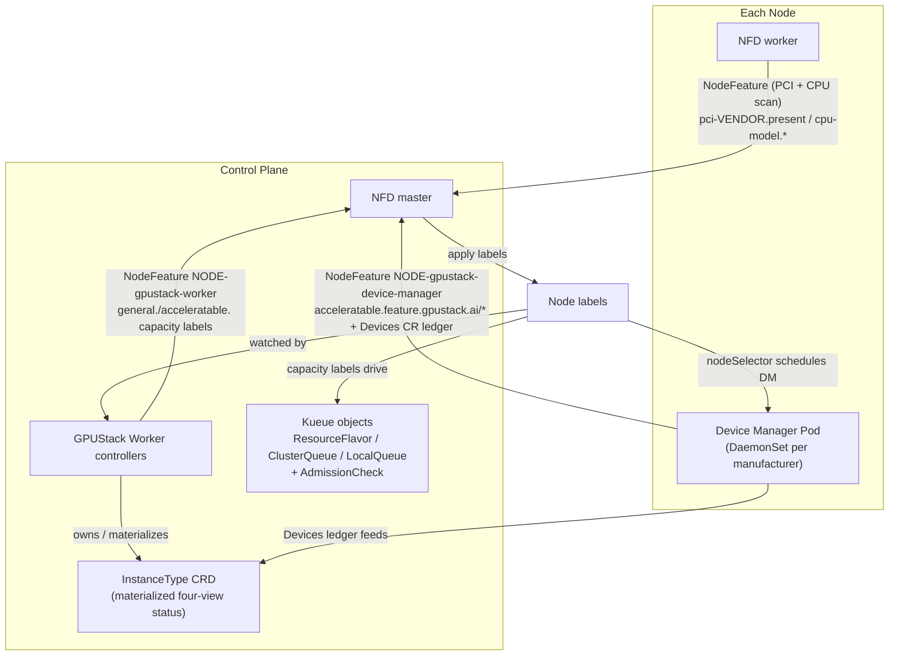

# Architecture

> **Purpose** — what GPUStack Operator builds, in one pass: the four-stage chain, the life of one
> sliced-GPU request, and the vocabulary the rest of the docs assume.
> **Audience** everyone · **Prerequisites** none · **Read time** ~4 min

GPUStack Operator turns raw node hardware into a Kueue-based scheduling chain, on two well-known
Kubernetes projects:

- [Node Feature Discovery (NFD)](https://github.com/kubernetes-sigs/node-feature-discovery) — detects
  hardware features and system configuration, publishing them as Node labels.
- [Kueue](https://github.com/kubernetes-sigs/kueue) — a Kubernetes-native job queueing system that
  admits and queues workloads across ClusterQueues, and whose AdmissionCheck extension point lets an
  external controller gate admission on per-accelerator feasibility.

Nothing else has to be deployed: NFD, Kueue and the two CSI drivers are vendored subcharts of this
chart.

## Contents

- [One binary, three subcommands](#one-binary-three-subcommands)
- [How it works: four stages](#how-it-works-four-stages)
- [Life of a sliced-GPU request](#life-of-a-sliced-gpu-request)
- [Vocabulary](#vocabulary)
- [Where to go next](#where-to-go-next)

## One binary, three subcommands

| Subcommand | Package | Deployed by | Job |
|---|---|---|---|
| `worker` (alias `w`) | `pkg/worker` | this chart, as a control-plane Deployment | aggregated extension API server + the scheduling-chain controllers |
| `worker-gateway` | `pkg/workergateway` | not this chart; run it yourself, wherever the fleet view belongs | aggregates InstanceTypes and capacity across upstream clusters |
| `device-manager` | `pkg/devicemanager` | this chart, as one DaemonSet per manufacturer | detects accelerators, maintains the `Devices` ledger, serves the device plugin |

Details, and the startup ordering the worker must keep, are in [Internals](architecture/internals.md).

## How it works: four stages

1. **Bootstrap** — deploy NFD and the Device Manager DaemonSets ([Installation Modes](architecture/installation-modes.md)).
2. **Device discovery** — the Device Manager detects accelerators, reports per-device feature labels and
   maintains the `Devices` CR ledger.
3. **Capacity profiling** — the Worker derives per-node capacity labels: CPU cores, the four `.sliced.*`
   logical-slicing capacities and the `.partitioned.*` hardware-partitioning capacities.
4. **Queue construction & admission** — Worker controllers materialize those labels into Kueue
   `ResourceFlavor` → `ClusterQueue` (one isolated queue per pool) and an `InstanceType`
   CRD, and gate admission with a per-accelerator `AdmissionCheck` read from the `Devices` ledger.

Stages 1–2 are detailed in [Device Discovery](architecture/device-discovery.md), stages 3–4 in [Scheduling
Chain](architecture/scheduling-chain.md).

## Life of a sliced-GPU request

A workload asking for half a GPU passes five admission gates, each seeing something the previous one
cannot:

| Step | What happens | Detail |
|---|---|---|
| Submit | a Pod (or a GPUStack `Instance`, which renders one) carries the pool's entrance label `kueue.x-k8s.io/queue-name: gpustack-fnv64-…` and requests `nvidia.com/gpu.sliced: 1` + `nvidia.com/gpu.sliced.memory-percentage: 50` | [Accelerator Requests](accelerator-requests.md) |
| Gate 1 — Pod webhook | validates the request rules and folds the memory budget into `nvidia.com/gpu.sliced.units`, the credit input | [Admission](architecture/admission.md#gate-1--the-pod-webhook) |
| Gate 2 — Kueue | reserves against the pool ClusterQueue's `credits.gpustack.ai/nvidia` quota — a scalar total, so it can over-admit a fragmented pool | [Admission](architecture/admission.md#gate-2--kueue-credits) |
| Gate 3 — AdmissionCheck | asks the pool's `Devices` ledger whether one accelerator can really host the slice; holds the workload with `Retry` if not | [Admission](architecture/admission.md#gate-3--the-per-accelerator-admissioncheck) |
| Gate 4 — scheduler / kubelet | picks a node whose `.sliced.*` capacity keys still fit, then an accelerator-bound token — *which is* the accelerator | [Device Discovery](architecture/device-discovery.md#placement-is-a-preference-not-a-decision) |
| Gate 5 — allocator | refuses an accelerator another mode holds, injects the manufacturer's runtime isolation, and records the allocation in the `Devices` ledger | [Device Discovery](architecture/device-discovery.md#the-device-plugin-allocator) |
| Observe | the `InstanceType.status` four-view moves as the pod allocates, and back when it exits (`kubectl get instancetype -w`) | [Admission](architecture/admission.md#four-view-status) |

## Vocabulary

The three hardware words — **Device**, **Accelerator**, **Resource** — and the layering between them
are in [Device Discovery](architecture/device-discovery.md#device-accelerator-resource). The rest:

| Term | Meaning |
|---|---|
| **pool** | one `(CPU key, [accelerator key,] os, arch)` group — one isolated `ClusterQueue` + one `InstanceType`, no borrowing |
| **`gKey` / `aKey`** | the general(CPU) node key (e.g. `amd-epyc-7763`, or the `generic` sentinel) / the accelerator device key (e.g. `nvidia-a10g`) |
| **family** | the two mutually exclusive ways to share an accelerator: **logical slicing** (`.sliced*`, the manufacturer's own runtime facility budgets compute and VRAM) and **physical partitioning** (`.partitioned*`, NVIDIA MIG). An accelerator serves exactly one |
| **credits** | `credits.gpustack.ai/<manufacturer>`, the only accelerator quota a ClusterQueue carries; one whole accelerator = `M = 1,600,000` credit units, so fractional shares stay integer-valued |
| **four-view (EX/SH/SL/PT)** | the `InstanceType.status` projections: free whole accelerators / shareable slots / logically sliceable VRAM-percent units / hardware partition instances |
| **`Devices` ledger** | the per-accelerator `AcceleratorAllocation` accounting on the `Devices` CR — the single authoritative record of who holds what |
| **entrance** | the per-namespace `LocalQueue` (`gpustack-fnv64-<hash>`) a workload submits against |

## Where to go next

- [Device Discovery](architecture/device-discovery.md) — stages 1 and 2, and what the allocator injects.
- [Scheduling Chain](architecture/scheduling-chain.md) — stages 3 and 4.
- [Admission](architecture/admission.md) — the five gates and the four-view status.
- [Installation Modes](architecture/installation-modes.md) — chart mode versus image mode.
- [Internals](architecture/internals.md) — startup order and the invariants that fail silently.
- [KV Cache Backend](kv-cache/backend.md) — a separate chain: running and observing a
  pooled KV cache for inference workloads.
- [Walkthrough](walkthrough.md) — all of it recorded on a live cluster, with real output.

Every page, with its audience and read time, is in the [documentation index](README.md).

---

**See also** — [Accelerator Requests](accelerator-requests.md) (the request contract) ·
[Settings](settings.md) · [All documentation](README.md)

**Next** → [Device Discovery](architecture/device-discovery.md) — stage 1 and 2 in detail.
