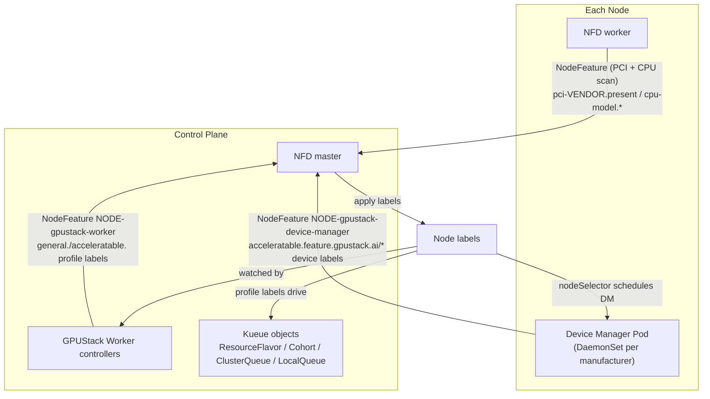
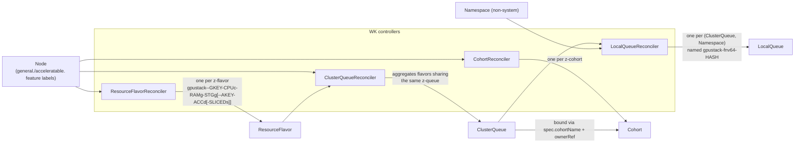

# Architecture

GPUStack Operator turns raw node hardware into a Kueue-based scheduling chain. It builds on two well-known Kubernetes projects:

- [Node Feature Discovery (NFD)](https://github.com/kubernetes-sigs/node-feature-discovery): detects hardware features and system configuration, and publishes them as Node labels.
- [Kueue](https://github.com/kubernetes-sigs/kueue): a Kubernetes-native job queueing system that manages workload admission, queuing, and preemption across ClusterQueues and Cohorts.

## Code Layout

### One binary, three subcommands

`cmd/gpustack-operator/main.go` wires a single binary with three cobra subcommands:

- **`worker`** (alias `w`, `pkg/worker`) — the control-plane process. Runs an aggregated extension API server *and* a controller-runtime manager in one process, installs the NFD / Kueue / Device-Manager / CSI applications, and runs the four scheduling-chain controllers (see [Stage 4](#stage-4-the-kueue-scheduling-chain)).
- **`worker-gateway`** (`pkg/workergateway`) — aggregates resources from upstream Kubernetes clusters.
- **`device-manager`** (`pkg/devicemanager`) — the per-node DaemonSet. Subcommands `serve` / `detect` / `monitor`: detects and monitors local accelerators, reports a `NodeFeature` + `Devices` CR, and runs the device-plugin allocator for device injection.

### Worker startup order matters

`pkg/worker/worker.go` runs `Prepare` (install system namespace → CRDs → extension API services →
webhook configs → settings → NFD/Kueue/DM/CSI apps) then `Start`. In `Start`, the controller
manager is deliberately started **only after** the extension API services report ready, so
controllers can index extension-API resources. Preserve this ordering when adding startup steps.

### Per-manufacturer device support

Detection (`pkg/devicemanager/detector/<mfr>`) and allocation (`pkg/devicemanager/allocator/<mfr>`)
have one subpackage per manufacturer: nvidia, amd, ascend, cambricon, hygon, iluvatar, metax,
mthreads, thead. Platform-specific code is split into `_linux.go` / `_other.go` build-constrained
files. The set of supported manufacturers and their PCI vendor IDs / resource names live in
`pkg/nodefeature` (overridable via `GPUSTACK_*` env vars).

### CGO bindings (`binding/`)

Generated Go bindings to vendor GPU runtime/management libraries (nvml, rsmi/amdsmi/amdgpu, cndev,
dcmi, hgml, ixml, mtml/mxsml, hsa, dl). The generators read `gen/binding/<runtime>/config.yaml` and
emit into `binding/<runtime>/` via `make generate binding` (c-for-go is vendored in `.sbin/`). The
top-level `binding/helper*.go` files are hand-written CPU/NUMA topology helpers — those are *not*
generated.

### The 63-character constraint, recurring

Kubernetes label *values* cap at 63 chars. Long names (ClusterQueue names, queue/cohort references)
are stored in `schedule.gpustack.ai/*` **annotations**, not labels; LocalQueues are named
`gpustack-fnv64-<hash>` (always 31 chars — see [Stage 4](#stage-4-the-kueue-scheduling-chain)). When
generating any name that flows into a label value, check this limit.

## How It Works

The chain is built in four stages:

1. **Bootstrap** — install NFD and the Device Manager (DM) DaemonSets.
2. **Device discovery** — DM detects accelerators and reports per-device feature labels.
3. **Capacity profiling** — the Worker (WK) derives capacity/profile labels for every node, keyed by the node's CPU identity.
4. **Queue construction** — WK controllers materialize the labels into Kueue `ResourceFlavor`, `Cohort`, `ClusterQueue`, and `LocalQueue` objects.



### Stage 1: Node Feature Discovery (NFD)

At startup, `pkg/worker/kuberess` installs the NFD Helm chart. NFD performs three jobs:

1. Labels every Node that carries a PCI display/accelerator-class device (PCI classes `02`, `03`, `0b`, `12`, overridable via `GPUSTACK_PCI_CLASS_PREFIXES` — see [Environment Variables](environment-variables.md)) with:

   ```
   feature.node.kubernetes.io/pci-${PCI_VENDOR_ID}.present: "true"
   ```

   For example, a node with an NVIDIA device gets `feature.node.kubernetes.io/pci-10de.present: "true"`.

2. Labels every Node with its CPU model identity (the `cpu` label source), and annotates it with the CPU details through the `gpustack-cpu-info` NodeFeatureRule:

   ```
   feature.node.kubernetes.io/cpu-model.vendor_id: "AMD"
   feature.node.kubernetes.io/cpu-model.family:    "25"
   feature.node.kubernetes.io/cpu-model.id:        "1"
   ```

   ```
   feature.gpustack.ai/cpu-name:             "AMD EPYC 7763 64-Core Processor"
   feature.gpustack.ai/cpu-family:           "25"
   feature.gpustack.ai/cpu-physical-cores:   "64"
   feature.gpustack.ai/cpu-threads-per-core: "2"
   feature.gpustack.ai/cpu-logical-cores:    "128"
   feature.gpustack.ai/cpu-stepping:         "1"
   feature.gpustack.ai/cpu-cache-line:       "64"
   feature.gpustack.ai/cpu-hz:               "2450000000"
   feature.gpustack.ai/cpu-boost-freq:       "3500000000"
   feature.gpustack.ai/cpu-cache-l1i:        "32768"
   feature.gpustack.ai/cpu-cache-l1d:        "32768"
   feature.gpustack.ai/cpu-cache-l2:         "524288"
   feature.gpustack.ai/cpu-cache-l3:         "33554432"
   ```

   An annotation keeps its `@cpu.model.*` template reference verbatim when NFD cannot resolve the attribute, so values leading with `@` are treated as unreported.

   The WK later normalizes these into the node's **general(CPU) node key** (`nodefeature.ExtractGeneralNodeKey`), which is always non-empty and always trails with the node's `kubernetes.io/os` and `kubernetes.io/arch` labels abbreviated to compact codes (`linux` → `ln`, `amd64` → `x64`, …). By default the key is simply `generic-${os}-${arch}` (e.g. `generic-ln-x64`), so all CPU-only capacity on the same os/arch pools together regardless of CPU model. Setting [`GPUSTACK_GENERAL_NODE_KEY_WITH_CPU_NAME=true`](environment-variables.md#configuration-knobs) blends the CPU identity into the key as `${cpuManufacturer}-${id}-${os}-${arch}`: the id leads with the sanitized `feature.gpustack.ai/cpu-name` annotation when reported (trademark markers and the trailing `" CPU @ …"` frequency part are dropped, a leading manufacturer prefix is deduplicated, and the result is truncated so the whole key fits 63 characters — e.g. `amd-epyc-7763-ln-x64`), or with the cpu-model family and id labels as the rare fallback when the annotation is unavailable (e.g. `amd-25-1-ln-x64`). The manufacturer is the lowercased `cpu-model.vendor_id` label — reported as a [cpuid](https://github.com/klauspost/cpuid) vendor enum name, so `Intel` → `intel`, `AMD` → `amd` — falling back to `generic` when the vendor is unknown or unreported. When no CPU identity is usable the key is just `${cpuManufacturer}-${os}-${arch}` (e.g. `amd-ln-x64`, or `generic-ln-x64` when the vendor is unknown too). The os/arch suffix is appended on every path as a correctness safeguard, not cosmetics: the `generic` fallback carries no CPU identity at all, and the cpu-model family/id labels are independent numbering spaces on x86 (CPUID) versus arm64 (MIDR), so a small value like `25-1` can legitimately appear on both architectures. Only the sanitized cpu-name tends to be arch-distinct in practice — and even that is not guaranteed under virtualization. Without the suffix, nodes of different ISAs could pool into one Kueue flavor/queue/cohort, which is wrong since amd64 and arm64 binaries are not interchangeable.

3. Labels Nodes that have **no** accelerator device from any known manufacturer (see `nodefeature.GetKnownAcceleratableManufacturers()`) with:

   ```
   feature.gpustack.ai/acceleratable: "false"
   ```

   This forms an explicit contrast with the `acceleratable: "true"` label reported later by the Device Manager, which also corrects false negatives if they occur.

### Stage 2: GPUStack Operator Device Manager (DM)

For each known manufacturer, a DaemonSet named `gpustack-operator-device-manager-${manufacturer}` is created with a node selector on the NFD PCI label. For example, nodes labeled `feature.node.kubernetes.io/pci-10de.present: "true"` receive a Pod from the `gpustack-operator-device-manager-nvidia` DaemonSet. These DaemonSets are normally rendered by the Helm chart itself (`deviceManager.enabled=true`, the default — the worker is then started with `--disable-applications=device-manager` so it does not install them again); when the chart is deployed with `deviceManager.enabled=false`, `pkg/worker/kuberess` instead installs them at runtime from the bundled operator chart (`gpustack-operator-<ver>.tgz`) as a separate Helm release `gpustack-operator-device-manager`.

Once running, the DM detect loop (`pkg/devicemanager/detector/detector.go`) periodically detects accelerators and reports a NodeFeature object named `${NODE_NAME}-gpustack-device-manager` (owned by the Node), whose labels are built by `nodefeature.ConstructAcceleratableNodeLabels`. Each detected accelerator model is keyed by the accelerated device key `${aKey} = ${manufacturer}-${id}`, where `id` is the product name sanitized to satisfy Kubernetes label naming rules:

| Label                                                                | Meaning                                                            |
|----------------------------------------------------------------------|--------------------------------------------------------------------|
| `${prefix}acceleratable=true`                                         | Node has usable accelerators; overrides the NFD `false` marker      |
| `acceleratable.${prefix}${manufacturer}=true`                         | Accelerator manufacturer                                            |
| `acceleratable.${prefix}${manufacturer}.driver-version=${dv}`         | Device driver version (omitted when undetected)                     |
| `acceleratable.${prefix}${manufacturer}.runtime-version=${rv}`        | Device runtime version (omitted when undetected)                    |
| `acceleratable.${prefix}${aKey}=true`                                 | Concrete device model marker                                        |
| `acceleratable.${prefix}${aKey}.product=${name}`        | Product name                                                        |
| `acceleratable.${prefix}${aKey}.memory=${memory}`       | VRAM size, formatted at the largest binary unit (e.g. `16Gi`)       |
| `acceleratable.${prefix}${aKey}.cores=${cores}`         | Accelerator core count                                              |
| `acceleratable.${prefix}${aKey}.count=${acc}`           | Number of accelerators of this model on the node                    |
| `acceleratable.${prefix}${aKey}.family=${family}`       | Product family (omitted when undetected)                            |
| `acceleratable.${prefix}${aKey}.comcap=${cc}` | Compute capability (omitted when undetected)                      |

where `prefix` is `feature.gpustack.ai/` — so the device labels live under the dedicated `acceleratable.feature.gpustack.ai/` key namespace — and `manufacturer` is one of the manufacturers supported by `pkg/devicemanager/detector` (NVIDIA, AMD, Ascend, Cambricon, Hygon, Iluvatar, MetaX, MThreads, T-Head). The per-manufacturer PCI vendor IDs, resource names, and runtime class names can all be overridden — see [Environment Variables](environment-variables.md#per-manufacturer-overrides).

The NodeFeature object is owned by the Node; the DM also reports a `Devices` custom resource named after the node (owned by that NodeFeature) and keeps monitoring devices, re-detecting whenever the device set or health changes.

Alongside detection, the DM runs the **device-plugin allocator** (`pkg/devicemanager/allocator/<mfr>`, on `pkg/deviceplugin`): it registers per-mode resources (exclusive / shared / sliced) with the kubelet and, on `Allocate`, returns the container injection. For **exclusive/shared** this is just the device-visibility env (`NVIDIA_VISIBLE_DEVICES` / `ASCEND_VISIBLE_DEVICES` / …). For **sliced (soft slicing)** it additionally applies **runtime isolation**: the container is started with a vendor preload library — NVIDIA HAMi-core `libvgpu.so`, Ascend vcann-rt `libvruntime.so` — activated via `/etc/ld.so.preload`, plus per-container quota derived from the slice request (NVIDIA env `CUDA_DEVICE_SM_LIMIT` / `CUDA_DEVICE_MEMORY_LIMIT_*`; Ascend an `npu_info.config` carrying `aicore-quota` / `memory-quota`). The preload libraries are compiled into the operator image per runtime version (cloned inline at pinned commits — no git submodule — and built in the `xbuild-nvidia-cuda-*` / `xbuild-ascend-cann-*` Dockerfile stages, with the build scripts under `pack/gpustack-operator/external/{nvidia,ascend}`) and staged onto the host (`/var/lib/gpustack/operator/lib`) by a device-manager **init container**; the allocator mounts the matching library + a per-pod working directory into each sliced container and reclaims those directories once their pods are gone.

A node hosts a single driver/runtime stack per manufacturer, so every `DevicesGroup` of a given manufacturer on that node shares the same driver and runtime version (same root/source). The per-runtime-version library subdir (`cuda-<major>` / `cann-<major>-<family>`) the allocator picks from the first allocated card is therefore correct for every card in a sliced allocation — a single sliced container can never span mismatched CUDA/CANN majors in practice. The allocator nonetheless guards against it **defensively** (NVIDIA rejects a sliced allocation spanning different CUDA majors; Ascend rejects a multi-card sliced allocation, since vcann-rt's `npu_info.config` models a single physical NPU), so any future regression fails the `Allocate` loudly instead of silently mounting an incompatible library.

### Stage 3: GPUStack Operator Worker (WK)

The WK's `NodeFeatureReconciler` (`pkg/worker/controllers/worker/nodefeature.go`) watches Nodes and reports a NodeFeature object named `${NODE_NAME}-gpustack-worker`, whose labels are built by `nodefeature.ConstructNodeCapacityLabels`.

For the **general** (CPU-only) view of every node, keyed by the general(CPU) node key `${gKey}` — `generic-${os}-${arch}` by default, or `${cpuManufacturer}-${id}-${os}-${arch}` with `GPUSTACK_GENERAL_NODE_KEY_WITH_CPU_NAME=true`:

| Label                                                       | Value                                                                       |
|--------------------------------------------------------------|------------------------------------------------------------------------------|
| `general.${prefix}${cpuManufacturer}=true`                   | CPU manufacturer marker                                                        |
| `general.${prefix}${gKey}=true`                              | Concrete CPU model marker                                                      |
| `general.${prefix}${gKey}.cpu=${cpu}`                        | Available CPU (from node capacity, overridable via a user-supplied label)      |
| `general.${prefix}${gKey}.ram=${ram}`                        | Available RAM in Gi; by default set to **2 Gi per CPU** (`OverrideGeneralRAMGiPerCPU(2)`), overridable via a user-supplied label (then rounded up to even, floored at the CPU count) |
| `general.${prefix}${gKey}.storage=${stg}`              | Available local storage in Gi (from ephemeral-storage capacity, rounded down to an even number; falls back to 15 Gi per CPU when unusable), overridable via a user-supplied label |
| `general.${prefix}${gKey}.z-flavor=${cpu}c-${ram}g-${stg}g` | Per-node flavor profile spec                                              |
| `general.${prefix}${gKey}.z-queue=1c-${ramUnit}g`      | Per-unit queue profile spec, `ramUnit = max(ram/cpu, 1)` Gi                     |
| `general.${prefix}${gKey}.z-cohort=1c-${ramUnit}g`     | Cohort profile spec (identical to the queue spec — general has no slicing)      |

For **each accelerator model** reported by the DM (keyed by the accelerated device key `${aKey}`), the analogous labels are produced under the `acceleratable.` namespace:

| Label                                                                                | Value                                                  |
|---------------------------------------------------------------------------------------|---------------------------------------------------------|
| `acceleratable.${prefix}${aKey}.cpu=${cpu}`                               | Node CPU (floored at the accelerator count)              |
| `acceleratable.${prefix}${aKey}.ram=${ram}`                               | Node RAM in Gi (rounded up to even, floored at the accelerator count) |
| `acceleratable.${prefix}${aKey}.storage=${stg}`                     | Node local storage in Gi (rounded down to even; falls back to 15 Gi per accelerator when unusable) |
| `acceleratable.${prefix}${aKey}.z-flavor=${cpu}c-${ram}g-${stg}g-${acc}d[-${sliced}s]` | Per-node flavor profile spec               |
| `acceleratable.${prefix}${aKey}.z-queue=${cpuUnit}c-${ramUnit}g-1d[-${sliced}s]`       | Per-unit queue profile spec                |
| `acceleratable.${prefix}${aKey}.z-cohort=${cpuUnit}c-${ramUnit}g-1d`                   | Cohort profile spec                        |

The differences from the general view:

1. `acc` is read from the DM-reported `.count` label (the model's labels are skipped entirely when it is missing or non-positive).
2. `cpuUnit = max(cpu/acc, 1)`, `ramUnit = max(ram/acc, 1)` Gi — i.e. the fair per-device share of the node.
3. If the user-supplied label `acceleratable.${prefix}${aKey}.sliced.partitions=${partitions}` is present, `sliced` appends an `-${sliced}s` suffix to `z-flavor` and `z-queue`. `z-cohort` **never** carries the sliced suffix — it is the matching key at the cohort level, so sliced and exclusive queues of the same per-unit shape join the same Cohort.

> **Opt-out:** setting any of a view's `.cpu` / `.ram` / `.storage` labels to an explicit `0` (or any non-positive quantity) suppresses that view's `.z-flavor` / `.z-queue` / `.z-cohort` labels — the zero value is echoed back as-is to keep the opt-out sticky, and the node's resources for that view (general or a specific accelerator model) are not exposed as Kueue flavors/queues.

> **Known behavior:** when one node carries several accelerator models, each model's labels claim the **full** node cpu/ram/storage. The resulting ClusterQueue quotas overlap across the per-model queues, i.e. the host resources are oversold across queues on such nodes.

### Stage 4: The Kueue scheduling chain

Together these labels drive the scheduling chain, implemented on top of Kueue by four controllers in `pkg/worker/controllers/worker`. Every Kueue object name carries the general(CPU) segment first, then (for accelerated profiles) the device segment, joined by `--`:

```
gpustack--${gKey}-${cpu}c-${ram}g[-${stg}g][--${aKey}-${acc}d[-${sliced}s]]
```



- **`ResourceFlavorReconciler`** (`resourceflavor.go`) watches Node label/taint changes and, via `nodefeature.ExtractNodeResourceFlavors`, creates one `ResourceFlavor` per profile, named `gpustack--${gKey}-${z-flavor}` for the general profile and `gpustack--${gKey}-${cpu}c-${ram}g[-${stg}g]--${aKey}-${acc}d[-${sliced}s]` for accelerated profiles. The flavor pins workloads to matching nodes through `spec.nodeLabels` — the node's `z-queue` label, plus the `general.${prefix}${gKey}=true` marker for accelerated flavors, so that with `GPUSTACK_GENERAL_NODE_KEY_WITH_CPU_NAME=true` the same device model on a different CPU never matches. The target queue/cohort names are recorded in the `schedule.gpustack.ai/queue` and `schedule.gpustack.ai/cohort` **annotations** (annotations rather than labels: the names may exceed the 63-character label value limit). A flavor whose profile no longer matches any node is **never deleted**: it is marked draining (`schedule.gpustack.ai/drain=true`) and kept as a zero-quota tombstone, and the mark is cleared once a node uses the profile again.
- **`CohortReconciler`** (`cohort.go`) watches Node and ClusterQueue changes. It creates a `Cohort` per distinct cohort profile as soon as a node references it, and deletes the `Cohort` only once it is fully idle — no node **and** no ClusterQueue still reference it (deleting it earlier would cascade-delete its ClusterQueues through the ownerRef and disrupt running workloads).
- **`ClusterQueueReconciler`** (`clusterqueue.go`) watches ResourceFlavors and Nodes. It aggregates all flavors carrying the same queue annotation into one `ClusterQueue`, computing each flavor's nominal quota as the per-node capacity multiplied by the number of matching nodes (accelerator quota is the matching nodes' card count scored on an integer credit base — `cards × B`, `B = 12800` — and exposed as `credits.gpustack.ai/${manufacturer}`; the integer base keeps Kueue's int64 usage accounting from rounding fractional shared/sliced credits up to 1). The queue also records descriptive metadata sampled from one matching node (`nodefeature.ExtractNodeQueue`): accelerated queues always carry the device product/family and detail document, and the node's os/arch are always recorded (they are part of the general node key, so every pooled node shares them), while the CPU-related metadata — the general(CPU-only) queue's identity/details and the accelerated queue's paired CPU — is recorded only with `GPUSTACK_GENERAL_NODE_KEY_WITH_CPU_NAME=true`, since the default `generic` key pools nodes with heterogeneous CPUs and a single sample would be misleading. The queue is bound to its `Cohort`, prefers nominal quota over borrowing, and never borrow-preempts; accelerator queues additionally enable reclaim within the cohort, so an exclusive queue can take back the credits it lends — a sliced queue holds zero credits and borrows them from its paired exclusive queue (`borrowingLimit` left unset, i.e. unlimited), and the exclusive side reclaims them when it needs them back. When every backing flavor is draining (or none remains), the queue is not hard-deleted: it first switches to `spec.stopPolicy: HoldAndDrain` so Kueue evicts admitted workloads and cancels reservations, and is removed only after no reservation remains. While a queue drains, its `InstanceType` reports zero capacity, and the `InstanceReconciler` stops any backing instance (rather than recreating its Pod) once its `InstanceType` goes `Inactive` or is removed; a stopped instance can be reconfigured and restarted only when a live `InstanceType` exists again.
- **`LocalQueueReconciler`** (`localqueue.go`) watches ClusterQueues and Namespaces, creating a `LocalQueue` in every non-system Namespace so workloads can submit from anywhere. Because workloads reference the LocalQueue through the `kueue.x-k8s.io/queue-name` **label** (value limit: 63 characters) while ClusterQueue names may be longer, the LocalQueue is named `gpustack-fnv64-${fnv64a(ClusterQueue name)}` — always 31 characters — and records the full ClusterQueue name in the `schedule.gpustack.ai/cluster-queue` annotation (`spec.clusterQueue` also points at it).

> **Known behavior:** the Kueue feature gate `AssignQueueLabelsForPods` is disabled at installation (`pkg/worker/kuberess/apps_kueue.go`), so Kueue never copies cluster/local queue names onto Pod labels — long ClusterQueue names would not fit a label value. Monitoring that previously read queue names from Pod labels should read the Workload object instead.

## Example

Consider cluster `cluster-1` with 5 linux/amd64 nodes (CPU / RAM / disk, `D` = accelerator count), running with `GPUSTACK_GENERAL_NODE_KEY_WITH_CPU_NAME=true` — with the default setting every general(CPU) segment below would simply read `generic-ln-x64`. node-1 and node-2 report `feature.gpustack.ai/cpu-name: "Intel(R) Xeon(R) Platinum 8259CL CPU @ 2.50GHz"` (→ `intel-xeon-platinum-8259cl-ln-x64`), the rest `"AMD EPYC 7R13 Processor"` (→ `amd-epyc-7r13-processor-ln-x64`) — sanitization drops the trademark markers and the `" CPU @ …"` frequency part and deduplicates the leading manufacturer. Had the cpu-name annotation been unresolved, a key would have led with the cpu-model family and id labels instead (e.g. `amd-25-1-ln-x64`):

| Node   | CPU model                           | Accelerators | CPU | RAM  | Disk |
|--------|-------------------------------------|--------------|-----|------|------|
| node-1 | `intel-xeon-platinum-8259cl-ln-x64` | —            | 16C | 32G  | 100G |
| node-2 | `intel-xeon-platinum-8259cl-ln-x64` | T4 × 1       | 4C  | 16G  | 100G |
| node-3 | `amd-epyc-7r13-processor-ln-x64`    | T4 × 1       | 8C  | 32G  | 100G |
| node-4 | `amd-epyc-7r13-processor-ln-x64`    | T4 × 2       | 8C  | 32G  | 100G |
| node-5 | `amd-epyc-7r13-processor-ln-x64`    | A10G × 4     | 48C | 192G | 100G |

Assuming the usable ephemeral-storage capacity rounds to 88 Gi, the chain materializes as
(general RAM defaults to 2 Gi per CPU; `nvidia-tesla-t4` / `nvidia-a10g` are the sanitized product keys):

| Node    | ResourceFlavor                                                               | ClusterQueue                                                             | Cohort                                                                   |
|---------|------------------------------------------------------------------------------|--------------------------------------------------------------------------|--------------------------------------------------------------------------|
| node-1  | `gpustack--intel-xeon-platinum-8259cl-ln-x64-16c-32g-88g`                    | `gpustack--intel-xeon-platinum-8259cl-ln-x64-1c-2g`                      | `gpustack--intel-xeon-platinum-8259cl-ln-x64-1c-2g`                      |
| node-2  | `gpustack--intel-xeon-platinum-8259cl-ln-x64-4c-8g-88g`                      | `gpustack--intel-xeon-platinum-8259cl-ln-x64-1c-2g`                      | `gpustack--intel-xeon-platinum-8259cl-ln-x64-1c-2g`                      |
| node-2  | `gpustack--intel-xeon-platinum-8259cl-ln-x64-4c-16g-88g--nvidia-tesla-t4-1d` | `gpustack--intel-xeon-platinum-8259cl-ln-x64-4c-16g--nvidia-tesla-t4-1d` | `gpustack--intel-xeon-platinum-8259cl-ln-x64-4c-16g--nvidia-tesla-t4-1d` |
| node-3  | `gpustack--amd-epyc-7r13-processor-ln-x64-8c-16g-88g`                        | `gpustack--amd-epyc-7r13-processor-ln-x64-1c-2g`                         | `gpustack--amd-epyc-7r13-processor-ln-x64-1c-2g`                         |
| node-3  | `gpustack--amd-epyc-7r13-processor-ln-x64-8c-32g-88g--nvidia-tesla-t4-1d`    | `gpustack--amd-epyc-7r13-processor-ln-x64-8c-32g--nvidia-tesla-t4-1d`    | `gpustack--amd-epyc-7r13-processor-ln-x64-8c-32g--nvidia-tesla-t4-1d`    |
| node-4  | `gpustack--amd-epyc-7r13-processor-ln-x64-8c-16g-88g` *(shared with node-3)* | `gpustack--amd-epyc-7r13-processor-ln-x64-1c-2g`                         | `gpustack--amd-epyc-7r13-processor-ln-x64-1c-2g`                         |
| node-4  | `gpustack--amd-epyc-7r13-processor-ln-x64-8c-32g-88g--nvidia-tesla-t4-2d`    | `gpustack--amd-epyc-7r13-processor-ln-x64-4c-16g--nvidia-tesla-t4-1d`    | `gpustack--amd-epyc-7r13-processor-ln-x64-4c-16g--nvidia-tesla-t4-1d`    |
| node-5  | `gpustack--amd-epyc-7r13-processor-ln-x64-48c-96g-88g`                       | `gpustack--amd-epyc-7r13-processor-ln-x64-1c-2g`                         | `gpustack--amd-epyc-7r13-processor-ln-x64-1c-2g`                         |
| node-5  | `gpustack--amd-epyc-7r13-processor-ln-x64-48c-192g-88g--nvidia-a10g-4d`      | `gpustack--amd-epyc-7r13-processor-ln-x64-12c-48g--nvidia-a10g-1d`       | `gpustack--amd-epyc-7r13-processor-ln-x64-12c-48g--nvidia-a10g-1d`       |
| node-5† | `gpustack--amd-epyc-7r13-processor-ln-x64-48c-192g-88g--nvidia-a10g-4d-8s`   | `gpustack--amd-epyc-7r13-processor-ln-x64-12c-48g--nvidia-a10g-1d-8s`    | `gpustack--amd-epyc-7r13-processor-ln-x64-12c-48g--nvidia-a10g-1d`       |

† Only when the user labels node-5 with `acceleratable.feature.gpustack.ai/nvidia-a10g.sliced.partitions=8`. A node advertises either the sliced or the exclusive flavor at a time, but both queues share the same Cohort because the cohort profile never carries the `-8s` suffix.

Each ClusterQueue is then mirrored as a hash-named LocalQueue (e.g. `gpustack--amd-epyc-7r13-processor-ln-x64-1c-2g` → `gpustack-fnv64-…`, 31 characters) in every non-system namespace; the `schedule.gpustack.ai/cluster-queue` annotation on the LocalQueue reveals which queue it fronts.

Observations worth calling out:

- **The CPU segment splits otherwise-identical device pools.** node-2 (Intel, 1×T4) and node-4 (AMD, 2×T4) both normalize to `4c-16g` per device, yet they land in **different** ClusterQueues (`gpustack--intel-xeon-platinum-8259cl-ln-x64-…` vs `gpustack--amd-epyc-7r13-processor-ln-x64-…`) — exactly the Intel+NVIDIA / AMD+NVIDIA separation. Pooling only happens between nodes with the same CPU model. With the default `generic-ln-x64` key this separation disappears: both would join `gpustack--generic-ln-x64-4c-16g--nvidia-tesla-t4-1d`.
- **Per-unit normalization still pools homogeneous nodes.** Had node-2 carried the same AMD CPU as node-4, both would have joined `gpustack--amd-epyc-7r13-processor-ln-x64-4c-16g--nvidia-tesla-t4-1d`, with each flavor's quota being its per-node capacity × matching node count.
- **Identical nodes share one flavor whose quota scales by node count.** node-3 and node-4 share `gpustack--amd-epyc-7r13-processor-ln-x64-8c-16g-88g`; its quota in the general queue is the per-node value × 2.
- **General capacity converges per CPU model** (`gpustack--intel-xeon-platinum-8259cl-ln-x64-1c-2g`, `gpustack--amd-epyc-7r13-processor-ln-x64-1c-2g`) thanks to the default 2 Gi-per-CPU normalization, with one flavor per distinct node shape.
- **Nodes without usable CPU information** (e.g. NFD cpu source disabled) fall back to the `generic-${os}-${arch}` general key even in this mode: they expose their general(CPU) view under `generic-ln-x64`, and their accelerated profiles pair with the `generic-ln-x64` CPU segment and pool together, pinning the `general.feature.gpustack.ai/generic-ln-x64=true` identity.
