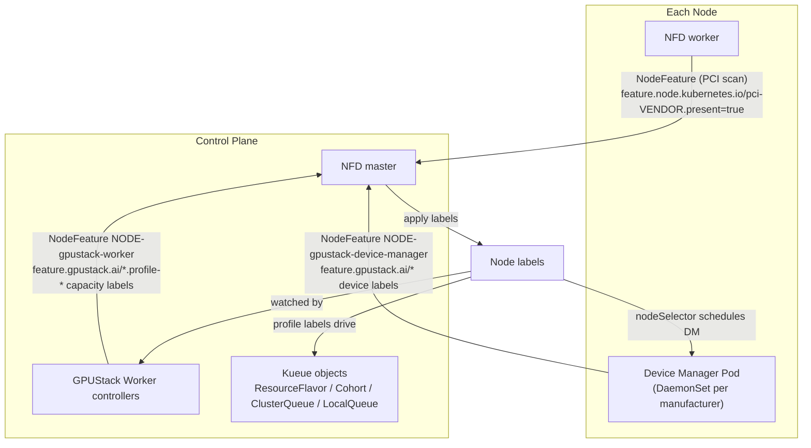
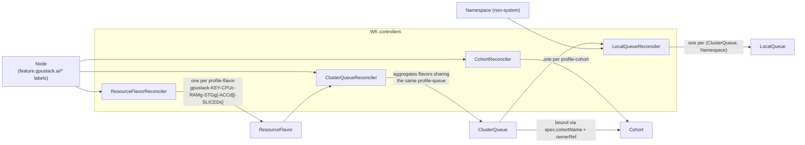

# Architecture

GPUStack Operator turns raw node hardware into a Kueue-based scheduling chain. It builds on two well-known Kubernetes projects:

- [Node Feature Discovery (NFD)](https://github.com/kubernetes-sigs/node-feature-discovery): detects hardware features and system configuration, and publishes them as Node labels.
- [Kueue](https://github.com/kubernetes-sigs/kueue): a Kubernetes-native job queueing system that manages workload admission, queuing, and preemption across ClusterQueues and Cohorts.

## How It Works

The chain is built in four stages:

1. **Bootstrap** — install NFD and the Device Manager (DM) DaemonSets.
2. **Device discovery** — DM detects accelerators and reports per-device feature labels.
3. **Capacity profiling** — the Worker (WK) derives capacity/profile labels for every node.
4. **Queue construction** — WK controllers materialize the labels into Kueue `ResourceFlavor`, `Cohort`, `ClusterQueue`, and `LocalQueue` objects.



### Stage 1: Node Feature Discovery (NFD)

At startup, `pkg/worker/kuberess` installs the NFD Helm chart. NFD performs two jobs:

1. Labels every Node that carries a PCI display/accelerator-class device (PCI classes `02`, `03`, `06`, `0b`, `12`) with:

   ```
   feature.node.kubernetes.io/pci-${PCI_VENDOR_ID}.present: "true"
   ```

   For example, a node with an NVIDIA device gets `feature.node.kubernetes.io/pci-10de.present: "true"`.

2. Labels Nodes that have **no** accelerator device from any known manufacturer (see `nodefeature.GetKnownAcceleratableManufacturers()`) with:

   ```
   feature.gpustack.ai/acceleratable: "false"
   ```

   This forms an explicit contrast with the `acceleratable: "true"` label reported later by the Device Manager, which also corrects false negatives if they occur.

### Stage 2: GPUStack Operator Device Manager (DM)

`pkg/worker/kuberess` also installs the Device Manager. For each known manufacturer, a DaemonSet named `gpustack-operator-device-manager-${manufacturer}` is created with a node selector on the NFD PCI label. For example, nodes labeled `feature.node.kubernetes.io/pci-10de.present: "true"` receive a Pod from the `gpustack-operator-device-manager-nvidia` DaemonSet.

Once running, the DM detect loop (`pkg/devicemanager/detector/detector.go`) periodically detects accelerators and reports a NodeFeature object named `${NODE_NAME}-gpustack-device-manager` (owned by the Node), whose labels are built by `nodefeature.ConstructAcceleratableNodeLabels`:

| Label                                                       | Meaning                                                            |
|-------------------------------------------------------------|--------------------------------------------------------------------|
| `${prefix}acceleratable=true`                                | Node has usable accelerators; overrides the NFD `false` marker      |
| `${prefix}${manufacturer}=true`                              | Accelerator manufacturer                                            |
| `${prefix}${manufacturer}.driver-version=${driverVersion}`   | Device driver version                                               |
| `${prefix}${manufacturer}.runtime-version=${runtimeVersion}` | Device runtime version                                              |
| `${prefix}${manufacturer}-${id}=true`                        | Concrete device model; `id` is the product name sanitized to satisfy Kubernetes label naming rules |
| `${prefix}${manufacturer}-${id}.product=${name}`             | Product name                                                        |
| `${prefix}${manufacturer}-${id}.memory=${memory}`            | VRAM size, in Mi                                                    |
| `${prefix}${manufacturer}-${id}.cores=${cores}`              | Accelerator core count                                              |
| `${prefix}${manufacturer}-${id}.accelerators=${accelerator}` | Number of accelerators of this model on the node                    |
| `${prefix}${manufacturer}-${id}.family=${family}`            | Product family                                                      |
| `${prefix}${manufacturer}-${id}.compute-capability=${cc}`    | Compute capability                                                  |

where `prefix` is `feature.gpustack.ai/` and `manufacturer` is one of the manufacturers supported by `pkg/devicemanager/detector` (NVIDIA, AMD, Ascend, Cambricon, Hygon, Iluvatar, MetaX, MThreads, T-Head).

The DM also reports a `Devices` custom resource per node and keeps monitoring devices, re-detecting whenever the device set or health changes.

### Stage 3: GPUStack Operator Worker (WK)

The WK's `NodeFeatureReconciler` (`pkg/worker/controllers/worker/nodefeature.go`) watches Nodes and reports a NodeFeature object named `${NODE_NAME}-gpustack-worker`, whose labels are built by `nodefeature.ConstructNodeCapacityLabels`.

For the **general** (CPU-only) view of every node:

| Label                                                  | Value                                                                       |
|---------------------------------------------------------|------------------------------------------------------------------------------|
| `${prefix}general.cpu=${cpu}`                            | Available CPU (from node capacity, overridable via a user-supplied label)     |
| `${prefix}general.ram=${ram}`                            | Available RAM in Gi; by default capped to **2 Gi per CPU** (`OverrideGeneralRAMGiPerCPU(2)`), overridable via a user-supplied label |
| `${prefix}general.local-storage=${stg}`                  | Available local storage in Gi (from ephemeral-storage capacity, rounded down to an even number) |
| `${prefix}general.profile-flavor=${cpu}c-${ram}g-${stg}g` | Per-node flavor profile spec                                                  |
| `${prefix}general.profile-queue=1c-${ramUnit}g`          | Per-unit queue profile spec, `ramUnit = max(ram/cpu, 1)` Gi                    |
| `${prefix}general.profile-cohort=1c-${ramUnit}g`         | Cohort profile spec (identical to the queue spec — general has no slicing)     |

For **each accelerator model** reported by the DM (keyed `${manufacturer}-${id}`), the analogous labels are produced:

| Label                                                                          | Value                                                  |
|----------------------------------------------------------------------------------|---------------------------------------------------------|
| `${prefix}${manufacturer}-${id}.cpu=${cpu}`                                        | Node CPU (floored at the accelerator count)              |
| `${prefix}${manufacturer}-${id}.ram=${ram}`                                        | Node RAM in Gi (rounded up to even, floored at the accelerator count) |
| `${prefix}${manufacturer}-${id}.local-storage=${stg}`                              | Node local storage in Gi                                 |
| `${prefix}${manufacturer}-${id}.profile-flavor=${cpu}c-${ram}g-${stg}g-${acc}d[-${sliced}s]` | Per-node flavor profile spec                    |
| `${prefix}${manufacturer}-${id}.profile-queue=${cpuUnit}c-${ramUnit}g-1d[-${sliced}s]`       | Per-unit queue profile spec                     |
| `${prefix}${manufacturer}-${id}.profile-cohort=${cpuUnit}c-${ramUnit}g-1d`                   | Cohort profile spec                             |

The differences from the general view:

1. `acc` is read from the DM-reported `.accelerators` label.
2. `cpuUnit = max(cpu/acc, 1)`, `ramUnit = max(ram/acc, 1)` Gi — i.e. the fair per-device share of the node.
3. If the user-supplied label `${prefix}${manufacturer}-${id}.sliced.partitions=${partitions}` is present, `sliced` appends an `-${sliced}s` suffix to `profile-flavor` and `profile-queue`. `profile-cohort` **never** carries the sliced suffix — it is the matching key at the cohort level, so sliced and exclusive queues of the same per-unit shape join the same Cohort.

### Stage 4: The Kueue scheduling chain

Together these labels drive the scheduling chain, implemented on top of Kueue by four controllers in `pkg/worker/controllers/worker`:



- **`ResourceFlavorReconciler`** (`resourceflavor.go`) watches Node label/taint changes and, via `nodefeature.ExtractNodeResourceFlavors`, creates one `ResourceFlavor` per profile, named `gpustack-${key}-${profile-flavor}`. The flavor pins workloads to matching nodes through `spec.nodeLabels` (the node's `profile-queue` label) and records its target queue/cohort in the `device.gpustack.ai/queue` and `device.gpustack.ai/cohort` labels. A companion cleanup controller (`resourceflavor_cleanup.go`) deletes flavors no longer referenced by any node.
- **`CohortReconciler`** (`cohort.go`) watches Node label changes and creates a `Cohort` named `gpustack-${key}-${profile-cohort}` as soon as one node references it, deleting it again when orphaned.
- **`ClusterQueueReconciler`** (`clusterqueue.go`) watches ResourceFlavors and Nodes. It aggregates all flavors carrying the same queue name into one `ClusterQueue` named `gpustack-${key}-${profile-queue}`, computing each flavor's nominal quota as the per-node capacity multiplied by the number of matching nodes (accelerator quota is summed from node allocatable, exposed as `credits.gpustack.ai/${manufacturer}`). The queue is bound to its `Cohort`, prefers nominal quota over borrowing, and never preempts within the cohort.
- **`LocalQueueReconciler`** (`localqueue.go`) watches ClusterQueues and Namespaces, creating a `LocalQueue` (named after the ClusterQueue) in every non-system Namespace so workloads can submit from anywhere.

## Example

Consider cluster `cluster-1` with 5 nodes (CPU / RAM / disk, `D` = accelerator count):

| Node   | Accelerators | CPU | RAM   | Disk |
|--------|--------------|-----|-------|------|
| node-1 | —            | 16C | 32G   | 100G |
| node-2 | T4 × 1       | 4C  | 16G   | 100G |
| node-3 | T4 × 1       | 8C  | 32G   | 100G |
| node-4 | T4 × 2       | 8C  | 32G   | 100G |
| node-5 | A10G × 4     | 48C | 192G  | 100G |

Assuming the usable ephemeral-storage capacity rounds to 88 Gi, the chain materializes as
(general RAM defaults to 2 Gi per CPU; `nvidia-tesla-t4` / `nvidia-a10g` are the sanitized product keys):

| Node   | ResourceFlavor                                  | ClusterQueue                            | Cohort                                  |
|--------|--------------------------------------------------|------------------------------------------|------------------------------------------|
| node-1 | `gpustack-general-16c-32g-88g`                   | `gpustack-general-1c-2g`                 | `gpustack-general-1c-2g`                 |
| node-2 | `gpustack-general-4c-8g-88g`                     | `gpustack-general-1c-2g`                 | `gpustack-general-1c-2g`                 |
| node-2 | `gpustack-nvidia-tesla-t4-4c-16g-88g-1d`         | `gpustack-nvidia-tesla-t4-4c-16g-1d`     | `gpustack-nvidia-tesla-t4-4c-16g-1d`     |
| node-3 | `gpustack-general-8c-16g-88g`                    | `gpustack-general-1c-2g`                 | `gpustack-general-1c-2g`                 |
| node-3 | `gpustack-nvidia-tesla-t4-8c-32g-88g-1d`         | `gpustack-nvidia-tesla-t4-8c-32g-1d`     | `gpustack-nvidia-tesla-t4-8c-32g-1d`     |
| node-4 | `gpustack-general-8c-16g-88g` *(shared with node-3)* | `gpustack-general-1c-2g`             | `gpustack-general-1c-2g`                 |
| node-4 | `gpustack-nvidia-tesla-t4-8c-32g-88g-2d`         | `gpustack-nvidia-tesla-t4-4c-16g-1d`     | `gpustack-nvidia-tesla-t4-4c-16g-1d`     |
| node-5 | `gpustack-general-48c-96g-88g`                   | `gpustack-general-1c-2g`                 | `gpustack-general-1c-2g`                 |
| node-5 | `gpustack-nvidia-a10g-48c-192g-88g-4d`           | `gpustack-nvidia-a10g-12c-48g-1d`        | `gpustack-nvidia-a10g-12c-48g-1d`        |
| node-5† | `gpustack-nvidia-a10g-48c-192g-88g-4d-8s`       | `gpustack-nvidia-a10g-12c-48g-1d-8s`     | `gpustack-nvidia-a10g-12c-48g-1d`        |

† Only when the user labels node-5 with `feature.gpustack.ai/nvidia-a10g.sliced.partitions=8`. A node advertises either the sliced or the exclusive flavor at a time, but both queues share the same Cohort because the cohort profile never carries the `-8s` suffix.

Observations worth calling out:

- **Per-unit normalization pools heterogeneous nodes.** node-2 (4C/16G, 1×T4) and node-4 (8C/32G, 2×T4) both normalize to `4c-16g` *per device*, so their flavors land in the **same** ClusterQueue `gpustack-nvidia-tesla-t4-4c-16g-1d`, which holds two flavors with quotas `cpu=4, ram=16Gi, credits.gpustack.ai/nvidia=1` and `cpu=8, ram=32Gi, credits.gpustack.ai/nvidia=2` respectively.
- **Identical nodes share one flavor whose quota scales by node count.** node-3 and node-4 share `gpustack-general-8c-16g-88g`; its quota in the general queue is the per-node value × 2.
- **All general capacity converges into a single queue/cohort** (`gpustack-general-1c-2g`) thanks to the default 2 Gi-per-CPU normalization, with one flavor per distinct node shape.
- **Every ClusterQueue is mirrored as a LocalQueue** of the same name in each non-system namespace.
