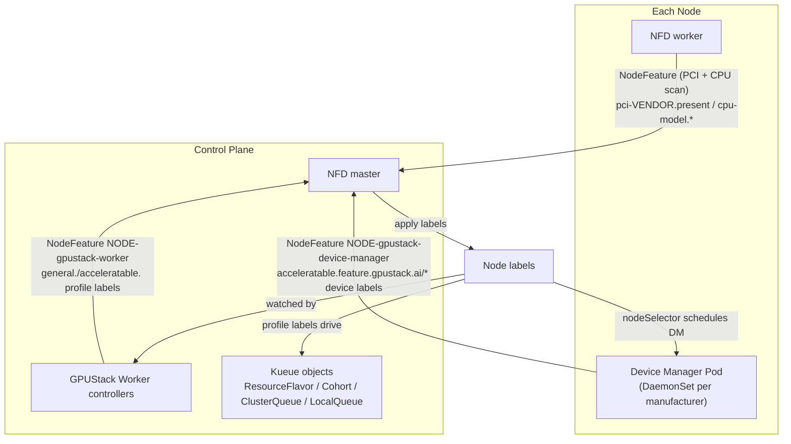
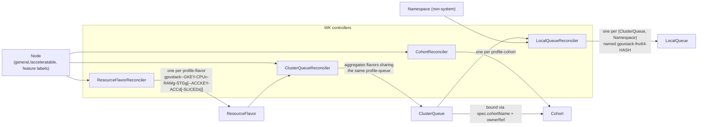

# Architecture

GPUStack Operator turns raw node hardware into a Kueue-based scheduling chain. It builds on two well-known Kubernetes projects:

- [Node Feature Discovery (NFD)](https://github.com/kubernetes-sigs/node-feature-discovery): detects hardware features and system configuration, and publishes them as Node labels.
- [Kueue](https://github.com/kubernetes-sigs/kueue): a Kubernetes-native job queueing system that manages workload admission, queuing, and preemption across ClusterQueues and Cohorts.

## How It Works

The chain is built in four stages:

1. **Bootstrap** — install NFD and the Device Manager (DM) DaemonSets.
2. **Device discovery** — DM detects accelerators and reports per-device feature labels.
3. **Capacity profiling** — the Worker (WK) derives capacity/profile labels for every node, keyed by the node's CPU identity.
4. **Queue construction** — WK controllers materialize the labels into Kueue `ResourceFlavor`, `Cohort`, `ClusterQueue`, and `LocalQueue` objects.



### Stage 1: Node Feature Discovery (NFD)

At startup, `pkg/worker/kuberess` installs the NFD Helm chart. NFD performs three jobs:

1. Labels every Node that carries a PCI display/accelerator-class device (PCI classes `02`, `03`, `06`, `0b`, `12`) with:

   ```
   feature.node.kubernetes.io/pci-${PCI_VENDOR_ID}.present: "true"
   ```

   For example, a node with an NVIDIA device gets `feature.node.kubernetes.io/pci-10de.present: "true"`.

2. Labels every Node with its CPU model identity (the `cpu` label source), and annotates it with the CPU details through the `gpustack-cpu-info` NodeFeatureRule:

   ```
   feature.node.kubernetes.io/cpu-model.vendor_id: "AMD"
   feature.node.kubernetes.io/cpu-model.family:    "25"
   feature.node.kubernetes.io/cpu-model.id:        "1"
   ```

   ```
   feature.gpustack.ai/cpu-name:             "AMD EPYC 7763 64-Core Processor"
   feature.gpustack.ai/cpu-physical-cores:   "64"
   feature.gpustack.ai/cpu-threads-per-core: "2"
   feature.gpustack.ai/cpu-logical-cores:    "128"
   feature.gpustack.ai/cpu-stepping:         "1"
   feature.gpustack.ai/cpu-cache-line:       "64"
   feature.gpustack.ai/cpu-hz:               "2450000000"
   feature.gpustack.ai/cpu-boost-freq:       "3500000000"
   feature.gpustack.ai/cpu-cache-l1i:        "32768"
   feature.gpustack.ai/cpu-cache-l1d:        "32768"
   feature.gpustack.ai/cpu-cache-l2:         "524288"
   feature.gpustack.ai/cpu-cache-l3:         "33554432"
   ```

   An annotation keeps its `@cpu.model.*` template reference verbatim when NFD cannot resolve the attribute, so values leading with `@` are treated as unreported.

   The WK later normalizes these into the node's **general(CPU) node key** `${cpuManufacturer}-${id}`: the id leads with the sanitized `feature.gpustack.ai/cpu-name` annotation when reported (e.g. `amd-epyc-7763-64-core-processor`), or with the cpu-model family and id labels otherwise (e.g. `amd-25-1`), and trails with the node's `kubernetes.io/os` and `kubernetes.io/arch` labels (e.g. `amd-25-1-linux-amd64`). Raw vendor strings are normalized to short names (`GenuineIntel` → `intel`). When neither the cpu-name annotation nor the cpu-model labels are usable, the key is empty and the node exposes no general(CPU) view.

3. Labels Nodes that have **no** accelerator device from any known manufacturer (see `nodefeature.GetKnownAcceleratableManufacturers()`) with:

   ```
   feature.gpustack.ai/acceleratable: "false"
   ```

   This forms an explicit contrast with the `acceleratable: "true"` label reported later by the Device Manager, which also corrects false negatives if they occur.

### Stage 2: GPUStack Operator Device Manager (DM)

`pkg/worker/kuberess` also installs the Device Manager. For each known manufacturer, a DaemonSet named `gpustack-operator-device-manager-${manufacturer}` is created with a node selector on the NFD PCI label. For example, nodes labeled `feature.node.kubernetes.io/pci-10de.present: "true"` receive a Pod from the `gpustack-operator-device-manager-nvidia` DaemonSet.

Once running, the DM detect loop (`pkg/devicemanager/detector/detector.go`) periodically detects accelerators and reports a NodeFeature object named `${NODE_NAME}-gpustack-device-manager` (owned by the Node), whose labels are built by `nodefeature.ConstructAcceleratableNodeLabels`:

| Label                                                                | Meaning                                                            |
|----------------------------------------------------------------------|--------------------------------------------------------------------|
| `${prefix}acceleratable=true`                                         | Node has usable accelerators; overrides the NFD `false` marker      |
| `acceleratable.${prefix}${manufacturer}=true`                         | Accelerator manufacturer                                            |
| `acceleratable.${prefix}${manufacturer}.driver-version=${dv}`         | Device driver version                                               |
| `acceleratable.${prefix}${manufacturer}.runtime-version=${rv}`        | Device runtime version                                              |
| `acceleratable.${prefix}${manufacturer}-${id}=true`                   | Concrete device model; `id` is the product name sanitized to satisfy Kubernetes label naming rules |
| `acceleratable.${prefix}${manufacturer}-${id}.product=${name}`        | Product name                                                        |
| `acceleratable.${prefix}${manufacturer}-${id}.memory=${memory}`       | VRAM size, in Mi                                                    |
| `acceleratable.${prefix}${manufacturer}-${id}.cores=${cores}`         | Accelerator core count                                              |
| `acceleratable.${prefix}${manufacturer}-${id}.accelerators=${acc}`    | Number of accelerators of this model on the node                    |
| `acceleratable.${prefix}${manufacturer}-${id}.family=${family}`       | Product family                                                      |
| `acceleratable.${prefix}${manufacturer}-${id}.compute-capability=${cc}` | Compute capability                                                |

where `prefix` is `feature.gpustack.ai/` — so the device labels live under the dedicated `acceleratable.feature.gpustack.ai/` key namespace — and `manufacturer` is one of the manufacturers supported by `pkg/devicemanager/detector` (NVIDIA, AMD, Ascend, Cambricon, Hygon, Iluvatar, MetaX, MThreads, T-Head).

The DM also reports a `Devices` custom resource per node and keeps monitoring devices, re-detecting whenever the device set or health changes.

### Stage 3: GPUStack Operator Worker (WK)

The WK's `NodeFeatureReconciler` (`pkg/worker/controllers/worker/nodefeature.go`) watches Nodes and reports a NodeFeature object named `${NODE_NAME}-gpustack-worker`, whose labels are built by `nodefeature.ConstructNodeCapacityLabels`.

For the **general** (CPU-only) view of every node, keyed by the general(CPU) node key `${gKey} = ${cpuManufacturer}-${id}` (skipped entirely when the key is not derivable):

| Label                                                       | Value                                                                       |
|--------------------------------------------------------------|------------------------------------------------------------------------------|
| `general.${prefix}${cpuManufacturer}=true`                   | CPU manufacturer marker                                                        |
| `general.${prefix}${gKey}=true`                              | Concrete CPU model marker                                                      |
| `general.${prefix}${gKey}.cpu=${cpu}`                        | Available CPU (from node capacity, overridable via a user-supplied label)      |
| `general.${prefix}${gKey}.ram=${ram}`                        | Available RAM in Gi; by default capped to **2 Gi per CPU** (`OverrideGeneralRAMGiPerCPU(2)`), overridable via a user-supplied label |
| `general.${prefix}${gKey}.local-storage=${stg}`              | Available local storage in Gi (from ephemeral-storage capacity, rounded down to an even number) |
| `general.${prefix}${gKey}.profile-flavor=${cpu}c-${ram}g-${stg}g` | Per-node flavor profile spec                                              |
| `general.${prefix}${gKey}.profile-queue=1c-${ramUnit}g`      | Per-unit queue profile spec, `ramUnit = max(ram/cpu, 1)` Gi                     |
| `general.${prefix}${gKey}.profile-cohort=1c-${ramUnit}g`     | Cohort profile spec (identical to the queue spec — general has no slicing)      |

For **each accelerator model** reported by the DM (keyed `${manufacturer}-${id}`), the analogous labels are produced under the `acceleratable.` namespace:

| Label                                                                                | Value                                                  |
|---------------------------------------------------------------------------------------|---------------------------------------------------------|
| `acceleratable.${prefix}${manufacturer}-${id}.cpu=${cpu}`                               | Node CPU (floored at the accelerator count)              |
| `acceleratable.${prefix}${manufacturer}-${id}.ram=${ram}`                               | Node RAM in Gi (rounded up to even, floored at the accelerator count) |
| `acceleratable.${prefix}${manufacturer}-${id}.local-storage=${stg}`                     | Node local storage in Gi                                 |
| `acceleratable.${prefix}${manufacturer}-${id}.profile-flavor=${cpu}c-${ram}g-${stg}g-${acc}d[-${sliced}s]` | Per-node flavor profile spec               |
| `acceleratable.${prefix}${manufacturer}-${id}.profile-queue=${cpuUnit}c-${ramUnit}g-1d[-${sliced}s]`       | Per-unit queue profile spec                |
| `acceleratable.${prefix}${manufacturer}-${id}.profile-cohort=${cpuUnit}c-${ramUnit}g-1d`                   | Cohort profile spec                        |

The differences from the general view:

1. `acc` is read from the DM-reported `.accelerators` label.
2. `cpuUnit = max(cpu/acc, 1)`, `ramUnit = max(ram/acc, 1)` Gi — i.e. the fair per-device share of the node.
3. If the user-supplied label `acceleratable.${prefix}${manufacturer}-${id}.sliced.partitions=${partitions}` is present, `sliced` appends an `-${sliced}s` suffix to `profile-flavor` and `profile-queue`. `profile-cohort` **never** carries the sliced suffix — it is the matching key at the cohort level, so sliced and exclusive queues of the same per-unit shape join the same Cohort.

> **Known behavior:** when one node carries several accelerator models, each model's labels claim the **full** node cpu/ram/local-storage. The resulting ClusterQueue quotas overlap across the per-model queues, i.e. the host resources are oversold across queues on such nodes.

### Stage 4: The Kueue scheduling chain

Together these labels drive the scheduling chain, implemented on top of Kueue by four controllers in `pkg/worker/controllers/worker`. Every Kueue object name carries the general(CPU) segment first, then (for accelerated profiles) the device segment, joined by `--`:

```
gpustack--${gKey}-${cpu}c-${ram}g[-${stg}g][--${manufacturer}-${id}-${acc}d[-${sliced}s]]
```



- **`ResourceFlavorReconciler`** (`resourceflavor.go`) watches Node label/taint changes and, via `nodefeature.ExtractNodeResourceFlavors`, creates one `ResourceFlavor` per profile, named `gpustack--${gKey}-${profile-flavor}` for the general profile and `gpustack--${gKey}-${host}--${manufacturer}-${id}-${acc}d[-${sliced}s]` for accelerated profiles. The flavor pins workloads to matching nodes through `spec.nodeLabels` — the node's `profile-queue` label, plus the `general.${prefix}${gKey}=true` marker for accelerated flavors so that the same device model on a different CPU never matches. The target queue/cohort names are recorded in the `schedule.gpustack.ai/queue` and `schedule.gpustack.ai/cohort` **annotations** (annotations rather than labels: the names may exceed the 63-character label value limit). A companion cleanup controller (`resourceflavor_cleanup.go`) deletes flavors no longer referenced by any node.
- **`CohortReconciler`** (`cohort.go`) watches Node label changes and creates a `Cohort` per distinct cohort profile as soon as one node references it, deleting it again when orphaned.
- **`ClusterQueueReconciler`** (`clusterqueue.go`) watches ResourceFlavors and Nodes. It aggregates all flavors carrying the same queue annotation into one `ClusterQueue`, computing each flavor's nominal quota as the per-node capacity multiplied by the number of matching nodes (accelerator quota is summed from node allocatable, exposed as `credits.gpustack.ai/${manufacturer}`). The queue is bound to its `Cohort`, prefers nominal quota over borrowing, and never preempts within the cohort.
- **`LocalQueueReconciler`** (`localqueue.go`) watches ClusterQueues and Namespaces, creating a `LocalQueue` in every non-system Namespace so workloads can submit from anywhere. Because workloads reference the LocalQueue through the `kueue.x-k8s.io/queue-name` **label** (value limit: 63 characters) while ClusterQueue names may be longer, the LocalQueue is named `gpustack-fnv64-${fnv64a(ClusterQueue name)}` — always 31 characters — and records the full ClusterQueue name in the `schedule.gpustack.ai/cluster-queue` annotation (`spec.clusterQueue` also points at it).

> **Known behavior:** the Kueue feature gate `AssignQueueLabelsForPods` is disabled at installation (`pkg/worker/kuberess/apps_kueue.go`), so Kueue never copies cluster/local queue names onto Pod labels — long ClusterQueue names would not fit a label value. Monitoring that previously read queue names from Pod labels should read the Workload object instead.

## Example

Consider cluster `cluster-1` with 5 linux/amd64 nodes (CPU / RAM / disk, `D` = accelerator count). node-1 and node-2 run an Intel Xeon (cpu-model `6-143` → `intel-6-143-linux-amd64`), the rest an AMD EPYC (cpu-model `25-1` → `amd-25-1-linux-amd64`); the cpu-name annotations are unresolved on every node, so the keys lead with the cpu-model family and id — had a node reported `feature.gpustack.ai/cpu-name: "Intel(R) Xeon(R) Platinum 8358 CPU @ 2.60GHz"`, its key would have been `intel-xeon-platinum-8358-linux-amd64` instead:

| Node   | CPU model                 | Accelerators | CPU | RAM   | Disk |
|--------|---------------------------|--------------|-----|-------|------|
| node-1 | `intel-6-143-linux-amd64` | —            | 16C | 32G   | 100G |
| node-2 | `intel-6-143-linux-amd64` | T4 × 1       | 4C  | 16G   | 100G |
| node-3 | `amd-25-1-linux-amd64`    | T4 × 1       | 8C  | 32G   | 100G |
| node-4 | `amd-25-1-linux-amd64`    | T4 × 2       | 8C  | 32G   | 100G |
| node-5 | `amd-25-1-linux-amd64`    | A10G × 4     | 48C | 192G  | 100G |

Assuming the usable ephemeral-storage capacity rounds to 88 Gi, the chain materializes as
(general RAM defaults to 2 Gi per CPU; `nvidia-tesla-t4` / `nvidia-a10g` are the sanitized product keys):

| Node   | ResourceFlavor                                            | ClusterQueue                                          | Cohort                                              |
|--------|------------------------------------------------------------|--------------------------------------------------------|------------------------------------------------------|
| node-1 | `gpustack--intel-6-143-linux-amd64-16c-32g-88g`                        | `gpustack--intel-6-143-linux-amd64-1c-2g`                          | `gpustack--intel-6-143-linux-amd64-1c-2g`                        |
| node-2 | `gpustack--intel-6-143-linux-amd64-4c-8g-88g`                          | `gpustack--intel-6-143-linux-amd64-1c-2g`                          | `gpustack--intel-6-143-linux-amd64-1c-2g`                        |
| node-2 | `gpustack--intel-6-143-linux-amd64-4c-16g-88g--nvidia-tesla-t4-1d`     | `gpustack--intel-6-143-linux-amd64-4c-16g--nvidia-tesla-t4-1d`     | `gpustack--intel-6-143-linux-amd64-4c-16g--nvidia-tesla-t4-1d`   |
| node-3 | `gpustack--amd-25-1-linux-amd64-8c-16g-88g`                            | `gpustack--amd-25-1-linux-amd64-1c-2g`                             | `gpustack--amd-25-1-linux-amd64-1c-2g`                           |
| node-3 | `gpustack--amd-25-1-linux-amd64-8c-32g-88g--nvidia-tesla-t4-1d`        | `gpustack--amd-25-1-linux-amd64-8c-32g--nvidia-tesla-t4-1d`        | `gpustack--amd-25-1-linux-amd64-8c-32g--nvidia-tesla-t4-1d`      |
| node-4 | `gpustack--amd-25-1-linux-amd64-8c-16g-88g` *(shared with node-3)*     | `gpustack--amd-25-1-linux-amd64-1c-2g`                             | `gpustack--amd-25-1-linux-amd64-1c-2g`                           |
| node-4 | `gpustack--amd-25-1-linux-amd64-8c-32g-88g--nvidia-tesla-t4-2d`        | `gpustack--amd-25-1-linux-amd64-4c-16g--nvidia-tesla-t4-1d`        | `gpustack--amd-25-1-linux-amd64-4c-16g--nvidia-tesla-t4-1d`      |
| node-5 | `gpustack--amd-25-1-linux-amd64-48c-96g-88g`                           | `gpustack--amd-25-1-linux-amd64-1c-2g`                             | `gpustack--amd-25-1-linux-amd64-1c-2g`                           |
| node-5 | `gpustack--amd-25-1-linux-amd64-48c-192g-88g--nvidia-a10g-4d`          | `gpustack--amd-25-1-linux-amd64-12c-48g--nvidia-a10g-1d`           | `gpustack--amd-25-1-linux-amd64-12c-48g--nvidia-a10g-1d`         |
| node-5† | `gpustack--amd-25-1-linux-amd64-48c-192g-88g--nvidia-a10g-4d-8s`      | `gpustack--amd-25-1-linux-amd64-12c-48g--nvidia-a10g-1d-8s`        | `gpustack--amd-25-1-linux-amd64-12c-48g--nvidia-a10g-1d`         |

† Only when the user labels node-5 with `acceleratable.feature.gpustack.ai/nvidia-a10g.sliced.partitions=8`. A node advertises either the sliced or the exclusive flavor at a time, but both queues share the same Cohort because the cohort profile never carries the `-8s` suffix.

Each ClusterQueue is then mirrored as a hash-named LocalQueue (e.g. `gpustack--amd-25-1-linux-amd64-1c-2g` → `gpustack-fnv64-…`, 31 characters) in every non-system namespace; the `schedule.gpustack.ai/cluster-queue` annotation on the LocalQueue reveals which queue it fronts.

Observations worth calling out:

- **The CPU segment splits otherwise-identical device pools.** node-2 (Intel, 1×T4) and node-4 (AMD, 2×T4) both normalize to `4c-16g` per device, yet they land in **different** ClusterQueues (`gpustack--intel-6-143-linux-amd64-…` vs `gpustack--amd-25-1-linux-amd64-…`) — exactly the Intel+NVIDIA / AMD+NVIDIA separation. Pooling only happens between nodes with the same CPU model.
- **Per-unit normalization still pools homogeneous nodes.** Had node-2 carried the same AMD CPU as node-4, both would have joined `gpustack--amd-25-1-linux-amd64-4c-16g--nvidia-tesla-t4-1d`, with each flavor's quota being its per-node capacity × matching node count.
- **Identical nodes share one flavor whose quota scales by node count.** node-3 and node-4 share `gpustack--amd-25-1-linux-amd64-8c-16g-88g`; its quota in the general queue is the per-node value × 2.
- **General capacity converges per CPU model** (`gpustack--intel-6-143-linux-amd64-1c-2g`, `gpustack--amd-25-1-linux-amd64-1c-2g`) thanks to the default 2 Gi-per-CPU normalization, with one flavor per distinct node shape.
- **Nodes without usable CPU information** (e.g. NFD cpu source disabled) expose no general(CPU) view at all; their accelerated profiles pair with the `generic` CPU segment and pool together, without pinning a general(CPU) identity.
