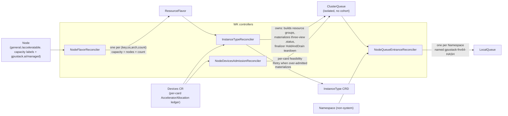

# Architecture

GPUStack Operator turns raw node hardware into a Kueue-based scheduling chain. It builds on two well-known Kubernetes projects:

- [Node Feature Discovery (NFD)](https://github.com/kubernetes-sigs/node-feature-discovery): detects hardware features and system configuration, and publishes them as Node labels.
- [Kueue](https://github.com/kubernetes-sigs/kueue): a Kubernetes-native job queueing system that manages workload admission and queuing across ClusterQueues, and — through its AdmissionCheck extension point — lets an external controller gate admission on per-card feasibility.

## Code Layout

### One binary, three subcommands

`cmd/gpustack-operator/main.go` wires a single binary with three cobra subcommands:

- **`worker`** (alias `w`, `pkg/worker`) — the control-plane process. Runs an aggregated extension API server *and* a controller-runtime manager in one process, installs the NFD / Kueue / Device-Manager / CSI applications, and runs the scheduling-chain controllers (see [Stage 4](#stage-4-the-kueue-scheduling-chain)).
- **`worker-gateway`** (`pkg/workergateway`) — aggregates resources from upstream Kubernetes clusters.
- **`device-manager`** (`pkg/devicemanager`) — the per-node DaemonSet. Subcommands `serve` / `detect` / `monitor`: detects and monitors local accelerators, reports a `NodeFeature` + `Devices` CR, and runs the device-plugin allocator for device injection.

### Worker startup order matters

`pkg/worker/worker.go` runs `Prepare` (install system namespace → CRDs → extension API services →
webhook configs → settings → NFD/Kueue/DM/CSI apps) then `Start`. In `Start`, the controller
manager is deliberately started **only after** the extension API services report ready, so
controllers can index extension-API resources. Preserve this ordering when adding startup steps.

### Per-manufacturer device support

Detection (`pkg/devicemanager/detector/<mfr>`) and allocation (`pkg/devicemanager/allocator/<mfr>`)
have one subpackage per manufacturer: nvidia, amd, ascend, cambricon, hygon, iluvatar, metax,
mthreads, thead. Platform-specific code is split into `_linux.go` / `_other.go` build-constrained
files. The set of supported manufacturers and their PCI vendor IDs / resource names live in
`pkg/nodefeature` (overridable via `GPUSTACK_*` env vars).

### CGO bindings (`binding/`)

Generated Go bindings to vendor GPU runtime/management libraries (nvml, rsmi/amdsmi/amdgpu, cndev,
dcmi, hgml, ixml, mtml/mxsml, hsa, dl). The generators read `gen/binding/<runtime>/config.yaml` and
emit into `binding/<runtime>/` via `make generate binding` (c-for-go is vendored in `.sbin/`). The
top-level `binding/helper*.go` files are hand-written CPU/NUMA topology helpers — those are *not*
generated.

### The 63-character constraint, recurring

Kubernetes label *values* cap at 63 chars. Long names (ClusterQueue names, queue references) are
stored in `schedule.gpustack.ai/*` **annotations**, not labels; LocalQueues are named
`gpustack-fnv64-<hash>` (always 31 chars — see [Stage 4](#stage-4-the-kueue-scheduling-chain)). When
generating any name that flows into a label value, check this limit.

## How It Works

The chain is built in four stages:

1. **Bootstrap** — install NFD and the Device Manager (DM) DaemonSets.
2. **Device discovery** — DM detects accelerators, reports per-device feature labels, and maintains the `Devices` CR ledger.
3. **Capacity profiling** — the Worker (WK) derives per-node capacity labels (CPU cores + the four `.sliced.*` accelerator capacities).
4. **Queue construction & admission** — WK controllers materialize the labels into Kueue `ResourceFlavor` → `ClusterQueue` (one isolated queue per pool, **no Cohort**) and a materialized `InstanceType` CRD, and gate admission with a per-card `AdmissionCheck` read from the `Devices` ledger.


### Stage 1: Node Feature Discovery (NFD)

At startup, `pkg/worker/kuberess` installs the NFD Helm chart. NFD performs three jobs:

1. Labels every Node that carries a PCI display/accelerator-class device (PCI classes `02`, `03`, `0b`, `12`, overridable via `GPUSTACK_PCI_CLASS_PREFIXES` — see [Settings & Environment Variables](settings.md)) with:

   ```
   feature.node.kubernetes.io/pci-${PCI_VENDOR_ID}.present: "true"
   ```

   For example, a node with an NVIDIA device gets `feature.node.kubernetes.io/pci-10de.present: "true"`.

2. Labels every Node with its CPU model identity (the `cpu` label source), and annotates it with the CPU details through the `gpustack-cpu-info` NodeFeatureRule:

   ```
   feature.node.kubernetes.io/cpu-model.vendor_id: "AMD"
   feature.node.kubernetes.io/cpu-model.family:    "25"
   feature.node.kubernetes.io/cpu-model.id:        "1"
   ```

   ```
   feature.gpustack.ai/cpu-name:             "AMD EPYC 7763 64-Core Processor"
   feature.gpustack.ai/cpu-family:           "25"
   feature.gpustack.ai/cpu-physical-cores:   "64"
   feature.gpustack.ai/cpu-threads-per-core: "2"
   feature.gpustack.ai/cpu-logical-cores:    "128"
   feature.gpustack.ai/cpu-stepping:         "1"
   feature.gpustack.ai/cpu-cache-line:       "64"
   feature.gpustack.ai/cpu-hz:               "2450000000"
   feature.gpustack.ai/cpu-boost-freq:       "3500000000"
   feature.gpustack.ai/cpu-cache-l1i:        "32768"
   feature.gpustack.ai/cpu-cache-l1d:        "32768"
   feature.gpustack.ai/cpu-cache-l2:         "524288"
   feature.gpustack.ai/cpu-cache-l3:         "33554432"
   ```

   An annotation keeps its `@cpu.model.*` template reference verbatim when NFD cannot resolve the attribute, so values leading with `@` are treated as unreported.

   The WK later normalizes these into the node's **general(CPU) node key** (`nodefeature.ExtractGeneralNodeKey`), which is always non-empty. By default the key is simply `generic`, so all CPU-only capacity pools together regardless of CPU model. Setting [`GPUSTACK_GENERAL_NODE_KEY_WITH_CPU_NAME=true`](settings.md#configuration-knobs) blends the CPU identity into the key as `${cpuManufacturer}-${id}`: the id leads with the sanitized `feature.gpustack.ai/cpu-name` annotation when reported (trademark markers and the trailing `" CPU @ …"` frequency part are dropped, a leading manufacturer prefix is deduplicated, and the result is truncated to fit the naming budget — e.g. `amd-epyc-7763`), or with the cpu-model family and id labels as the rare fallback when the annotation is unavailable (e.g. `amd-25-1`). The manufacturer is the lowercased `cpu-model.vendor_id` label — reported as a [cpuid](https://github.com/klauspost/cpuid) vendor enum name, so `Intel` → `intel`, `AMD` → `amd` — falling back to `generic` when the vendor is unknown or unreported.

   The key deliberately **does not** encode os/arch. Instead, os/arch is appended in full to every ResourceFlavor / ClusterQueue / InstanceType **name** (`…-linux-arm64`, never an abbreviation) and pinned explicitly on the ResourceFlavor's `spec.nodeLabels` (`kubernetes.io/os`, `kubernetes.io/arch`). This is a correctness safeguard, not cosmetics: the `generic` fallback carries no CPU identity, and the cpu-model family/id labels are independent numbering spaces on x86 (CPUID) versus arm64 (MIDR), so a small value like `25-1` can legitimately appear on both architectures — amd64 and arm64 binaries are not interchangeable, so their capacity must never pool into one flavor/queue. Keeping os/arch out of the key (while pinning it on the name + nodeLabels) also reclaims label-length budget the old abbreviated `-ln-x64` suffix consumed.

3. Labels Nodes that have **no** accelerator device from any known manufacturer (see `nodefeature.GetKnownAcceleratableManufacturers()`) with:

   ```
   feature.gpustack.ai/acceleratable: "false"
   ```

   This forms an explicit contrast with the `acceleratable: "true"` label reported later by the Device Manager, which also corrects false negatives if they occur.

### Stage 2: GPUStack Operator Device Manager (DM)

For each known manufacturer, a DaemonSet named `gpustack-operator-device-manager-${manufacturer}` is created with a node selector on the NFD PCI label. For example, nodes labeled `feature.node.kubernetes.io/pci-10de.present: "true"` receive a Pod from the `gpustack-operator-device-manager-nvidia` DaemonSet. These DaemonSets are normally rendered by the Helm chart itself (`deviceManager.enabled=true`, the default — the worker is then started with `--disable-applications=device-manager` so it does not install them again); when the chart is deployed with `deviceManager.enabled=false`, `pkg/worker/kuberess` instead installs them at runtime from the bundled operator chart (`gpustack-operator-<ver>.tgz`) as a separate Helm release `gpustack-operator-device-manager`.

Once running, the DM detect loop (`pkg/devicemanager/detector/detector.go`) periodically detects accelerators and reports a NodeFeature object named `${NODE_NAME}-gpustack-device-manager` (owned by the Node), whose labels are built by `nodefeature.ConstructAcceleratableNodeLabels`. Each detected accelerator model is keyed by the accelerated device key `${aKey} = ${manufacturer}-${id}`, where `id` is the product name sanitized to satisfy Kubernetes label naming rules:

| Label                                                                | Meaning                                                            |
|----------------------------------------------------------------------|--------------------------------------------------------------------|
| `${prefix}acceleratable=true`                                         | Node has usable accelerators; overrides the NFD `false` marker      |
| `acceleratable.${prefix}${manufacturer}=true`                         | Accelerator manufacturer                                            |
| `acceleratable.${prefix}${manufacturer}.driver-version=${dv}`         | Device driver version (omitted when undetected)                     |
| `acceleratable.${prefix}${manufacturer}.runtime-version=${rv}`        | Device runtime version (omitted when undetected)                    |
| `acceleratable.${prefix}${aKey}=true`                                 | Concrete device model marker                                        |
| `acceleratable.${prefix}${aKey}.product=${name}`        | Product name                                                        |
| `acceleratable.${prefix}${aKey}.memory=${memory}`       | Per-card VRAM size, formatted at the largest binary unit (e.g. `16Gi`) |
| `acceleratable.${prefix}${aKey}.cores=${cores}`         | Accelerator core count                                              |
| `acceleratable.${prefix}${aKey}.count=${acc}`           | Number of accelerators of this model on the node                    |
| `acceleratable.${prefix}${aKey}.family=${family}`       | Product family (omitted when undetected)                            |
| `acceleratable.${prefix}${aKey}.comcap=${cc}` | Compute capability (omitted when undetected)                      |

where `prefix` is `feature.gpustack.ai/` — so the device labels live under the dedicated `acceleratable.feature.gpustack.ai/` key namespace — and `manufacturer` is one of the manufacturers supported by `pkg/devicemanager/detector` (NVIDIA, AMD, Ascend, Cambricon, Hygon, Iluvatar, MetaX, MThreads, T-Head). The per-manufacturer PCI vendor IDs, resource names, and runtime class names can all be overridden — see [Settings & Environment Variables](settings.md#per-manufacturer-overrides).

The NodeFeature object is owned by the Node. The DM also reports a **`Devices` custom resource** named after the node (owned by that NodeFeature), stamped with the accelerator flavors' selector labels (the feature key + `kubernetes.io/os|arch`) so the pool's queue can reverse-look-up its Devices. Its `.status` holds the per-card **`AcceleratorAllocation` ledger** — every card's `mode` (free / exclusive / shared / sliced) and `Remaining` credit budget — which is the **single authoritative accounting** of accelerator occupancy: it drives the InstanceType three-view display *and* feeds the per-card AdmissionCheck (Stage 4). The DM keeps monitoring devices, re-detecting whenever the device set or health changes; a separate `NodeDevicesReconciler` syncs the `gpustack.ai/managed` mark from the Node onto the same-named `Devices` so the per-node DM never asserts a node-management decision it does not own.

Alongside detection, the DM runs the **device-plugin allocator** (`pkg/devicemanager/allocator/<mfr>`, on `pkg/deviceplugin`): it registers per-mode resources (exclusive / shared / sliced) with the kubelet and, on `Allocate`, returns the container injection and records the allocation into the `Devices` ledger. For **exclusive/shared** the injection is just the device-visibility env (`NVIDIA_VISIBLE_DEVICES` / `ASCEND_VISIBLE_DEVICES` / …). For **sliced (soft slicing)** it additionally applies **runtime isolation** with **decoupled compute and memory budgets**: the compute (SM / aicore) budget comes from `.sliced.cores-percentage` (defaulting to 100 %) and the VRAM budget from the per-card memory request (`.sliced.memory-percentage` preferred over `.sliced.memory-mib`, floored and capped at the card VRAM), so a slice can cap SM independently of VRAM. The container is started with a vendor preload library — NVIDIA HAMi-core `libvgpu.so`, Ascend vcann-rt `libvruntime.so` — activated via `/etc/ld.so.preload`, plus per-container quota (NVIDIA env `CUDA_DEVICE_SM_LIMIT` / `CUDA_DEVICE_MEMORY_LIMIT_*`; Ascend an `npu_info.config` carrying `aicore-quota` / `memory-quota`). The preload libraries are compiled into the operator image per runtime version (cloned inline at pinned commits — no git submodule — built in the `xbuild-nvidia-cuda-*` / `xbuild-ascend-cann-*` Dockerfile stages, scripts under `pack/gpustack-operator/external/{nvidia,ascend}`) and staged onto the host (`/var/lib/gpustack/operator/lib`) by a device-manager **init container**; the allocator mounts the matching library + a per-pod working directory into each sliced container and reclaims those directories once their pods are gone.

A node hosts a single driver/runtime stack per manufacturer, so every `DevicesGroup` of a given manufacturer on that node shares the same driver and runtime version. The per-runtime-version library subdir (`cuda-<major>` / `cann-<major>-<family>`) the allocator picks from the first allocated card is therefore correct for every card in a sliced allocation. The allocator nonetheless guards against a mismatch **defensively** (NVIDIA rejects a sliced allocation spanning different CUDA majors; Ascend rejects a multi-card sliced allocation, since vcann-rt's `npu_info.config` models a single physical NPU), so any future regression fails the `Allocate` loudly instead of silently mounting an incompatible library.

### Stage 3: GPUStack Operator Worker capacity profiling (WK)

Two WK controllers turn Node + Devices signals into the capacity labels the scheduling chain consumes:

- **`NodeFeatureReconciler`** (`nodefeature.go`) watches Nodes and reports a NodeFeature object named `${NODE_NAME}-gpustack-worker`. It stamps the node-management marker `gpustack.ai/managed=true` — unless `GPUSTACK_NODE_MANAGEMENT_MANUAL=true` (switch ①, read per-reconcile), in which case auto-injection is skipped and only an explicit admin-set `managed` label is honored, so onboarding can be gated node-by-node.
- **`NodeCapacityReconciler`** (`nodecapacity.go`) builds the capacity labels via `nodefeature.ConstructNodeCapacityLabels`: the general(CPU) key presence marker plus, **for each accelerator model** reported by the DM, the four per-card sliced capacities that the default scheduler / kubelet count at admission time:

  | Label suffix (`acceleratable.${prefix}${aKey}.…`) | Value |
  |----------------------------------------------------|--------|
  | `.sliced.units`             | `count × M` (M = 1,600,000 credit units per whole card) |
  | `.sliced.cores-percentage`  | `count × 512 × 100` |
  | `.sliced.memory-percentage` | `count × 100` |
  | `.sliced.memory-mib`        | `Σ count × per-model VRAM MiB` (weighted per model so mixed-VRAM models sum correctly) |

  Every acceleratable model is sliceable (`MaxPartitions = SlicedResourceMaxSize = 512` for soft-partition devices — see `pkg/devicemanager/detector`); there is no longer a `.sliced.partitions` opt-in gate. Stale cleanup covers all four `.sliced.*` suffixes.

The per-node **unit spec** (unitCPU / unitRAM / localStorage) is **no longer written onto the node** — it is derived downstream onto the ResourceFlavor (Stage 4), a decoupling that lets an admin change a unit spec through the InstanceType API without touching any Node.

### Stage 4: The Kueue scheduling chain

The capacity labels drive a scheduling chain built on Kueue by the controllers in `pkg/worker/controllers/worker`. **There is one isolated ClusterQueue per pool and no Cohort** — with exclusive / shared / sliced folded into one queue there is no cross-queue borrowing to broker, so `spec.cohortName` is empty and the old `CohortReconciler` / `z-cohort` are gone. Names carry the general(CPU) key or the accelerated device key, then the full os/arch:

```
ResourceFlavor:  gpustack-${key}-${os}-${arch}-${count}{c|d}   # c = CPU cores (general), d = devices (accelerated)
ClusterQueue:    gpustack-${key}-${os}-${arch}                  # the RF name minus the -${count}{c|d} suffix
InstanceType:    gpustack-${key}-${os}-${arch}                  # materialized CRD, one per ClusterQueue
```



- **`NodeFlavorReconciler`** (`nodeflavor.go`) indexes managed nodes by `(key, os, arch, count)` and creates one `ResourceFlavor` per group. The flavor pins workloads through `spec.nodeLabels` — the feature key `{general.|acceleratable.}feature.gpustack.ai/${key}=true`, `kubernetes.io/os|arch` (full), and a blanket `{Operator: Exists}` toleration (eligibility is by nodeLabels, not taints) — and carries the pool identity in labels (`.count`, `.capacity = contributing nodes × count`) plus the derived unit spec / per-card VRAM in `note.gpustack.ai/*` annotations. A flavor whose group has **no** contributing node is **deleted** — there is no drain-tombstone anymore. The unit spec (`unitCPU`/`unitRAM`/`localStorage`) is the first stage of a two-stage min-of-mins aggregation: from the group's nodes pick the min-capacity node (comparing `>0` values only), deriving a non-accelerated flavor's factory default `1c-2g` or an accelerated flavor's per-device share.
- **`InstanceTypeReconciler`** (`instancetype.go`) is the **sole owner** of the backing `ClusterQueue` and the materialized `InstanceType` CRD. `ensureClusterQueue` builds the queue's resource groups from the pool's ResourceFlavors — an accelerated queue advertises only `credits.gpustack.ai/${manufacturer}` (nominal = `capacity × M`, one whole card = `M = 1,600,000` credit units so Kueue's int64 accounting never rounds fractional shared/sliced credits up to 1); a non-accelerated queue advertises only CPU. The queue's unit spec is the second aggregation stage (min across the feeding flavors), and is **never clobbered** when an admin already set it. Under `instance-type-derived-from-node=true` (switch ③, default) the reconciler auto-creates the `InstanceType` from the ResourceFlavors, removing only its own derived ones when the flavors vanish. It **materializes the three-view status** (below) into `InstanceType.status`, DeepEqual-guarded, and stamps the queue with `schedule.gpustack.ai/queue-entrance = <fronting LocalQueue name>` (+ `status.entrance`). Teardown runs through the `gpustack.ai/controlled` finalizer: drive the queue to `spec.stopPolicy: HoldAndDrain`, wait for Kueue to evict admitted workloads, then delete the queue before releasing the finalizer.
- **`NodeQueueEntranceReconciler`** (`nodequeueentrance.go`) watches ClusterQueues and Namespaces, creating a `LocalQueue` in every non-system Namespace so workloads can submit from anywhere. Because workloads reference the LocalQueue through the `kueue.x-k8s.io/queue-name` **label** (63-char limit) while ClusterQueue names may be longer, the LocalQueue is named `gpustack-fnv64-${fnv64a(ClusterQueue name)}` — always 31 characters — and records the full ClusterQueue name in the `schedule.gpustack.ai/cluster-queue` annotation.
- **`NodeDevicesAdmissionReconciler`** (`nodedevicesadmission.go`) provides the per-card **AdmissionCheck**. `installKueue` applies the `gpustack-node-devices` AdmissionCheck object right after the Kueue install (Kueue's CRD is runtime-installed, so the chart cannot); the reconciler keeps it `Active`, and the accelerated ClusterQueue references it in `spec.admissionChecksStrategy` **only once it is Active**. After Kueue reserves quota, the check reads the assigned pool's `Devices` ledger (uncached, via `APIReader`) and computes per-card feasibility (`Remaining ≥ demand`: a whole card for exclusive, `.sliced.units` for sliced, an owner share for shared). Since the ledger seeds every card at `M`, an exclusive over-admit that coarse `credits` let through (a scalar total can hide that no *single* card is free) is caught exactly and held with `Retry` — a transient state that self-heals when Kueue re-admits after the backoff. This is a **check-only** gate: it never preempts and never `Rejected`.

**Four-gate admission.** Together these form a layered admission model where Kueue is a coarse gate, not the ledger:

1. **Kueue `credits`** — coarse total admission by fractional scoring (`capacity × M`); ensures the pool has enough aggregate capacity, but a scalar total cannot see per-card fragmentation.
2. **Default scheduler / kubelet** — node-level counting of `.sliced` / `.sliced.units` / `.sliced.cores-percentage` / `.sliced.memory-*` picks a node with room.
3. **`NodeDevicesAdmission` AdmissionCheck** — per-card feasibility from the `Devices` ledger; closes the credits "over-admit exclusive" gap.
4. **`Devices` CR `AcceleratorAllocation` ledger** — the single authoritative accounting, written below the kubelet by the device-plugin `Allocate` for every allocation (Kueue-routed or not); it drives the three-view and feeds gate 3.

**Three-view status.** `InstanceType.status` carries three per-card bin-packing projections computed from the `Devices` ledger (not a credits fold-down): `Accelerator` = free whole cards; `AcceleratorShared` = shareable ownership slots; `AcceleratorSliced` = sliceable VRAM-percent units. Because the reconciler watches the `Devices` CR and writes the result into a real CRD's `.status`, a `kubectl get instancetype -w` observes capacity move as pods allocate and free — a read-only projection over the ClusterQueue could not (it borrows the CQ `resourceVersion`, unchanged on a `Devices`-only allocation). The v1 (`worker.gpustack.ai/v1`) InstanceType is a thin proxy + conversion over the real `v1alpha1` CRD; an admin editing a unit spec through the InstanceType API back-fills the ClusterQueue notes without touching any Node. The **admin-editable** part of an InstanceType is its `UnitResources` — the per-unit `.cpu` and `.ram` — and its `.localStorage`; for a **non-accelerated** type `unitCPU` is always `1` (one CPU core per unit), so an edit to it is reset on the next reconcile (`unitRAM` / `localStorage` stay editable). The Instance validating webhook enforces this unit spec on **Create and Update**: a submission's RAM must not exceed `unitRAM × count` and its local storage must not exceed the InstanceType's `LocalStorage`. The Pod webhook does **not** read the InstanceType — it folds a slice's memory using the operator-owned ClusterQueue's VRAM note (Stage 4, Pod admission webhook), keeping the two paths distinct.

**Pod admission webhook.** A `pods` CREATE webhook (objectSelector on `kueue.x-k8s.io/queue-name`, `failurePolicy: Fail`) mutates a sliced request — defaulting `.sliced.cores-percentage` to 100 and folding `.sliced.memory-percentage` / `.sliced.memory-mib` into `.sliced.units` (only when units are absent; memory-percentage wins) — and validates it (rejecting no-memory / both-memory-keys / non-positive `.sliced.*` / `cores-% < memory-%` / mixed modes). The per-card VRAM divisor for the fold is read from the operator-owned ClusterQueue (reverse-looked-up by the `schedule.gpustack.ai/queue-entrance` label), never from the user-writable LocalQueue. Its `MutatingWebhookConfiguration` name sorts before `kueue-mutating-webhook-configuration` so the fold runs before Kueue hashes container resources.

**Running-instance drain.** When an `InstanceType` drains (goes `Inactive`, is being deleted, or is gone), the `InstanceReconciler` (`instance.go`) evaluates this on every reconcile — before (re)creating the Pod — and **stops** the backing Instance (`spec.stop=true`) rather than recreating a Pod the drained queue can never admit; an `InstanceType` watch enqueues affected Instances so the stop is prompt.

> **Known behavior:** the Kueue feature gate `AssignQueueLabelsForPods` is disabled at installation (`pkg/worker/kuberess/apps_kueue.go`), so Kueue never copies cluster/local queue names onto Pod labels — long ClusterQueue names would not fit a label value. The deployed Kueue Configuration also sets `resources.quotaCheckStrategy: IgnoreUndeclared`, so a single-dimension queue (only `cpu`, or only the manufacturer `credits`) does not reject a Workload for the other Pod resources (`memory`/`ephemeral-storage`) it does not cover.

## Example

Consider cluster `cluster-1` with 5 linux/arm64 nodes, running with the default general key (`GPUSTACK_GENERAL_NODE_KEY_WITH_CPU_NAME=false`), so every CPU-only view pools under the `generic` key regardless of CPU model:

| Node   | Accelerators | CPU | RAM  | Disk |
|--------|--------------|-----|------|------|
| node-1 | —            | 16C | 32G  | 100G |
| node-2 | T4 × 1       | 4C  | 16G  | 100G |
| node-3 | T4 × 1       | 8C  | 32G  | 100G |
| node-4 | T4 × 2       | 8C  | 32G  | 100G |
| node-5 | A10G × 4     | 48C | 192G | 100G |

The chain materializes as follows (`nvidia-tesla-t4` / `nvidia-a10g` are the sanitized product keys; general capacity is the node's CPU count, the unit spec defaults to `1c-2g`; accelerated `credits` = card count × `M`):

| Node       | ResourceFlavor                                   | ClusterQueue                          | InstanceType                          |
|------------|--------------------------------------------------|---------------------------------------|---------------------------------------|
| node-1     | `gpustack-generic-linux-arm64-16c`               | `gpustack-generic-linux-arm64`        | `gpustack-generic-linux-arm64`        |
| node-2..5  | `gpustack-generic-linux-arm64-{4c,8c,48c}`       | `gpustack-generic-linux-arm64` *(all pool here)* | `gpustack-generic-linux-arm64`        |
| node-2/3   | `gpustack-nvidia-tesla-t4-linux-arm64-1d`        | `gpustack-nvidia-tesla-t4-linux-arm64`| `gpustack-nvidia-tesla-t4-linux-arm64`|
| node-4     | `gpustack-nvidia-tesla-t4-linux-arm64-2d`        | `gpustack-nvidia-tesla-t4-linux-arm64`| `gpustack-nvidia-tesla-t4-linux-arm64`|
| node-5     | `gpustack-nvidia-a10g-linux-arm64-4d`            | `gpustack-nvidia-a10g-linux-arm64`    | `gpustack-nvidia-a10g-linux-arm64`    |

Each ClusterQueue is mirrored as a hash-named LocalQueue (e.g. `gpustack-generic-linux-arm64` → `gpustack-fnv64-…`, 31 characters) in every non-system namespace. Observations:

- **One isolated queue per pool, zero Cohort.** Exclusive / shared / sliced all live in one accelerated queue; there is no borrow topology, so no `Cohort` objects exist after reconcile.
- **The flavor is keyed by device count.** node-2 and node-3 (1×T4 each) share `gpustack-nvidia-tesla-t4-linux-arm64-1d`; node-4 (2×T4) gets its own `…-2d`. All three T4 flavors feed the single `gpustack-nvidia-tesla-t4-linux-arm64` queue, whose `credits.gpustack.ai/nvidia` nominal is `(1+1+2) × M`.
- **CPU pools under `generic` by default.** All five nodes' CPU views pool into `gpustack-generic-linux-arm64`; with `GPUSTACK_GENERAL_NODE_KEY_WITH_CPU_NAME=true` they would instead split by CPU model (e.g. `gpustack-intel-xeon-…-linux-arm64` vs `gpustack-amd-epyc-…-linux-arm64`).
- **The three-view is per-card, from the ledger.** The `gpustack-nvidia-a10g-linux-arm64` InstanceType on node-5 reports `.status` `8`-cards-style views computed from that node's `Devices` ledger; a request for more whole cards than any single node has free is held by the AdmissionCheck even if pool `credits` would cover it.
