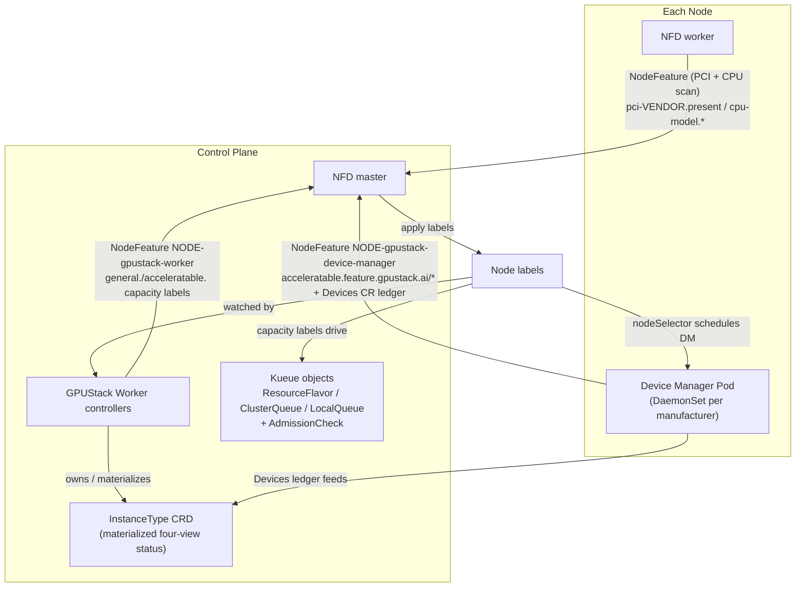
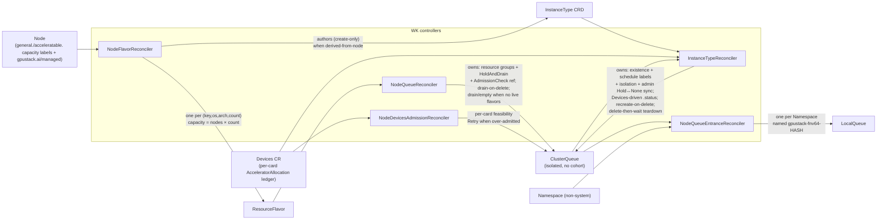

# Architecture

GPUStack Operator turns raw node hardware into a Kueue-based scheduling chain. It builds on two well-known Kubernetes projects:

- [Node Feature Discovery (NFD)](https://github.com/kubernetes-sigs/node-feature-discovery): detects hardware features and system configuration, and publishes them as Node labels.
- [Kueue](https://github.com/kubernetes-sigs/kueue): a Kubernetes-native job queueing system that manages workload admission and queuing across ClusterQueues, and — through its AdmissionCheck extension point — lets an external controller gate admission on per-card feasibility.

## Code Layout

### One binary, three subcommands

`cmd/gpustack-operator/main.go` wires a single binary with three cobra subcommands:

- **`worker`** (alias `w`, `pkg/worker`) — the control-plane process. Runs an aggregated extension API server *and* a controller-runtime manager in one process, installs the NFD / Kueue / Device-Manager / CSI applications, and runs the scheduling-chain controllers (see [Stage 4](#stage-4-the-kueue-scheduling-chain)).
- **`worker-gateway`** (`pkg/workergateway`) — aggregates resources from upstream Kubernetes clusters.
- **`device-manager`** (`pkg/devicemanager`) — the per-node DaemonSet. Subcommands `serve` / `detect` / `monitor`: detects and monitors local accelerators, reports a `NodeFeature` + `Devices` CR, and runs the device-plugin allocator for device injection.

### Worker startup order matters

`pkg/worker/worker.go` runs `Prepare` (install system namespace → CRDs → extension API services →
webhook configs → settings → NFD/Kueue/DM/CSI apps) then `Start`. In `Start`, the controller
manager is deliberately started **only after** the extension API services report ready, so
controllers can index extension-API resources. Preserve this ordering when adding startup steps.

### The worker gateway mirrors the cluster API, it does not embed it

`pkg/workergateway/service` folds the `InstanceType`s of many clusters into one fleet-wide
`AggregatedInstanceType`: candidates (one per cluster) group into tiers by accelerator
`OnceMaxRequest`, and each level carries an overview bundle — a single achievable allocation copied
from the winning member — plus a `Remaining` that is the per-dimension sum.

Those overview types **re-declare** the cluster `InstanceTypeStatus`'s resource views field by field
rather than embedding them, and no generator maintains them. A view added to the CRD therefore still
compiles while the gateway never ingests, sums or serves it, and the fleet reads as having no
capacity on that dimension. Adding one means touching `types.go` plus every aggregation site in
`helper.go` (`newAggregatedTier`, `newAggregatedCandidate`, both `Recompute` methods,
`overviewResourceIsZero`). `TestAggregatedInstanceTypeMirrorsEveryStatusView` fails while the field
sets differ, but it cannot see a missed aggregation site — walk them.

### Per-manufacturer device support

Detection (`pkg/devicemanager/detector/<mfr>`) and allocation (`pkg/devicemanager/allocator/<mfr>`)
have one subpackage per manufacturer: nvidia, amd, ascend, cambricon, hygon, iluvatar, metax,
mthreads, thead. Platform-specific code is split into `_linux.go` / `_other.go` build-constrained
files. The set of supported manufacturers and their PCI vendor IDs / resource names live in
`pkg/nodefeature` (overridable via `GPUSTACK_*` env vars).

### CGO bindings (`binding/`)

Generated Go bindings to vendor GPU runtime/management libraries (nvml, rsmi/amdsmi/amdgpu, cndev,
dcmi, hgml, ixml, mtml/mxsml, hsa, dl). The generators read `gen/binding/<runtime>/config.yaml` and
emit into `binding/<runtime>/` via `make generate binding` (c-for-go is vendored in `.sbin/`). The
top-level `binding/helper*.go` files are hand-written CPU/NUMA topology helpers — those are *not*
generated.

### The 63-character constraint, recurring

Kubernetes label *values* cap at 63 chars. Long names (ClusterQueue names, queue references) are
stored in `schedule.gpustack.ai/*` **annotations**, not labels; LocalQueues are named
`gpustack-fnv64-<hash>` (always 31 chars — see [Stage 4](#stage-4-the-kueue-scheduling-chain)). When
generating any name that flows into a label value, check this limit.

## How It Works

The chain is built in four stages:

1. **Bootstrap** — install NFD and the Device Manager (DM) DaemonSets.
2. **Device discovery** — DM detects accelerators, reports per-device feature labels, and maintains the `Devices` CR ledger.
3. **Capacity profiling** — the Worker (WK) derives per-node capacity labels (CPU cores + the four `.sliced.*` logical-slicing capacities and the `.partitioned.*` hardware-partitioning capacities).
4. **Queue construction & admission** — WK controllers materialize the labels into Kueue `ResourceFlavor` → `ClusterQueue` (one isolated queue per pool, **no Cohort**) and a materialized `InstanceType` CRD, and gate admission with a per-card `AdmissionCheck` read from the `Devices` ledger.



### Stage 1: Node Feature Discovery (NFD)

At startup, `pkg/worker/kuberess` installs the NFD Helm chart. NFD performs three jobs:

1. Labels every Node that carries a PCI display/accelerator-class device (PCI classes `02`, `03`, `0b`, `12`, overridable via `GPUSTACK_PCI_CLASS_PREFIXES` — see [Settings & Environment Variables](settings.md)) with:

   ```
   feature.node.kubernetes.io/pci-${PCI_VENDOR_ID}.present: "true"
   ```

   For example, a node with an NVIDIA device gets `feature.node.kubernetes.io/pci-10de.present: "true"`.

2. Labels every Node with its CPU model identity (the `cpu` label source), and annotates it with the CPU details through the `gpustack-cpu-info` NodeFeatureRule:

   ```
   feature.node.kubernetes.io/cpu-model.vendor_id: "AMD"
   feature.node.kubernetes.io/cpu-model.family:    "25"
   feature.node.kubernetes.io/cpu-model.id:        "1"
   ```

   ```
   feature.gpustack.ai/cpu-name:             "AMD EPYC 7763 64-Core Processor"
   feature.gpustack.ai/cpu-family:           "25"
   feature.gpustack.ai/cpu-physical-cores:   "64"
   feature.gpustack.ai/cpu-threads-per-core: "2"
   feature.gpustack.ai/cpu-logical-cores:    "128"
   feature.gpustack.ai/cpu-stepping:         "1"
   feature.gpustack.ai/cpu-cache-line:       "64"
   feature.gpustack.ai/cpu-hz:               "2450000000"
   feature.gpustack.ai/cpu-boost-freq:       "3500000000"
   feature.gpustack.ai/cpu-cache-l1i:        "32768"
   feature.gpustack.ai/cpu-cache-l1d:        "32768"
   feature.gpustack.ai/cpu-cache-l2:         "524288"
   feature.gpustack.ai/cpu-cache-l3:         "33554432"
   ```

   An annotation keeps its `@cpu.model.*` template reference verbatim when NFD cannot resolve the attribute, so values leading with `@` are treated as unreported.

   The WK later normalizes these into the node's **general(CPU) node key** (`nodefeature.ExtractGeneralNodeKey`), which is always non-empty and **always blends the node's real CPU identity** as `${cpuManufacturer}-${id}`: the id leads with the sanitized `feature.gpustack.ai/cpu-name` annotation when reported (trademark markers and the trailing `" CPU @ …"` frequency part are dropped, a leading manufacturer prefix is deduplicated, and the result is truncated to fit the naming budget — e.g. `amd-epyc-7763`), or with the cpu-model family and id labels as the fallback when the annotation is unavailable (e.g. `amd-25-1`). The manufacturer is the lowercased `cpu-model.vendor_id` label — reported as a [cpuid](https://github.com/klauspost/cpuid) vendor enum name, so `Intel` → `intel`, `AMD` → `amd` — falling back to `generic` when the vendor is unknown or unreported (and the whole key degrades to `generic` only when NFD reports no CPU identity at all). Whether the CPU manufacturer actually **subdivides** the scheduling pools is a separate, runtime decision made at the aggregation layer by [`instance-type-aware-cpu-manufacturer`](settings.md#online-adjustable-settings) (Stage 4) — the node key itself is always CPU-accurate so the finest-grained `ResourceFlavor`s can be re-grouped without rewriting them.

   The key deliberately **does not** encode os/arch. Instead, os/arch is appended in full to every ResourceFlavor / ClusterQueue / InstanceType **name** (`…-linux-arm64`, never an abbreviation) and pinned explicitly on the ResourceFlavor's `spec.nodeLabels` (`kubernetes.io/os`, `kubernetes.io/arch`). This is a correctness safeguard, not cosmetics: the cpu-model family/id labels are independent numbering spaces on x86 (CPUID) versus arm64 (MIDR), so a small value like `25-1` can legitimately appear on both architectures — amd64 and arm64 binaries are not interchangeable, so their capacity must never pool into one flavor/queue. Keeping os/arch out of the key (while pinning it on the name + nodeLabels) also reclaims label-length budget the old abbreviated `-ln-x64` suffix consumed.

3. Labels Nodes that have **no** accelerator device from any known manufacturer (see `nodefeature.GetKnownAcceleratableManufacturers()`) with:

   ```
   feature.gpustack.ai/acceleratable: "false"
   ```

   This forms an explicit contrast with the `acceleratable: "true"` label reported later by the Device Manager, which also corrects false negatives if they occur.

### Stage 2: GPUStack Operator Device Manager (DM)

For each known manufacturer, a DaemonSet named `gpustack-operator-device-manager-${manufacturer}` is created with a node selector on the NFD PCI label. For example, nodes labeled `feature.node.kubernetes.io/pci-10de.present: "true"` receive a Pod from the `gpustack-operator-device-manager-nvidia` DaemonSet. These DaemonSets are normally rendered by the Helm chart itself (`deviceManager.enabled=true`, the default — the worker is then started with `--disable-applications=device-manager` so it does not install them again); when the chart is deployed with `deviceManager.enabled=false`, `pkg/worker/kuberess` instead installs them at runtime from the bundled operator chart (`gpustack-operator-<ver>.tgz`) as a separate Helm release `gpustack-operator-device-manager`.

Once running, the DM detect loop (`pkg/devicemanager/detector/detector.go`) periodically detects accelerators and reports a NodeFeature object named `${NODE_NAME}-gpustack-device-manager` (owned by the Node), whose labels are built by `nodefeature.ConstructAcceleratableNodeLabels`. Each detected accelerator model is keyed by the accelerated device key `${aKey} = ${manufacturer}-${id}`, where `id` is the product name sanitized to satisfy Kubernetes label naming rules:

| Label                                                                | Meaning                                                            |
|----------------------------------------------------------------------|--------------------------------------------------------------------|
| `${prefix}acceleratable=true`                                         | Node has usable accelerators; overrides the NFD `false` marker      |
| `acceleratable.${prefix}${manufacturer}=true`                         | Accelerator manufacturer                                            |
| `acceleratable.${prefix}${manufacturer}.driver-version=${dv}`         | Device driver version (omitted when undetected)                     |
| `acceleratable.${prefix}${manufacturer}.runtime-version=${rv}`        | Device runtime version (omitted when undetected)                    |
| `acceleratable.${prefix}${aKey}=true`                                 | Concrete device model marker                                        |
| `acceleratable.${prefix}${aKey}.product=${name}`        | Product name                                                        |
| `acceleratable.${prefix}${aKey}.memory=${memory}`       | Per-card VRAM size, formatted at the largest binary unit (e.g. `16Gi`) |
| `acceleratable.${prefix}${aKey}.cores=${cores}`         | Accelerator core count                                              |
| `acceleratable.${prefix}${aKey}.count=${acc}`           | Number of accelerators of this model on the node                    |
| `acceleratable.${prefix}${aKey}.family=${family}`       | Product family (omitted when undetected)                            |
| `acceleratable.${prefix}${aKey}.comcap=${cc}` | Compute capability (omitted when undetected)                      |

where `prefix` is `feature.gpustack.ai/` — so the device labels live under the dedicated `acceleratable.feature.gpustack.ai/` key namespace — and `manufacturer` is one of the manufacturers supported by `pkg/devicemanager/detector` (NVIDIA, AMD, Ascend, Cambricon, Hygon, Iluvatar, MetaX, MThreads, T-Head). The per-manufacturer PCI vendor IDs, resource names, and runtime class names can all be overridden — see [Settings & Environment Variables](settings.md#per-manufacturer-overrides).

The NodeFeature object is owned by the Node. The DM also reports a **`Devices` custom resource** named after the node (owned by that NodeFeature), stamped with the accelerator flavors' selector labels (the feature key + `kubernetes.io/os|arch`) so the pool's queue can reverse-look-up its Devices. Its `.status` holds the per-card **`AcceleratorAllocation` ledger** — every card's `mode` (free / exclusive / shared / sliced / partitioned) and `Remaining` credit budget, plus, for a hardware-partitioned card, its allocated and still-placeable partition profiles — which is the **single authoritative accounting** of accelerator occupancy: it drives the InstanceType four-view display *and* feeds the per-card AdmissionCheck (Stage 4). The DM keeps monitoring devices, re-detecting whenever the device set or health changes; a separate `NodeDevicesReconciler` syncs the `gpustack.ai/managed` mark from the Node onto the same-named `Devices` so the per-node DM never asserts a node-management decision it does not own.

Alongside detection, the DM runs the **device-plugin allocator** (`pkg/devicemanager/allocator/<mfr>`, on `pkg/deviceplugin`): it registers per-mode resources (exclusive / shared / sliced / partitioned) with the kubelet and, on `Allocate`, returns the container injection and records the allocation into the `Devices` ledger. **A card serves only the family its reported capability can back**: an unpartitioned card advertises the exclusive, shared and logical-sliced token pools, a card in a hardware partitioning mode advertises only the `.partitioned` pool, and a family's tokens are simply absent from the other population — which is what stops the kubelet from handing a partition request a card that cannot host it. For **exclusive/shared** the injection is just the device-visibility env (`NVIDIA_VISIBLE_DEVICES` / `ASCEND_VISIBLE_DEVICES` / …). For **partitioned** it materializes the requested hardware instance (NVIDIA MIG) on a card it selects itself and injects only that instance; see [Accelerator Requests](./accelerator-requests.md) and [NVIDIA MIG Operations](./operation/nvidia-mig.md). For **sliced (logical slicing)** it additionally applies **runtime isolation** with **decoupled compute and memory budgets**: the compute (SM / aicore) budget comes from `.sliced.cores-percentage` (defaulting to 100 %) and the VRAM budget from the per-card memory request (`.sliced.memory-percentage` preferred over `.sliced.memory-mib`, floored and capped at the card VRAM), so a slice can cap SM independently of VRAM. The container is started with a vendor preload library — NVIDIA HAMi-core `libvgpu.so`, Ascend vcann-rt `libvruntime.so` — activated via `/etc/ld.so.preload`, plus per-container quota (NVIDIA env `CUDA_DEVICE_SM_LIMIT` / `CUDA_DEVICE_MEMORY_LIMIT_*`; Ascend an `npu_info.config` carrying `aicore-quota` / `memory-quota`). It also quiets each preload library's verbose per-call logging by default — injecting `LIBCUDA_LOG_LEVEL=0` (HAMi-core) / `ENPU_LOG_LEVEL=1` (vcann-rt) unless the workload already sets that variable — so a normal run is not buried in interception-library noise. The preload libraries are compiled into the operator image per runtime version (cloned inline at pinned commits — no git submodule — built in the `xbuild-nvidia-cuda-*` / `xbuild-ascend-cann-*` Dockerfile stages, scripts under `pack/gpustack-operator/external/{nvidia,ascend}`) and staged onto the host (`/var/lib/gpustack/operator/lib`) by a device-manager **init container**; the allocator mounts the matching library + a per-pod working directory into each sliced container and reclaims those directories once their pods are gone.

For an **SSH-enabled Instance** the workload runs in a two-container Pod (`main` = the user image, `sshd` = an Alpine sidecar that `nsenter`s into `main`). The accelerator request and its runtime-isolation artifacts are placed on `main` — where the workload (and the SSH shell, which enters `main`'s namespaces) actually runs — while `sshd` requests an internal-only `device.gpustack.ai/<manufacturer>.visibility` resource (quantity = `main`'s card count). The allocator serves that resource from the same `ResourceServer` under an internal `Visibility` mode: its `Allocate` selects no fresh device but reuses the physical device(s) `main` was already allocated — correlated by an in-process, pod-keyed reservation recorded at `main`'s `Allocate` (kubelet allocates `main` before `sshd`, sequentially, in Pod spec order) — and returns only the vendor visible-devices env, so the sidecar gets a narrow device-cgroup grant to the same card with no slicing artifacts and no ledger consumption. The visibility resource is advertised per card as a pool of `SlicedResourceMaxSize` tokens outside the known-acceleratable families, so it never gates scheduling and admission never reads it as a second accelerator mode. It is registered by every accelerator backend. The per-card AdmissionCheck (Stage 4) re-checks feasibility only **before** admission — once a Workload is admitted its own allocation is already in the ledger, so re-evaluating it is skipped to avoid counting a slice against itself.

**Container identification and cross-mode exclusion.** The device-plugin `Allocate` call carries the assigned device IDs but not the pod identity, so the allocator maps a call to the (pod, container) being admitted by matching the pending pods on the node that request the resource: it drops the candidates this call could not actually serve on the cards offered (a slice whose per-card demand exceeds their remaining), skips a (pod, container) that already holds a reservation, and takes the oldest of the survivors — the candidates left are genuinely interchangeable. The feasibility test **disambiguates, it does not gate**: it reads a ledger that lags reality, so an all-infeasible candidate set falls back to the unfiltered oldest rather than failing a resolvable request; admission belongs to the Pod webhook and the AdmissionCheck, upstream. Every node's `Allocate`s run in that node's single device-manager process, so a per-node in-process mutex serializes each workload `Allocate`'s *identify → cross-mode check → reserve* section (the durable-annotation patch runs outside it). Reservations are keyed per **(Pod UID, container)** and the durable `device.gpustack.ai/accelerator.allocated` annotation is a **map keyed by container name**, so two containers of one group each holding a live claim are both recorded and both charged — an entry charges its card until its **Pod** is gone, matching the reclaimer and the kubelet, which both scope a device to the Pod's life rather than the container's.

Together this (a) enforces the **per-card exclusive/shared/sliced cross-mode invariant** — a card kubelet assigned that another mode already holds, per the ledger `Status` or the in-process reservation, is refused with `FailedPrecondition`, so an exclusive tenant truly owns its card on every path, Kueue or raw. Prevention runs one stage earlier too: `ListAndWatch` keeps a card held in another mode advertised (removing tokens would strand kubelet's checkpointed allocations) but reports its tokens **Unhealthy** — read from the ledger `Status` and the in-process reservation, and pushed on the same reservation/release instant — so kubelet, which picks tokens freely (its `GetPreferredAllocation` call *does* run under the default TopologyManager policy `none`, but is merely advisory — the kubelet is free to ignore the returned set), can never hand a held card to an opposite-mode pod in the first place; the `Visibility` server is exempt because the `sshd` sidecar must co-allocate the held card. And (b) it maps a batch of identical GPU Pods admitted together (e.g. by Kueue) one-to-one to **distinct** pods, so their annotations and the per-card ledger stay correct instead of one pod being double-attributed and another lost. The `sshd` visibility path re-finds its Pod's **non-self accelerator reservation** rather than using the reservation-skip; because the request rules confine a Pod's accelerator claims to one container group, that reservation is unambiguous.

The **`Partitioned`** family is the one exception to card-bound tokens. Its `Allocate` treats the kubelet's device IDs as a *quantity* and chooses the card itself, under the same mutex, against the live geometry — publishing the choice (card, profile, intended memory-slice intervals) into the reservation before releasing the mutex, so a concurrent call selects against post-decision state. Cards are **packed, not spread**: the most-occupied card that still fits wins, which keeps a sibling whole for a later whole-card profile. A retried `Allocate` for a container that already has an allocation reuses the card it already used, read from the reservation and then from the durable annotation. Because no partition token names a card, that family's health is a pure node-level count of remaining room — `allocated + remaining` published over a stable set of IDs, never removing an ID a live allocation holds — and the family reports **no** NUMA topology, since the kubelet would otherwise align CPU and memory to a card the plugin may not use. One residual is stated rather than solved: a partition an administrator carves out of band is invisible to every annotation-derived key, so hand-carving on a managed node is unsupported (see [Accelerator Requests](./accelerator-requests.md#limitations)).

A node hosts a single driver/runtime stack per manufacturer, so every `DevicesGroup` of a given manufacturer on that node shares the same driver and runtime version. The per-runtime-version library subdir (`cuda-<major>` / `cann-<major>-<family>`) the allocator picks from the first allocated card is therefore correct for every card in a sliced allocation. The allocator nonetheless guards against a mismatch **defensively** (NVIDIA rejects a sliced allocation spanning different CUDA majors; Ascend rejects a multi-card sliced allocation, since vcann-rt's `npu_info.config` models a single physical NPU), so any future regression fails the `Allocate` loudly instead of silently mounting an incompatible library.

### Stage 3: GPUStack Operator Worker capacity profiling (WK)

Two WK controllers turn Node + Devices signals into the capacity labels the scheduling chain consumes:

- **`NodeFeatureReconciler`** (`node_feature.go`) watches Nodes and reports a NodeFeature object named `${NODE_NAME}-gpustack-worker`. It stamps the node-management marker `gpustack.ai/managed=true` — unless `GPUSTACK_NODE_MANAGEMENT_MANUAL=true` (switch ①, read per-reconcile), in which case auto-injection is skipped and only an explicit admin-set `managed` label is honored, so onboarding can be gated node-by-node.
- **`NodeCapacityReconciler`** (`node_capacity.go`) builds the capacity labels via `nodefeature.ConstructNodeCapacityLabels`, reading both the Node and the same-named `Devices` CR: the general(CPU) key presence marker plus, **for each accelerator model whose `.sliced` resource is present and > 0 in the Node capacity**, the four per-card logical-slicing capacities that the default scheduler / kubelet count at admission time:

  | Label suffix (`acceleratable.${prefix}${aKey}.…`) | Value |
  |----------------------------------------------------|--------|
  | `.sliced.units`             | `count × M` (M = 1,600,000 credit units per whole card) |
  | `.sliced.cores-percentage`  | `Σ per-card slices × 100` (compute overcommit) or `count × 100` (compute non-overcommittable) |
  | `.sliced.memory-percentage` | `count × 100` |
  | `.sliced.memory-mib`        | `Σ count × per-model VRAM MiB` (weighted per model so mixed-VRAM models sum correctly) |

  Symmetrically, **for each model whose `.partitioned` resource is present and > 0**, it emits the hardware-partitioning capacities — counted over the *disjoint* population of cards in a partitioning mode, so no card is ever counted by both families:

  | Label suffix (`acceleratable.${prefix}${aKey}.…`) | Value |
  |----------------------------------------------------|--------|
  | `.partitioned.units`               | `partitioned cards × M` (a partitioned card is worth a whole card's credits, exactly as a logically sliceable one is) |
  | `.partitioned.<kind>-<profile>`    | `Σ (allocated + remaining)` instances of that profile over the node's partitioned cards |

  The per-profile key is **geometry-aware and ledger-derived**, not a static ceiling: with one `3g.40gb` carved on an 80 GB card, `…partitioned.mig-7g.80gb` reads 0 while `…partitioned.mig-3g.40gb` still reads 1 free instance. Both terms are needed because the scheduler fits a Pod by subtracting the requests of the Pods already on the node — publishing bare `remaining` would subtract every live instance twice. A card whose ledger has not been published yet falls back to its static per-profile ceiling rather than to zero, so a fresh node advertises room instead of nothing.

  The per-card logical-slice count is the per-vendor maximum the DeviceManager records on **each card's** `Status.LogicalSliced` (NVIDIA 128, Ascend 63, Cambricon 16, Hygon 4, MThreads 16, MetaX 16 — each bounded by the vendor runtime's per-device user-process limit, see `pkg/devicemanager/detector`); the group's `AcceleratorSlicedDetail` aggregates those per-card counts, and a MIG-enabled card reports zero logical count and its physical MIG profiles instead. A vendor whose runtime time-shares compute (NVIDIA / Ascend) advertises `.sliced.cores-percentage = Σ per-card slice count × 100` — each slice may claim a full 100 % — while one whose compute is **not overcommittable** (Cambricon / Hygon / MThreads / MetaX) caps it at `count × 100`. The non-overcommit form varies by vendor: Hygon is a hard spatial partition (its `vdev.conf` assigns each slice a disjoint CU bitmask, so the sum stays within one card), whereas MThreads' `cores%` is a best-effort relative weight — not a hard partition — that is nonetheless accounted as non-overcommit. Both families' counting keys are **presence-gated on capacity**: the reconciler patches a family's keys only while that family's bare pool (`.sliced` / `.partitioned`) is present and positive in `Node.status.capacity`, and reverse-patches (removes) them when it disappears or reaches 0 — so a model with no logical slicing gets none of the four `.sliced.*` capacities, and a model with no partitioned card gets no `.partitioned.*` key. The gate reads capacity rather than allocatable deliberately: allocatable also falls to zero when a family is merely saturated, which would delete the keys while instances are live. Stale cleanup covers all four `.sliced.*` suffixes, `.partitioned.units` and every per-profile partition key. Enabling or disabling NVIDIA MIG on a card is a manual `nvidia-smi` operation the operator only observes on the next Device Manager detection — see [NVIDIA MIG Operations](./operation/nvidia-mig.md), whose [three-configuration walkthrough](./operation/nvidia-mig.md#walkthrough-three-mig-configurations-on-one-node) shows the disjoint populations on a recorded 8-card node, including a **mixed** one where both families are advertised at once.

The **unit spec** (unitCPU / unitRAM / localStorage) is **not derived from node capacity at all** — the InstanceType carries a fixed default chosen by acceleratable-ness (non-accelerated `1c / 2Gi / 100Gi`, accelerated `4c / 16Gi / 100Gi`), which an admin overrides through the InstanceType API without touching any Node (Stage 4).

### Stage 4: The Kueue scheduling chain

The capacity labels drive a scheduling chain built on Kueue by the controllers in `pkg/worker/controllers/worker`. **There is one isolated ClusterQueue per pool and no Cohort** — with exclusive / shared / sliced / partitioned folded into one queue there is no cross-queue borrowing to broker, so `spec.cohortName` is empty and the old `CohortReconciler` / `z-cohort` are gone.

The **`ResourceFlavor` is the finest grain and is setting-independent**: it always encodes the CPU key (and, when accelerated, the accelerator key too), so the aggregation layer can be re-grouped without ever rewriting a flavor. The aggregation layer (`ClusterQueue` / `InstanceType` / `InstanceTypeFlavor`) is then grouped by the editable [`instance-type-aware-cpu-manufacturer`](settings.md#online-adjustable-settings) (default `false`):

```
ResourceFlavor (always the finest grain, setting-independent):
  gpustack--${gKey}-${os}-${arch}-${cpu}c              # non-accelerated (c = CPU cores)
  gpustack--${gKey}--${aKey}-${os}-${arch}-${acc}d     # accelerated     (d = devices)

ClusterQueue / InstanceType — grouped by instance-type-aware-cpu-manufacturer:
  aware=false (default):  gpustack--generic-${os}-${arch}           # all CPUs collapse into one generic pool
                          gpustack--${aKey}-${os}-${arch}           # one pool per accelerator (CPU ignored)
  aware=true:             gpustack--${gKey}-${os}-${arch}           # split per CPU
                          gpustack--${gKey}--${aKey}-${os}-${arch}  # split per (CPU, accelerator)

InstanceTypeFlavor (catalog, no os/arch): mirrors the same grouping —
  gpustack--generic / gpustack--${aKey}   (aware=false)
  gpustack--${gKey}  / gpustack--${gKey}--${aKey}   (aware=true)
```

Two discriminators keep the pools clean. Every flavor and queue carries `feature.gpustack.ai/acceleratable=true|false`, so a collapsed generic queue selects "all non-accelerated flavors", and — critically — an *aware* generic queue (`general.${gKey}=true`) never matches an accelerated flavor that also carries `general.${gKey}=true`. The raw CPU detail rides in each flavor's `note.gpustack.ai/cpuDetail` (always on a CPU flavor; on an accelerated flavor only when awareness is on), and the InstanceType defaulting webhook folds it back into the type's `spec.cpu` / `spec.accelerator.cpu` when awareness is on.



- **`NodeFlavorReconciler`** (`node_flavor.go`) indexes managed nodes by `(key, os, arch, count)` and creates one `ResourceFlavor` per group. The flavor pins workloads through `spec.nodeLabels` — the feature key `{general.|acceleratable.}feature.gpustack.ai/${key}=true`, `kubernetes.io/os|arch` (full), and a blanket `{Operator: Exists}` toleration (eligibility is by nodeLabels, not taints) — and carries the pool identity in labels (`.count`, `.capacity = contributing nodes × count`) plus the per-card VRAM and device descriptors in `note.gpustack.ai/*` annotations (device information only — no unit spec). A flavor whose group has **no** contributing node is **deleted** — there is no drain-tombstone anymore. The flavor identity is read from the first contributing node — every contributor to a flavor name shares it — so there is no min-capacity-node selection. After it syncs a flavor, and only under `instance-type-derived-from-node=true` (default), it **authors the pool's `InstanceType`** — **create-only**, at the setting-correct name and identity (`generalGroup`/`acceleratorGroup`/`acceleratable`/`os`/`arch`; the CPU key is the `generic` sentinel when awareness is off) and the fixed default unit spec (non-accelerated `1c/2Gi/100Gi`, accelerated `4c/16Gi/100Gi`); an existing type (admin- or operator-authored) is left untouched, so the `InstanceTypeReconciler` stays the sole owner of an InstanceType's lifecycle.
- **`InstanceTypeReconciler`** (`instance_type.go`) owns the backing `ClusterQueue`'s **existence and metadata** and the materialized `InstanceType` CRD's status — not its quota. `ensureClusterQueue` creates the name-identical queue when missing, stamping the pool's schedule labels (`nodefeature.PoolScheduleLabels` — the `feature.gpustack.ai/acceleratable` boolean, the general/accelerator feature key(s) selected by `instance-type-aware-cpu-manufacturer`, and `kubernetes.io/os|arch`, all derived from the InstanceType **spec** identity) and the fixed no-borrow **isolation** (empty cohort, never-reclaim/borrow preemption) at creation; it never fills the resource groups or references the AdmissionCheck (the `NodeQueueReconciler` owns those), and it prunes a stale feature-key label when the group/acceleratable changes so the re-pointed queue's selectors match the new pool. It watches the queue to keep the InstanceType `.status` fresh (the four-view / CPU projection below + `status.entrance`, DeepEqual-guarded) and to **recreate the queue if an admin accidentally deletes it** while the InstanceType still lives. It does **not** author InstanceTypes (the `NodeFlavorReconciler` does) and never deletes one for lack of flavors. On delete, a `gpustack.ai/controlled` finalizer runs a **delete-then-wait teardown**: mark the InstanceType `Inactive`, delete the backing queue once, and hold the finalizer until Kueue has actually removed it — it does not drain the queue itself; the `NodeQueueReconciler` observes the deletion and drives the drain. Separately, it keeps `it.Spec.Inactive` and the queue's `StopPolicy` in sync for the **admin `Inactive`** path — setting `StopPolicy=Hold` when `Inactive` (blocks new admission without evicting running workloads, never `HoldAndDrain`), clearing to `None` when an admin reactivates, and one-way/stickily backfilling `Inactive=true` whenever the queue is stopped by any means — so the `Hold↔None` toggle is owned here while `HoldAndDrain` stays owned by the `NodeQueueReconciler`.
- **`NodeQueueReconciler`** (`node_queue.go`) owns the backing `ClusterQueue`'s **quota and admission gating** — resource groups, the `HoldAndDrain` drain policy (the admin `Hold↔None` toggle is owned by the `InstanceTypeReconciler`), and the node-devices AdmissionCheck reference — resolved from the pool's ResourceFlavors alone (it never looks at the owning InstanceType). It fills the groups from the live flavors, smallest per-node count first so Kueue packs small nodes first — an accelerated queue advertises only `credits.gpustack.ai/${manufacturer}` (nominal = `capacity × M`, one whole card = `M = 1,600,000` credit units so Kueue's int64 accounting never rounds fractional shared/sliced credits up to 1), a non-accelerated queue only CPU — and references the `gpustack-node-devices` AdmissionCheck on an accelerated derived queue once it is Active. A flavor Kueue is still **finalizing** (its nodes left, so `NodeFlavorReconciler` deleted it but Kueue holds its `resource-in-use` finalizer until no ClusterQueue references it) is treated as **absent**: dropping it from the groups is the very ClusterQueue update Kueue waits for to release that finalizer — a workload still admitted on a dropped *partial-pool* flavor is evicted by Kueue and re-admitted on the pool's remaining live flavors (its node has left the pool, so it must move regardless). When a queue is **being deleted** (an admin's delete or the InstanceType teardown) it drives `HoldAndDrain` unconditionally so Kueue evicts the admitted workloads and can then drop its own finalizer and remove the queue — Kueue never evicts on delete by itself. When a pool loses **all** live flavors while the queue still carries quota, gated by `instance-type-drain-when-no-flavors` (switch ④, default true) it drives `HoldAndDrain` and requeues until every reservation clears, then empties the groups (so Kueue's counters never go negative); it **reactivates** (StopPolicy `None`) a queue *it* drained to empty — a `HoldAndDrain`, never an admin `Hold` — once its flavors return, though the `InstanceTypeReconciler`'s sticky `Inactive` backfill then re-holds a type that had been drained, so a recovered pool stays inactive until an admin clears `Inactive`.
- **`NodeQueueEntranceReconciler`** (`node_queue_entrance.go`) watches ClusterQueues and Namespaces, creating a `LocalQueue` in every non-system Namespace so workloads can submit from anywhere. Because workloads reference the LocalQueue through the `kueue.x-k8s.io/queue-name` **label** (63-char limit) while ClusterQueue names may be longer, the LocalQueue is named `gpustack-fnv64-${fnv64a(ClusterQueue name)}` — always 31 characters — and records the full ClusterQueue name in the `schedule.gpustack.ai/queue` annotation.
- **`NodeDevicesAdmissionReconciler`** (`node_devices_admission.go`) provides the per-card **AdmissionCheck**. `installKueue` applies the `gpustack-node-devices` AdmissionCheck object right after the Kueue install (Kueue's CRD is runtime-installed, so the chart cannot); the reconciler keeps it `Active`, and the `NodeQueueReconciler` makes the accelerated queue reference it in `spec.admissionChecksStrategy` **only once it is Active**. After Kueue reserves quota, the check reads the assigned pool's `Devices` ledger (uncached, via `APIReader`) and computes per-card feasibility (`Remaining ≥ demand`: a whole card for exclusive, `.sliced.units` for sliced, an owner share for shared, and — for a partition request — a free placement of the requested profile). It carries one correlated `(cards, per-card demand, profile)` demand tuple **per family** and scopes every family to the cards that can serve it, so an exclusive or shared request is never judged feasible against a partitioned card and is left queued instead of being admitted into a permanent `Pending`. On the partition side a request's `cards` term counts *instances*, not distinct cards: one card hosts as many replicas as its remaining geometry allows. Since the ledger seeds every card at `M`, an exclusive over-admit that coarse `credits` let through (a scalar total can hide that no *single* card is free) is caught exactly and held with `Retry` — a transient state that self-heals when Kueue re-admits after the backoff. This is a **check-only** gate: it never preempts and never `Rejected`.

**Five-gate admission.** Together these form a layered admission model where Kueue is a coarse gate, not the ledger — each gate produces or consumes the `.sliced.*` / `.partitioned.*` values at a distinct point along the path:

1. **GPUStack Operator Worker — Pod webhook** — it enforces the [normative request rules](./accelerator-requests.md#the-request-rules) and folds each family's credit input: for a logical slice, `.sliced.memory-percentage` / `.sliced.memory-mib` into `.sliced.units`, dividing the memory demand by the pool InstanceType's per-card `Memory` (never the user-writable LocalQueue); for a hardware partition, the requested profile's VRAM into `.partitioned.units` through the same VRAM-anchored fold, so a `3g.40gb` partition and a same-VRAM logical slice cost identical credits. Either way the memory participates in the Kueue `credits` fold-down before Kueue ever scores it.
2. **Kueue `credits`** — coarse total admission by fractional scoring (`capacity × M`); ensures the pool has enough aggregate capacity, but a scalar total cannot see per-card fragmentation.
3. **`NodeDevicesAdmission` AdmissionCheck** — introspects every node of the assigned ResourceFlavor through the `Devices` ledger for per-card feasibility, closing the credits "over-admit exclusive" gap (a scalar total cannot see that 8 cards each 50 %-sliced satisfy no 5-exclusive request).
4. **Default scheduler / kubelet** — node-level counting of the remaining `.sliced` / `.sliced.units` / `.sliced.cores-percentage` / `.sliced.memory-*` capacities (logical) or `.partitioned` / `.partitioned.units` / `.partitioned.<kind>-<profile>` capacities (physical) picks the best-fitting node among that ResourceFlavor's nodes. Because the two families' keys are advertised by disjoint card populations, the resource name alone rules out a node that cannot serve the kind at all — the one placement error `Allocate` can never repair.
5. **GPUStack Operator DeviceManager — allocator** — at `Allocate`, performs the actual per-card device selection, container injection (visibility env / runtime-isolation preload), and records the allocation into the `Devices` ledger. Real per-slice runtime isolation exists today for NVIDIA and Ascend (preload library + per-container compute/VRAM quota), for MThreads (`MTHREADS_QOS_*` env vars consumed by the host sGPU kmod), for Hygon (a per-pod `vdev.conf` — a `cores%`-derived CU bitmask + VRAM cap — mounted read-only at `/etc/vdev/docker/` and read by the host DTK/hyhal runtime), for MetaX (a sysfs `sgpu` subdevice — the allocator puts the card in `sgpu` mode and writes a `cores%`-derived compute quota + VRAM cap under a `fixed-share` scheduling class to `/sys/bus/pci/devices/<BDF>/sgpu/create`, then injects `METAX_SGPUS` plus the card device nodes for the host MetaX runtime), and for Cambricon (a cnDev sMLU profile + instance — the allocator creates or reuses a profile with `mluQuota = cores%` and `memorySize` set to the VRAM budget, instantiates a subdevice, and injects its device nodes `/dev/cambricon_dev*` / `/dev/cambricon_ipcm*` / the instance node, with a `VIRTUAL_DEVICES` env fallback for `--use-runtime` deployments since sMLU does not support CDI); per-slice runtime isolation now covers every sliceable vendor. A **partition** allocation instead materializes the hardware instance itself, on a card the plugin selects. `.sliced` and `.partitioned` are both capped at exactly **1** by the Pod webhook, so the vendor-specific multi-slice divergence that cap used to hide can no longer be requested at all.

The `Devices` CR `AcceleratorAllocation` ledger is the single authoritative accounting, written below the kubelet by the device-plugin `Allocate` for every allocation (Kueue-routed or not); it drives the four-view and is the store beneath gate 3, not a numbered gate itself.

**Four-view status.** `InstanceType.status` carries four per-card bin-packing projections computed from the `Devices` ledger (not a credits fold-down): `Accelerator` (**EX**) = free whole cards; `AcceleratorShared` (**SH**) = shareable ownership slots; `AcceleratorSliced` (**SL**) = logically sliceable VRAM-percent units; `AcceleratorPartitioned` (**PT**) = hardware partition instances the pool's partitioned cards can still host. Each card feeds **exactly one** of the two groups, decided by the capability it reports and never by its scalar ledger: `EX`/`SH`/`SL` count unpartitioned cards only, `PT` partitioned cards only. So a partition-only pool reads `0/0 0/0 0/0` for the first three, a logical-only pool reads `0/0` for `PT`, and an exclusive tenant is never shown capacity a partitioned card could not actually serve. `EX` and `SH`'s `OnceMaxRequest` is the largest single *node*'s availability (one request can span a node's cards) while `SL`'s and `PT`'s is the freest single *card*'s, since both target one card. `kubectl get instancetypes` folds them into the `Accelerator(EX/SH/SL/PT)` column as four `onceMaxRequest/remaining` groups. Because the reconciler watches the `Devices` CR and writes the result into a real CRD's `.status`, a `kubectl get instancetype -w` observes capacity move as pods allocate and free — a read-only projection over the ClusterQueue could not (it borrows the CQ `resourceVersion`, unchanged on a `Devices`-only allocation). The v1 (`worker.gpustack.ai/v1`) InstanceType is a thin proxy + conversion over the real `v1alpha1` CRD; the unit spec lives **only** on the InstanceType — a derived type is stamped with the fixed default at creation, and an admin edit changes only the InstanceType (never a Node or the ClusterQueue notes). The InstanceType validating webhook **requires** the complete input on create — `acceleratorGroup` (only when `acceleratable`) / `os` / `arch` plus the unit triple (`unitResources.cpu`/`.ram` + `localStorage`; an empty or partial spec is rejected), read independently of any editable setting, and a **CPU-only (`acceleratable=false`) type's unit CPU must be exactly 1 core** (an accelerated type keeps any unitless positive integer) — and **freezes the spec on update**: every field is **immutable except `displayName` (rename) and `inactive` (take in/out of service)**, so to re-size or re-point a pool you delete and re-create the type. Create-time shape checks are not re-run on update (only immutability is), so a legacy type stored before a tightened rule can still be renamed or deactivated. The defaulting webhook defaults an empty `generalGroup` to the `generic` sentinel, stamps the pool's schedule labels (`nodefeature.PoolScheduleLabels`, grouped by `instance-type-aware-cpu-manufacturer`) and the `schedule.gpustack.ai/queue-entrance` label (`nodefeature.FormatLocalQueueName(name)`), enriches the descriptors from a matching ResourceFlavor, and — when awareness is on — folds that flavor's `cpuDetail` note into `spec.cpu` (generic) or `spec.accelerator.cpu` (accelerated). The Instance validating webhook enforces the unit spec on **Create and Update**: a submission's RAM must not exceed `unitRAM × count` and its local storage must not exceed the InstanceType's `LocalStorage`. The Pod webhook reads the **InstanceType** for a slice's per-card VRAM divisor — reverse-looked-up by the `schedule.gpustack.ai/queue-entrance` label to `spec.memory` (Stage 4, Pod admission webhook) — never the user-writable LocalQueue.

**Pod admission webhook.** A `pods` CREATE webhook (objectSelector on `kueue.x-k8s.io/queue-name`, `failurePolicy: Fail`) mutates a slicing request — defaulting `.sliced.cores-percentage` to 100, folding `.sliced.memory-percentage` / `.sliced.memory-mib` into `.sliced.units` (memory-percentage wins; the value is always recomputed, since no trusted path sets it) and a partition profile's VRAM into `.partitioned.units` — and validates it against the seven normative request rules: one family per Pod in exactly one container group, `.sliced` / `.partitioned` / every per-profile key exactly 1, one profile shape, at most one slicing container, and no accelerator on a restartable init container. The rules, with an accepted and a rejected example each, are in [Accelerator Requests](./accelerator-requests.md#the-request-rules). The per-card VRAM divisor for the fold is read from the operator-owned **InstanceType**'s `spec.memory` (reverse-looked-up by the `schedule.gpustack.ai/queue-entrance` label), never from the user-writable LocalQueue. Its `MutatingWebhookConfiguration` name sorts before `kueue-mutating-webhook-configuration` so the fold runs before Kueue hashes container resources.

**Running-instance stop.** Before (re)creating an Instance's Pod, the `InstanceReconciler` (`instance.go`) reads the backing `ClusterQueue`'s `StopPolicy` and **stops** the Instance (`spec.stop=true`) — rather than recreating a Pod the queue can never admit — when that queue is `HoldAndDrain` (a pool drain or a teardown that evicts admitted workloads), or when the `InstanceType` is being deleted or gone. An admin `Hold` (the `Inactive` switch) is deliberately **not** a stop: already-running Pods keep running and a new Instance simply stays pending. The InstanceType phase cannot drive this — it collapses both `Hold` and a fully-drained `HoldAndDrain` to `Inactive`, and a fast drain clears the reservation before a durable `Draining` phase is ever observed — so the stop keys on the `StopPolicy`. A `ClusterQueue` watch (on its `StopPolicy`) re-enqueues the type's Instances so the stop is prompt even when no Pod event fires; the `InstanceType` watch is narrowed to the deletion signal for a prompt teardown stop.

> **Known behavior:** the Kueue feature gate `AssignQueueLabelsForPods` is disabled at installation (`pkg/worker/kuberess/apps_kueue.go`), so Kueue never copies cluster/local queue names onto Pod labels — long ClusterQueue names would not fit a label value. The deployed Kueue Configuration also sets `resources.quotaCheckStrategy: IgnoreUndeclared`, so a single-dimension queue (only `cpu`, or only the manufacturer `credits`) does not reject a Workload for the other Pod resources (`memory`/`ephemeral-storage`) it does not cover.

## Walkthrough

For a **recorded end-to-end run on a live cluster** — the materialized `ResourceFlavor` / `ClusterQueue` /
`InstanceType` / `LocalQueue` objects with real YAML, then removing/re-adding a node, requesting a sliced
GPU (with `nvidia-smi` showing the capped VRAM), authoring a custom `InstanceType`, and switching
CPU-manufacturer awareness on — see the [walkthrough](./walkthrough.md).
