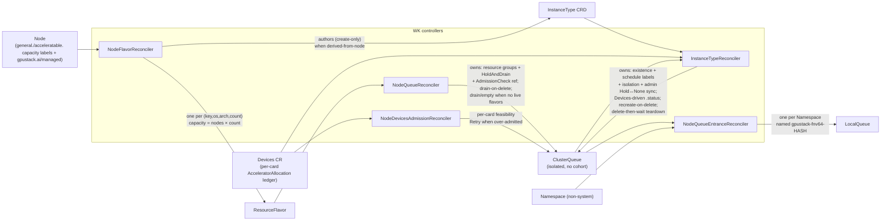

# Scheduling Chain

> **Purpose** — how node and device signals become capacity labels, and how five controllers
> materialize those labels into a Kueue `ResourceFlavor` → `ClusterQueue` → `LocalQueue` chain plus an
> `InstanceType` CRD.
> **Audience** contributors · **Prerequisites** [Architecture](../architecture.md),
> [Device Discovery](discovery.md) · **Read time** ~15 min

This is stages 3 and 4 of the four-stage chain. What a request then has to pass to be admitted is in
[Admission](admission.md).

## Contents

- [Stage 3: capacity profiling](#stage-3-capacity-profiling)
- [The unit spec is not derived from node capacity](#the-unit-spec-is-not-derived-from-node-capacity)
- [Stage 4: the Kueue chain](#stage-4-the-kueue-chain)
- [Naming and grouping](#naming-and-grouping)
- [The controllers](#the-controllers)

## Stage 3: capacity profiling

Two Worker controllers turn Node + Devices signals into the capacity labels the scheduling chain
consumes.

**`NodeFeatureReconciler`** (`node_feature.go`) watches Nodes and reports a NodeFeature object named
`${NODE_NAME}-gpustack-worker`. It stamps the node-management marker `gpustack.ai/managed=true` —
unless `GPUSTACK_NODE_MANAGEMENT_MANUAL=true` (read per-reconcile), in which case auto-injection is
skipped and only an explicit admin-set `managed` label is honored, so onboarding can be gated
node-by-node.

**`NodeCapacityReconciler`** (`node_capacity.go`) builds the capacity labels via
`nodefeature.ConstructNodeCapacityLabels`, reading both the Node and the same-named `Devices` CR: the
general(CPU) key presence marker plus the two accelerator families' per-card capacities.

### Logical-slicing capacities

**For each accelerator model whose `.sliced` resource is present and > 0 in the Node capacity**, the
four per-card logical-slicing capacities that the default scheduler / kubelet count at admission time:

| Label suffix (`acceleratable.${prefix}${aKey}.…`) | Value |
|----------------------------------------------------|--------|
| `.sliced.units`             | `count × M` (M = 1,600,000 credit units per whole card) |
| `.sliced.cores-percentage`  | `Σ per-card slices × 100` (compute overcommit) or `count × 100` (compute non-overcommittable) |
| `.sliced.memory-percentage` | `count × 100` |
| `.sliced.memory-mib`        | `Σ count × per-model VRAM MiB` (weighted per model so mixed-VRAM models sum correctly) |

### Hardware-partitioning capacities

Symmetrically, **for each model whose `.partitioned` resource is present and > 0**, the
hardware-partitioning capacities — counted over the *disjoint* population of cards in a partitioning
mode, so no card is ever counted by both families:

| Label suffix (`acceleratable.${prefix}${aKey}.…`) | Value |
|----------------------------------------------------|--------|
| `.partitioned.units`               | `partitioned cards × M` (a partitioned card is worth a whole card's credits, exactly as a logically sliceable one is) |
| `.partitioned.<kind>-<profile>`    | `Σ (allocated + remaining)` instances of that profile over the node's partitioned cards |

The per-profile key is **geometry-aware and ledger-derived**, not a static ceiling: with one `3g.40gb`
carved on an 80 GB card, `…partitioned.mig-7g.80gb` reads 0 while `…partitioned.mig-3g.40gb` still
reads 1 free instance.

> **Why both terms** — the scheduler fits a Pod by subtracting the requests of the Pods already on the
> node, so publishing bare `remaining` would subtract every live instance twice. A card whose ledger
> has not been published yet falls back to its static per-profile ceiling rather than to zero, so a
> fresh node advertises room instead of nothing.

### Per-card slice counts, per vendor

The per-card logical-slice count is the per-vendor maximum the Device Manager records on **each
card's** `Status.LogicalSliced` (NVIDIA 128, Ascend 63, Cambricon 16, Hygon 4, MThreads 16, MetaX 16 —
each bounded by the vendor runtime's per-device user-process limit, see
`pkg/devicemanager/detector`); the group's `AcceleratorSlicedDetail` aggregates those per-card counts,
and a MIG-enabled card reports zero logical count and its physical MIG profiles instead.

A vendor whose runtime time-shares compute (NVIDIA / Ascend) advertises `.sliced.cores-percentage =
Σ per-card slice count × 100` — each slice may claim a full 100 % — while one whose compute is **not
overcommittable** (Cambricon / Hygon / MThreads / MetaX) caps it at `count × 100`. The non-overcommit
form varies by vendor: Hygon is a hard spatial partition (its `vdev.conf` assigns each slice a
disjoint CU bitmask, so the sum stays within one card), whereas MThreads' `cores%` is a best-effort
relative weight — not a hard partition — that is nonetheless accounted as non-overcommit.

### Presence-gating on capacity

Both families' counting keys are **presence-gated on capacity**: the reconciler patches a family's
keys only while that family's bare pool (`.sliced` / `.partitioned`) is present and positive in
`Node.status.capacity`, and reverse-patches (removes) them when it disappears or reaches 0 — so a
model with no logical slicing gets none of the four `.sliced.*` capacities, and a model with no
partitioned card gets no `.partitioned.*` key.

> **Why capacity and not allocatable** — allocatable also falls to zero when a family is merely
> saturated, which would delete the keys while instances are live.

Stale cleanup covers all four `.sliced.*` suffixes, `.partitioned.units` and every per-profile
partition key. Enabling or disabling hardware partitioning on a card is a manual vendor-CLI operation
(`nvidia-smi` for NVIDIA, `ppu-smi mig` for T-Head) the operator only observes on the next Device Manager
detection — see [NVIDIA MIG Operations](../operation/nvidia-mig.md), whose [three-configuration
walkthrough](../operation/nvidia-mig.md#walkthrough-three-mig-configurations-on-one-node) shows the
disjoint populations on a recorded 8-card node, including a **mixed** one where both families are
advertised at once, and [T-Head PPU Partitioning Operations](../operation/thead-mig.md) for the same
procedure on T-Head.

## The unit spec is not derived from node capacity

The **unit spec** (unitCPU / unitRAM / localStorage) is **not derived from node capacity at all** —
the InstanceType carries a default chosen by acceleratable-ness: a non-accelerated pool gets
`1c / 2Gi / 100Gi`, an accelerated one a **per-product preset** looked up from the accelerator's
manufacturer and product name, falling back to `4c / 16Gi / 100Gi` when no preset matches (the tier
per product family is in [Instance Type Unit Resources Preset
Reference](../reference/instance-type-unit-resources.md)). Either way an admin overrides it through
the InstanceType API without touching any Node.

## Stage 4: the Kueue chain

The capacity labels drive a scheduling chain built on Kueue by the controllers in
`pkg/worker/controllers/worker`. **There is one isolated ClusterQueue per pool and no Cohort** — with
exclusive / shared / sliced / partitioned folded into one queue there is no cross-queue borrowing to
broker, so `spec.cohortName` is empty and the old `CohortReconciler` / `z-cohort` are gone.

## Naming and grouping

The **`ResourceFlavor` is the finest grain and is setting-independent**: it always encodes the CPU key
(and, when accelerated, the accelerator key too), so the aggregation layer can be re-grouped without
ever rewriting a flavor. The aggregation layer (`ClusterQueue` / `InstanceType` / `InstanceTypeFlavor`)
is then grouped by the editable
[`instance-type-aware-cpu-manufacturer`](../settings.md#online-adjustable-settings) (default `false`):

```
ResourceFlavor (always the finest grain, setting-independent):
  gpustack--${gKey}-${os}-${arch}-${cpu}c              # non-accelerated (c = CPU cores)
  gpustack--${gKey}--${aKey}-${os}-${arch}-${acc}d     # accelerated     (d = devices)

ClusterQueue / InstanceType — grouped by instance-type-aware-cpu-manufacturer:
  aware=false (default):  gpustack--generic-${os}-${arch}           # all CPUs collapse into one generic pool
                          gpustack--${aKey}-${os}-${arch}           # one pool per accelerator (CPU ignored)
  aware=true:             gpustack--${gKey}-${os}-${arch}           # split per CPU
                          gpustack--${gKey}--${aKey}-${os}-${arch}  # split per (CPU, accelerator)

InstanceTypeFlavor (catalog, no os/arch): mirrors the same grouping —
  gpustack--generic / gpustack--${aKey}   (aware=false)
  gpustack--${gKey}  / gpustack--${gKey}--${aKey}   (aware=true)
```

Two discriminators keep the pools clean. Every flavor and queue carries
`feature.gpustack.ai/acceleratable=true|false`, so a collapsed generic queue selects "all
non-accelerated flavors", and — critically — an *aware* generic queue (`general.${gKey}=true`) never
matches an accelerated flavor that also carries `general.${gKey}=true`. The raw CPU detail rides in
each flavor's `note.gpustack.ai/cpuDetail` (always on a CPU flavor; on an accelerated flavor only when
awareness is on), and the InstanceType defaulting webhook folds it back into the type's `spec.cpu` /
`spec.accelerator.cpu` when awareness is on.

## The controllers



### `NodeFlavorReconciler` (`node_flavor.go`)

Indexes managed nodes by `(key, os, arch, count)` and creates one `ResourceFlavor` per group. The
flavor pins workloads through `spec.nodeLabels` — the feature key
`{general.|acceleratable.}feature.gpustack.ai/${key}=true`, `kubernetes.io/os|arch` (full), and a
blanket `{Operator: Exists}` toleration (eligibility is by nodeLabels, not taints) — and carries the
pool identity in labels (`.count`, `.capacity = contributing nodes × count`) plus the per-card VRAM and
device descriptors in `note.gpustack.ai/*` annotations (device information only — no unit spec).

A flavor whose group has **no** contributing node is **deleted** — there is no drain-tombstone anymore.
The flavor identity is read from the first contributing node — every contributor to a flavor name
shares it — so there is no min-capacity-node selection.

After it syncs a flavor, and only under `instance-type-derived-from-node=true` (default), it **authors
the pool's `InstanceType`** — **create-only**, at the setting-correct name and identity
(`generalGroup`/`acceleratorGroup`/`acceleratable`/`os`/`arch`; the CPU key is the `generic` sentinel
when awareness is off) and the default unit spec (non-accelerated `1c/2Gi/100Gi`; accelerated, the
product's preset — `4c/16Gi/100Gi` when nothing matches); an existing type (admin- or
operator-authored) is left untouched, so the `InstanceTypeReconciler` stays the sole owner of an
InstanceType's lifecycle.

It also **watches the derived types it authored and re-authors one that is deleted** — the same
safeguard the `InstanceTypeReconciler` applies to the backing queue, one layer up.

> **Why nothing else would** — its own inputs never change when an output is destroyed, and the
> periodic informer resync is no fallback, because it re-delivers the flavor unchanged and the update
> filter drops it. A definition lost at runtime deletes every derived type at once, which is exactly
> that case.

### `InstanceTypeReconciler` (`instance_type.go`)

Owns the backing `ClusterQueue`'s **existence and metadata** and the materialized `InstanceType` CRD's
status — not its quota.

`ensureClusterQueue` creates the name-identical queue when missing, stamping the pool's schedule labels
(`nodefeature.PoolScheduleLabels` — the `feature.gpustack.ai/acceleratable` boolean, the
general/accelerator feature key(s) selected by `instance-type-aware-cpu-manufacturer`, and
`kubernetes.io/os|arch`, all derived from the InstanceType **spec** identity) and the fixed no-borrow
**isolation** (empty cohort, never-reclaim/borrow preemption) at creation; it never fills the resource
groups or references the AdmissionCheck (the `NodeQueueReconciler` owns those), and it prunes a stale
feature-key label when the group/acceleratable changes so the re-pointed queue's selectors match the
new pool.

It watches the queue to keep the InstanceType `.status` fresh (the [four-view](admission.md#four-view-status)
/ CPU projection + `status.entrance`, DeepEqual-guarded) and to **recreate the queue if an admin
accidentally deletes it** while the InstanceType still lives. It does **not** author InstanceTypes (the
`NodeFlavorReconciler` does) and never deletes one for lack of flavors.

On delete, a `gpustack.ai/controlled` finalizer runs a **delete-then-wait teardown**: mark the
InstanceType `Inactive`, delete the backing queue once, and hold the finalizer until Kueue has actually
removed it — it does not drain the queue itself; the `NodeQueueReconciler` observes the deletion and
drives the drain.

Separately, it keeps `it.Spec.Inactive` and the queue's `StopPolicy` in sync for the **admin
`Inactive`** path — setting `StopPolicy=Hold` when `Inactive` (blocks new admission without evicting
running workloads, never `HoldAndDrain`), clearing to `None` when an admin reactivates, and
one-way/stickily backfilling `Inactive=true` whenever the queue is stopped by any means — so the
`Hold↔None` toggle is owned here while `HoldAndDrain` stays owned by the `NodeQueueReconciler`.

### `NodeQueueReconciler` (`node_queue.go`)

Owns the backing `ClusterQueue`'s **quota and admission gating** — resource groups, the `HoldAndDrain`
drain policy (the admin `Hold↔None` toggle is owned by the `InstanceTypeReconciler`), and the
node-devices AdmissionCheck reference — resolved from the pool's ResourceFlavors alone (it never looks
at the owning InstanceType).

It fills the groups from the live flavors, smallest per-node count first so Kueue packs small nodes
first — an accelerated queue advertises only `credits.gpustack.ai/${manufacturer}` (nominal =
`capacity × M`, one whole card = `M = 1,600,000` credit units so Kueue's int64 accounting never rounds
fractional shared/sliced credits up to 1), a non-accelerated queue only CPU — and references the
`gpustack-node-devices` AdmissionCheck on an accelerated derived queue once it is Active.

A flavor Kueue is still **finalizing** (its nodes left, so `NodeFlavorReconciler` deleted it but Kueue
holds its `resource-in-use` finalizer until no ClusterQueue references it) is treated as **absent**:
dropping it from the groups is the very ClusterQueue update Kueue waits for to release that finalizer —
a workload still admitted on a dropped *partial-pool* flavor is evicted by Kueue and re-admitted on the
pool's remaining live flavors (its node has left the pool, so it must move regardless).

When a queue is **being deleted** (an admin's delete or the InstanceType teardown) it drives
`HoldAndDrain` unconditionally so Kueue evicts the admitted workloads and can then drop its own
finalizer and remove the queue — Kueue never evicts on delete by itself.

When a pool loses **all** live flavors while the queue still carries quota, gated by
`instance-type-drain-when-no-flavors` (default true) it drives `HoldAndDrain` and requeues until every
reservation clears, then empties the groups (so Kueue's counters never go negative); it **reactivates**
(StopPolicy `None`) a queue *it* drained to empty — a `HoldAndDrain`, never an admin `Hold` — once its
flavors return, though the `InstanceTypeReconciler`'s sticky `Inactive` backfill then re-holds a type
that had been drained, so a recovered pool stays inactive until an admin clears `Inactive`.

A drained queue also stops the Instances running against it — see [Running-instance
stop](admission.md#running-instance-stop).

### `NodeQueueEntranceReconciler` (`node_queue_entrance.go`)

Watches ClusterQueues and Namespaces, creating a `LocalQueue` in every non-system Namespace so
workloads can submit from anywhere. Because workloads reference the LocalQueue through the
`kueue.x-k8s.io/queue-name` **label** (63-char limit) while ClusterQueue names may be longer, the
LocalQueue is named `gpustack-fnv64-${fnv64a(ClusterQueue name)}` — always 31 characters — and records
the full ClusterQueue name in the `schedule.gpustack.ai/queue` annotation.

### `NodeDevicesAdmissionReconciler` (`node_devices_admission.go`)

Provides the per-card **AdmissionCheck** — the third of the five admission gates. Its behavior is
described in [Admission](admission.md#gate-3--the-per-card-admissioncheck).

---

**See also** — [Device Discovery](discovery.md) (where the capacity signals come from) ·
[Walkthrough](../walkthrough.md) (the same objects on a live cluster) ·
[Settings](../settings.md#online-adjustable-settings)

**Next** → [Admission](admission.md) — the five gates a request passes.
