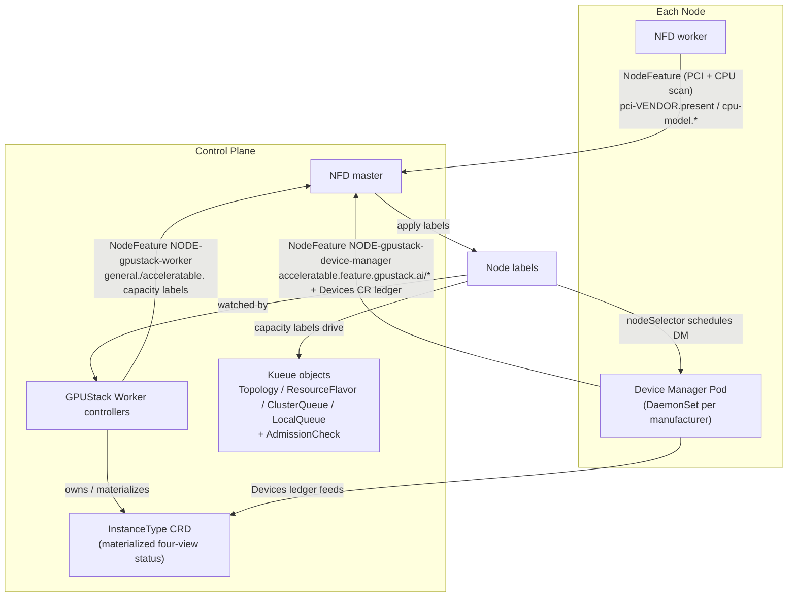

# Architecture

GPUStack Operator uses [Node Feature Discovery (NFD)](https://github.com/kubernetes-sigs/node-feature-discovery)
to publish node features as labels. [Kueue](https://github.com/kubernetes-sigs/kueue) queues workloads
against the resulting capacity; its AdmissionCheck lets GPUStack check the fit on individual
accelerators.

The chart includes NFD, Kueue and two CSI drivers as subcharts. It also includes Topograph, which
stays disabled until an administrator selects a provider.

## Contents

- [One binary, four subcommands](#one-binary-four-subcommands)
- [How it works: four stages](#how-it-works-four-stages)
- [Life of a sliced-GPU request](#life-of-a-sliced-gpu-request)
- [Vocabulary](#vocabulary)
- [Where to go next](#where-to-go-next)

## One binary, four subcommands

| Subcommand | Package | Deployed by | Job |
|---|---|---|---|
| `worker` (alias `w`) | `pkg/worker` | this chart, as a control-plane Deployment | aggregated extension API server + the scheduling-chain controllers |
| `worker-gateway` | `pkg/workergateway` | not this chart; run it yourself, wherever the fleet view belongs | aggregates InstanceTypes and capacity across upstream clusters |
| `device-manager` | `pkg/devicemanager` | this chart, as one DaemonSet per manufacturer | detects accelerators, maintains the `Devices` ledger, serves the device plugin |
| `model-manager` (alias `mm`) | `pkg/modelmanager` | this chart, as one DaemonSet on every node | the CSI node plugin that mounts a Hugging Face `ModelArtifact` from the node's verified cache ([Node Model Store](../modules/model-delivery/node-store.md)) |

Details, and the startup ordering the worker must keep, are in [Internals](../contribute/internals.md).

## How it works: four stages

1. The chart starts NFD and the Device Manager DaemonSets ([Installation Modes](../operate/installation-modes.md)).
2. The Device Manager detects accelerators, publishes their feature labels and maintains the
   `Devices` record.
3. The Worker derives per-node capacity labels for CPU cores, the four logical-slicing
   capacities (`.sliced.*`) and hardware partitioning (`.partitioned.*`).
4. Worker controllers turn those labels and topology profiles into Kueue `Topology`,
   `ResourceFlavor` and `ClusterQueue` objects, with one isolated queue per pool. They also
   create an `InstanceType` and use a per-accelerator `AdmissionCheck`.

Stages 1–2 are detailed in [Device Discovery](../modules/devices/discovery.md), stages 3–4 in [Scheduling
Chain](../modules/devices/scheduling.md).

## Life of a sliced-GPU request

A workload asking for half a GPU passes five admission gates, each seeing something the previous one
cannot:

| Step | What happens | Detail |
|---|---|---|
| Submit | a Pod — plain, or rendered by a GPUStack `Instance` or by a [`ModelDeployment`](../modules/model-deployment/deployment.md) replica — carries the pool's entrance label `kueue.x-k8s.io/queue-name: gpustack-fnv64-…` and requests `nvidia.com/gpu.sliced: 1` + `nvidia.com/gpu.sliced.memory-percentage: 50` | [Accelerator Requests](../modules/devices/requests.md) |
| Gate 1 — Pod webhook | validates the request rules and folds the memory budget into `nvidia.com/gpu.sliced.units`, the credit input | [Admission](../modules/devices/admission.md#gate-1--the-pod-webhook) |
| Gate 2 — Kueue | reserves against the pool ClusterQueue's `credits.gpustack.ai/nvidia` quota and fits the complete PodSet inside the selected topology domains | [Topology-Aware Scheduling](../modules/topology/scheduling.md) |
| Gate 3 — AdmissionCheck | asks the pool's `Devices` ledger whether one accelerator can really host the slice; holds the workload with `Retry` if not | [Admission](../modules/devices/admission.md#gate-3--the-per-accelerator-admissioncheck) |
| Gate 4 — scheduler / kubelet | picks a node whose `.sliced.*` capacity keys still fit, then an accelerator-bound token — *which is* the accelerator | [Device Discovery](../modules/devices/discovery.md#placement-is-a-preference-not-a-decision) |
| Gate 5 — allocator | refuses an accelerator another mode holds, injects the manufacturer's runtime isolation, and records the allocation in the `Devices` ledger | [Device Discovery](../modules/devices/discovery.md#the-device-plugin-allocator) |
| Observe | the `InstanceType.status` four-view moves as the pod allocates, and back when it exits (`kubectl get instancetype -w`) | [Admission](../modules/devices/admission.md#four-view-status) |

## Vocabulary

The three hardware words — **Device**, **Accelerator**, **Resource** — and the layering between them
are in [Device Discovery](../modules/devices/discovery.md#device-accelerator-resource). The rest:

| Term | Meaning |
|---|---|
| **pool** | one `(CPU key, [accelerator key,] os, arch)` group — one isolated `ClusterQueue` + one `InstanceType`, no borrowing |
| **`gKey` / `aKey`** | the general(CPU) node key (e.g. `amd-epyc-7763`, or the `generic` sentinel) / the accelerator device key (e.g. `nvidia-a10g`) |
| **family** | the two mutually exclusive ways to share an accelerator: **logical slicing** (`.sliced*`, the manufacturer's own runtime facility budgets compute and VRAM) and **physical partitioning** (`.partitioned*`, NVIDIA MIG). An accelerator serves exactly one |
| **credits** | `credits.gpustack.ai/<manufacturer>`, the only accelerator quota a ClusterQueue carries; one whole accelerator = `M = 1,600,000` credit units, so fractional shares stay integer-valued |
| **four-view (EX/SH/SL/PT)** | the `InstanceType.status` projections: free whole accelerators / shareable slots / logically sliceable VRAM-percent units / hardware partition instances |
| **`Devices` ledger** | the per-accelerator `AcceleratorAllocation` accounting on the `Devices` CR — the single authoritative record of who holds what |
| **entrance** | the per-namespace `LocalQueue` (`gpustack-fnv64-<hash>`) a workload submits against |

## Where to go next

- [Device Discovery](../modules/devices/discovery.md) — stages 1 and 2, and what the allocator injects.
- [Scheduling Chain](../modules/devices/scheduling.md) — stages 3 and 4.
- [Topology-Aware Scheduling](../modules/topology/scheduling.md) — inventory, profiles and Kueue TAS.
- [Admission](../modules/devices/admission.md) — the five gates and the four-view status.
- [Installation Modes](../operate/installation-modes.md) — chart mode versus image mode.
- [Internals](../contribute/internals.md) — startup order and the invariants that fail silently.
- [KV Cache Backend](../modules/kv-cache/backend.md) — a separate chain: running and observing a
  pooled KV cache for inference workloads; quota over that cache is granted per namespace through
  [KV Cache Pool](../modules/kv-cache/pool.md).
- [Walkthrough](walkthrough.md) — all of it recorded on a live cluster, with real output.

Every page, with its audience and read time, is in the [documentation index](../README.md).

---

**See also** — [Accelerator Requests](../modules/devices/requests.md) (the request contract) ·
[Settings](../reference/settings.md) · [All documentation](../README.md)

**Next** → [Device Discovery](../modules/devices/discovery.md) — stage 1 and 2 in detail.
