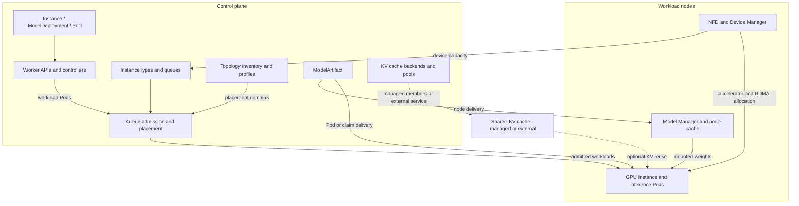

# Architecture

GPUStack Operator manages accelerator-backed workloads on Kubernetes. It discovers devices, turns
node capacity into schedulable pools, and runs GPU Instances and model deployments against those
pools. Optional model delivery, topology placement and shared KV cache support inference workloads
that need more than a single GPU.

## Contents

- [Components](#components)
- [Workload flow](#workload-flow)
- [Device scheduling](#device-scheduling)
- [Model delivery and KV cache](#model-delivery-and-kv-cache)
- [Request admission](#request-admission)
- [Vocabulary](#vocabulary)
- [Related documentation](#related-documentation)

## Components

The operator ships one binary with four subcommands:

| Component | Deployment | Role |
|---|---|---|
| `worker` | Control-plane Deployment | Serves the public APIs and manages workloads, queues and supporting resources. |
| `device-manager` | One DaemonSet per manufacturer | Discovers accelerators and network interfaces, reports available capacity and allocates devices to containers. |
| `model-manager` | Node DaemonSet | Caches model weights and mounts them into workloads using node delivery. |
| `worker-gateway` | Installed separately | Combines InstanceTypes and capacity from multiple clusters into a fleet view. |

The chart also includes [Node Feature Discovery (NFD)](https://github.com/kubernetes-sigs/node-feature-discovery),
[Kueue](https://github.com/kubernetes-sigs/kueue) and two CSI drivers. Topograph is optional and remains
disabled until an administrator selects a provider. See [Installation Modes](../operate/installation-modes.md)
for the deployment choices and [Internals](../contribute/internals.md) for contributor details.

## Workload flow

GPU Instances provide containers with optional SSH access. Model deployments run inference engines
and, where configured, routers or prefill/decode groups. Both use the same device capacity and
admission chain. Model delivery and KV cache are optional services alongside that chain.

The diagram shows the main dependencies. It does not require every workload to use a model artifact,
RDMA, a topology source or a shared cache. An ordinary Pod can request device resources directly.

## Device scheduling

Device scheduling has four stages:

1. NFD identifies node hardware and labels the nodes.
2. The Device Manager discovers accelerators and network interfaces and maintains the `Devices`
   inventory and allocation record.
3. The Worker derives schedulable CPU and accelerator capacity from that inventory.
4. The Worker creates InstanceTypes and Kueue resources. Each pool has an isolated queue; topology
   profiles constrain placement, and admission checks verify whether individual accelerators fit.

[Device Discovery](../modules/devices/discovery.md) covers the first two stages.
[Scheduling Chain](../modules/devices/scheduling.md) covers capacity and queues.
[RDMA Operations](../modules/rdma/operations.md) explains network resource requests, while
[Topology-Aware Scheduling](../modules/topology/scheduling.md) explains placement domains.

## Model delivery and KV cache

A `ModelArtifact` describes model weights from a model repository, an image or a persistent-volume
claim. A workload can download weights in its own Pod, use an existing claim, or mount weights from
an eligible node's verified cache. Node delivery is handled by the Model Manager; it is separate from
device admission. See [Model Delivery](../modules/model-delivery/_index.md).

A shared KV cache stores reusable inference state. A backend runs the cache service or points to an
external one; pools and namespace bindings provide access and quota grants. Compatible workloads
receive the cache configuration when their Pods are created. This service is optional, and its quota
is separate from accelerator quota. See [KV Cache](../modules/kv-cache/_index.md).

[Model Deployment](../modules/model-deployment/_index.md) brings these services together with engine,
router and replica configuration. [GPU Instances](../modules/instances/_index.md) support interactive
containers and SSH access using the same accelerator allocation.

## Request admission

For a workload requesting a GPU slice, admission proceeds through five gates:

| Gate | Check | Details |
|---|---|---|
| Pod webhook | Validates resource combinations and calculates the scheduling units. | [Accelerator Requests](../modules/devices/requests.md) |
| Kueue | Reserves pool quota and places the workload within compatible topology domains. | [Topology-Aware Scheduling](../modules/topology/scheduling.md) |
| AdmissionCheck | Verifies that individual accelerators can satisfy the request; retries when they cannot. | [Admission](../modules/devices/admission.md) |
| Scheduler and kubelet | Select a node and device tokens with enough remaining capacity. | [Device Discovery](../modules/devices/discovery.md) |
| Device allocator | Checks conflicting allocations, configures device access and records the grant. | [Device Discovery](../modules/devices/discovery.md#the-device-plugin-allocator) |

InstanceType status reports the remaining capacity as workloads allocate and release devices. Use
`kubectl get instancetype -w` to watch those changes. The [Walkthrough](walkthrough.md) shows the
request and its resulting Kubernetes resources.

## Vocabulary

| Term | Meaning |
|---|---|
| Pool | Nodes with compatible CPU, accelerator, operating system and architecture identities, served by an isolated queue. |
| InstanceType | The resource configuration and available capacity offered by a pool. |
| Allocation mode | Whole accelerators, shared accelerators, logical slices or hardware partitions. |
| Credits | Integer units used by Kueue to account for accelerator quota, including fractional requests. |
| Four capacity views | Exclusive, shared, sliced and partitioned capacity reported by an InstanceType. |
| `Devices` ledger | The per-node inventory and record of accelerator allocations. |
| LocalQueue | The namespace queue through which a workload enters its pool. |

The hardware terms Device, Accelerator and Resource are defined in
[Device Discovery](../modules/devices/discovery.md#device-accelerator-resource).

## Related documentation

- [Walkthrough](walkthrough.md) — submit a workload and inspect the scheduling chain.
- [GPU Instances](../modules/instances/_index.md) — configure an interactive container and SSH access.
- [Model Deployment](../modules/model-deployment/_index.md) — configure inference engines and replicas.
- [Model Delivery](../modules/model-delivery/_index.md) — resolve, cache and mount model weights.
- [KV Cache](../modules/kv-cache/_index.md) — connect inference workloads to a shared cache.
- [Installation Modes](../operate/installation-modes.md) — choose how to install the operator.

---

**See also** — [Accelerator Requests](../modules/devices/requests.md) ·
[Settings](../reference/settings.md) · [All documentation](../README.md)

**Next** → [Walkthrough](walkthrough.md) — follow a workload from submission to allocation.
