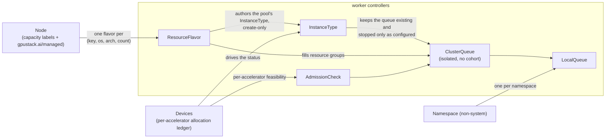

# Scheduling Chain

The worker turns Node and `Devices` signals into capacity labels, Kueue queues and `InstanceType`
resources. These are stages 3 and 4 of the chain introduced in
[Architecture](/gpustack-operator/v0.9.0-rc2/docs/getting-started/architecture/index.md); [Admission](/gpustack-operator/v0.9.0-rc2/docs/modules/devices/admission/index.md) covers the checks
a workload then passes.

## Contents

- [Stage 3: capacity profiling](#stage-3-capacity-profiling)
- [Unit spec defaults](#unit-spec-defaults)
- [Stage 4: the Kueue chain](#stage-4-the-kueue-chain)
- [Naming and grouping](#naming-and-grouping)
- [The controllers](#the-controllers)

## Stage 3: capacity profiling

The worker turns Node and `Devices` signals into the capacity labels the chain consumes, in three
jobs:

- It reports a NodeFeature `${NODE_NAME}-gpustack-worker` per Node, stamping
  `gpustack.ai/managed=true`. Under `GPUSTACK_NODE_MANAGEMENT_MANUAL=true` (read per-reconcile) it
  skips that injection, honoring only an admin-set `managed` label, so onboarding is gated
  node-by-node.
- It builds the capacity labels from the Node and its same-named `Devices` resource: the general(CPU)
  presence marker plus both families' per-accelerator capacities.
- It keeps the [per-card fit labels](#per-card-fit-labels) on each managed Node, from the same
  `Devices` ledger.

### Logical-slicing capacities

For every accelerator model whose `.sliced` resource is present and greater than zero in the Node
capacity, the worker publishes four `.sliced.*` counting keys. The default scheduler and the kubelet
consume them at admission. Both capacity tables below list suffixes of
`acceleratable.${prefix}${aKey}.…` labels:

| Label suffix | Value |
|----------------------------------------------------|--------|
| `.sliced.units`             | `count × M` (M = 1,600,000 credit units per whole accelerator) |
| `.sliced.cores-percentage`  | `Σ per-accelerator slices × 100` (compute overcommit) or `count × 100` (compute non-overcommittable) |
| `.sliced.memory-percentage` | `count × 100` |
| `.sliced.memory-mib`        | `Σ count × per-model VRAM MiB` (weighted per model so mixed-VRAM models sum correctly) |

### Hardware-partitioning capacities

The `.partitioned.*` keys follow the same rule for models whose `.partitioned` resource is present
and greater than zero. They are counted over the disjoint population of accelerators in a
partitioning mode, so no accelerator counts in both families:

| Label suffix | Value |
|----------------------------------------------------|--------|
| `.partitioned.units`               | `partitioned accelerators × M` (a partitioned accelerator is worth a whole accelerator's credits, exactly as a logically sliceable one is) |
| `.partitioned.<kind>-<profile>`    | `Σ (allocated + remaining)` instances of that profile over the node's partitioned accelerators |

The per-profile key is geometry-aware and ledger-derived, not a static ceiling: with one `3g.40gb`
carved on an 80 GB accelerator, `…partitioned.mig-7g.80gb` reads 0 while `…partitioned.mig-3g.40gb`
still reads 1 free instance.

Reading a live instance twice is what the `allocated +` term prevents:
the scheduler fits a Pod by subtracting the requests of the Pods already on the node, so a bare
`remaining` count would count every live instance again. An accelerator whose ledger is not
published yet falls back to its static per-profile ceiling, not to zero, so a fresh node advertises
room instead of nothing.

`<profile>` is the published name, not always what the manufacturer's CLI prints:

- a manufacturer that writes its two-number geometry without a separator has one added — T-Head's
  `4g48gb` publishes as `4g.48gb`, matching how NVIDIA already writes `3g.40gb`;
- the rule is keyed on the manufacturer, not the shape, so the same string from NVIDIA is published
  untouched;
- any other shape is published as the driver reports it.

So either manufacturer's partition reads alike in a Pod spec, in the `InstanceType`'s offered inventory
and in the per-profile ledgers.

Below that boundary every layer keeps the manufacturer's spelling — the `Devices` record, the on-disk
ownership markers, every call into its library — since a name the library does not report cannot create
a partition. See [T-Head MIG
Operations](thead-mig.md#how-partition-profiles-are-discovered).

### Per-accelerator slice counts, per manufacturer

| Manufacturer | Slices per accelerator | Compute |
|---|---|---|
| NVIDIA | 128 | time-shared, so overcommittable |
| Ascend | 63 | time-shared, so overcommittable |
| Cambricon | 16 | not overcommittable |
| Hygon | 4 | not overcommittable — a hard spatial partition (`vdev.conf` assigns each slice a disjoint CU bitmask, so the sum stays within one accelerator) |
| MThreads | 16 | not overcommittable — `cores%` is a best-effort relative weight, not a hard partition |
| MetaX | 16 | not overcommittable |

Each count is the maximum the Device Manager records on **each accelerator's** status, bounded by the
manufacturer runtime's per-device user-process limit; the group aggregates them per model. A
MIG-enabled accelerator reports zero logical count and its physical MIG profiles instead.

An overcommittable manufacturer advertises `.sliced.cores-percentage = Σ slice count × 100`, each slice
able to claim a full 100 %; the others cap it at `count × 100`.

### Presence-gating on capacity

Both families' counting keys are presence-gated on capacity: patched only while the bare pool
(`.sliced` / `.partitioned`) is present and positive in `Node.status.capacity`, reverse-patched away
when it disappears or reaches 0. A model with no logical slicing gets none of the four `.sliced.*`
capacities; one with no partitioned accelerator gets no `.partitioned.*` key.

> **Why capacity and not allocatable** — allocatable also falls to zero when a family is merely
> saturated, which would delete the keys while instances are live.

Stale cleanup covers all four `.sliced.*` suffixes, `.partitioned.units` and every per-profile key.
Enabling or disabling hardware partitioning is manual, through the manufacturer's CLI (`nvidia-smi`,
`ppu-smi mig` for T-Head), and the operator sees it only on the next Device Manager detection.

The [three-configuration
walkthrough](nvidia-mig.md#walkthrough-three-mig-configurations-on-one-node) in [NVIDIA MIG
Operations](nvidia-mig.md) shows the disjoint populations on a recorded 8-accelerator node,
including a **mixed** one advertising both families;
[T-Head](/gpustack-operator/v0.9.0-rc2/docs/modules/devices/thead-mig/index.md) covers the same procedure.

### RDMA feature labels

A node with a usable RDMA link also carries `feature.gpustack.ai/rdma.capable=true`, and
conditionally two informational keys. No operator-generated flavor pins any of them; `rdma.capable`
is the one meant for a workload's own nodeSelector, and withholding it is how a node with no usable
link stops being selected by one.

See [Network Topology](/gpustack-operator/v0.9.0-rc2/docs/modules/rdma/network-topology/index.md#the-three-node-labels) for
which link states count as usable, when each informational key is present, and why the accelerator
interconnect gets no label at all.

### Per-card fit labels

Every capacity key above is a node total, so it cannot say how the free room is spread over the
node's accelerators. Two labels per accelerator model say what one accelerator can still give:

| Label | Value |
|---|---|
| `sliced-max-free-units.fit.gpustack.ai/<aKey>` | the largest free `units` on any one accelerator of the model that can serve a logical slice and still has a free slot for one |
| `shared-free-cards.fit.gpustack.ai/<aKey>` | how many accelerators of the model can still grant an ownership share |

- Both values use Gate 3's own per-accelerator predicates. For a single Pod asking for one
  accelerator, a label admits a node exactly when [Gate 3](/gpustack-operator/v0.9.0-rc2/docs/modules/devices/admission/index.md#gate-3--the-per-accelerator-admissioncheck)
  would.
- A value is `0` when every accelerator of that population is full. A label disappears when the model
  has no accelerator of that population, and when the node stops being managed.
- An accelerator hosting its full `logicalSliced.count` of slices is full for the sliced label, however
  much memory it has left: it takes no further slice. On Hygon that is four.
- A label is written only when its value changes, after a 3 s window that coalesces ledger bursts. The
  cost is at most one Node metadata patch per allocation or release burst per node.
- The labels filter only; no capacity or quota is ever charged against them.

The Workload webhook turns them into a placement constraint: it ANDs `Gt U-1` or `Gt N-1` into the
required node affinity of the Workload's PodSet template, which Kueue's topology-aware scheduling
reads. How it recognizes this operator's Workloads in a shared Kueue, and what it leaves out, is
under [Gate 3](/gpustack-operator/v0.9.0-rc2/docs/modules/devices/admission/index.md#gate-3--the-per-accelerator-admissioncheck).

The pin stays on the Workload and never reaches the Pod; why that must hold is under
[Gate 3](/gpustack-operator/v0.9.0-rc2/docs/modules/devices/admission/index.md#gate-3--the-per-accelerator-admissioncheck) too.

## Unit spec defaults

The unit spec (unitCPU / unitRAM / localStorage) is not derived from node capacity at all. The
InstanceType default follows acceleratable-ness: `1c / 2Gi / 100Gi` non-accelerated; accelerated, a
per-product preset keyed by the accelerator's manufacturer and product name, falling back to
`4c / 16Gi / 100Gi`.

The tier per product family is in [Instance Type Unit Resources
Reference](../../reference/instance-type-unit-resources.md); an admin overrides it through the InstanceType
API without touching any Node.

## Stage 4: the Kueue chain

The capacity and topology-profile labels drive a Kueue chain built by the worker. One isolated
ClusterQueue per pool: with exclusive / shared / sliced / partitioned in one queue there is no
cross-queue borrowing to broker, so `spec.cohortName` stays empty.

Kueue assigns a ResourceFlavor per PodSet, not per Workload. Each PodSet forms its own assignment
group and a candidate flavor is evaluated against that PodSet's own `nodeSelector`, so one ClusterQueue
can serve two accelerator models at once: a Workload's PodSets may land on different flavors of the
same pool.

Every generated flavor also pins `topology.gpustack.ai/profile` and references the Kueue `Topology`
for that ordered level set. Kueue TAS chooses a domain for the complete PodSet; a
`ModelDeployment` can require a level without naming its concrete value. The discovery, profile,
quota-conservation, and request path is in [Topology-Aware
Scheduling](../topology/scheduling.md).

TAS also ranks the domains that fit by a Pod's preferred node affinity, which is how a node-delivered
model's Pods [prefer the nodes holding its
weights](../topology/scheduling.md#placement-of-node-delivered-models).

## Naming and grouping

The `ResourceFlavor` is the finest grain and setting-independent: always the CPU key, plus the
accelerator key when accelerated, so the aggregation layer re-groups without rewriting a flavor. That
layer (`ClusterQueue` / `InstanceType` / `InstanceTypeFlavor`) is grouped by the editable
[`instance-type-aware-cpu-manufacturer`](/gpustack-operator/v0.9.0-rc2/docs/reference/settings/index.md#online-adjustable-settings) (default `false`):

```
ResourceFlavor (always the finest grain, setting-independent):
  gpustack--${gKey}-${os}-${arch}-${cpu}c              # non-accelerated (c = CPU cores)
  gpustack--${gKey}--${aKey}-${os}-${arch}-${acc}d     # accelerated     (d = devices)

ClusterQueue / InstanceType — grouped by instance-type-aware-cpu-manufacturer:
  aware=false (default):  gpustack--generic-${os}-${arch}           # all CPUs collapse into one generic pool
                          gpustack--${aKey}-${os}-${arch}           # one pool per accelerator (CPU ignored)
  aware=true:             gpustack--${gKey}-${os}-${arch}           # split per CPU
                          gpustack--${gKey}--${aKey}-${os}-${arch}  # split per (CPU, accelerator)

InstanceTypeFlavor (catalog, no os/arch): mirrors the same grouping —
  gpustack--generic / gpustack--${aKey}   (aware=false)
  gpustack--${gKey}  / gpustack--${gKey}--${aKey}   (aware=true)
```

Two discriminators keep the pools clean, and one annotation carries the raw CPU detail:

- `feature.gpustack.ai/acceleratable=true|false`, on every flavor and queue, lets a collapsed generic
  queue select "all non-accelerated flavors" and stops an *aware* generic queue (`general.${gKey}=true`)
  matching an accelerated flavor carrying the same key.
- When `instance-type-mixed-on-node=false`, the worker publishes `feature.gpustack.ai/cpu-only=true`
  through NFD only for Nodes without a detected accelerator; CPU flavors select it to exclude GPU Nodes.
- `note.gpustack.ai/cpuDetail` carries the raw CPU detail: always on a CPU flavor, on an accelerated one
  only when awareness is on. The defaulting webhook folds it back into the type's spec — see
  [Admission](/gpustack-operator/v0.9.0-rc2/docs/modules/devices/admission/index.md#the-instancetype-and-instance-webhooks).

## The controllers

The worker keeps five sets of objects converged:



### Capacity flavors

One controller indexes managed nodes by `(key, os, arch, count, topology profile)`, one
`ResourceFlavor` per group. `spec.nodeLabels` pins workloads — the feature key
`{general.|acceleratable.}feature.gpustack.ai/${key}=true`, full `kubernetes.io/os|arch`, and
`topology.gpustack.ai/profile` — plus a blanket `{Operator: Exists}` toleration, eligibility being by
nodeLabels, not taints. `spec.topologyName` references the generated Kueue Topology for that profile.

Labels carry the pool identity (`.count`, `.capacity = contributing nodes × count`);
`note.gpustack.ai/*` annotations the per-accelerator VRAM and device descriptors — device information
only, no unit spec.

A flavor whose group has no contributing node is deleted. The name comes from the first contributing
node, and every contributor to a flavor name shares it.

After syncing a flavor, and only under `instance-type-derived-from-node=true` (default), the worker
authors the pool's `InstanceType`, **create-only**, at the setting-correct name and identity
(`generalGroup`/`acceleratorGroup`/`acceleratable`/`os`/`arch`; the CPU key is the `generic` sentinel
when awareness is off) with the [default unit spec](#unit-spec-defaults).

An existing type is untouched, admin- or operator-authored. The worker watches the types it authored
and re-authors a deleted one.

### The InstanceType lifecycle

A second controller keeps the backing `ClusterQueue` existing and the materialized `InstanceType`'s
status fresh, but not its quota. It does not author InstanceTypes and never deletes one for lack of
flavors.

- **Creation and identity.** A missing queue is created under the name-identical name, stamped at
  creation with the pool's schedule labels (the `feature.gpustack.ai/acceleratable` boolean, the
  feature key(s) selected by `instance-type-aware-cpu-manufacturer`, `kubernetes.io/os|arch` — all
  from the InstanceType **spec** identity) and the fixed no-borrow **isolation** (empty cohort, no
  reclaim/borrow preemption). A stale feature-key label is pruned when the group or acceleratable
  changes, so the re-pointed queue's selectors match.
- **The empty-plan hold.** The queue is created on `Hold`, marked
  `topology.gpustack.ai/empty-plan-hold`, because the queue has no resource groups yet and
  [a queue without them admits every Workload](/gpustack-operator/v0.9.0-rc2/docs/modules/devices/admission/index.md#known-behavior-the-deployed-kueue-configuration).
  The update that fills the groups drops the marker, and the hold is then released unless the type is
  `Inactive`.
- **Status and recreation.** The queue is watched to keep the type's `.status` fresh (the
  [four-view](/gpustack-operator/v0.9.0-rc2/docs/modules/devices/admission/index.md#four-view-status) / CPU projection + `status.entrance`), and to recreate a
  queue an admin deleted while the InstanceType still lives.
- **Teardown.** Deleting the type runs a delete-then-wait teardown: mark the type `Inactive`, delete
  the queue once, and hold a `gpustack.ai/controlled` finalizer until Kueue has removed it. It does
  not drain; the quota controller below sees the deletion and drives that.
- **Inactive and the stop policy.** The type's `spec.inactive` is synced with the queue's
  `StopPolicy`: `Hold` when `Inactive` (blocking new admission without evicting running workloads,
  never `HoldAndDrain`), `None` when an admin reactivates, and `Inactive=true` backfilled one-way and
  stickily whenever the queue is stopped by any means.

While the pool is in a drained state waiting for flavors (the marker below), this sync writes its
`Hold`/`None` pair onto the stop policy the drain saved and later restores, and pauses the backfill:
an `Inactive` change made while an emptied pool waits for a flavor is what the pool comes back with.


It neither releases a marked empty-plan `Hold` nor mirrors it into `Inactive`; once the marker is
gone it treats the `Hold` like an admin's, released only while the type is not `Inactive`. Clearing
`Inactive` on a queue that has no resource groups marks its `Hold` rather than releasing it.

### Queue quota and draining

A third controller fills the queue's quota and admission gating — resource groups, the `HoldAndDrain`
drain policy (admin `Hold`/`None` belongs to the lifecycle controller above), the AdmissionCheck
references — resolved from the pool's ResourceFlavors alone, never the owning InstanceType.

- **Groups** — from the live topology-aware flavors, smallest per-node count first so Kueue packs small nodes first. An
  accelerated queue advertises only `credits.gpustack.ai/${manufacturer}` (nominal `capacity × M`; one
  whole accelerator = `M = 1,600,000` credits, so Kueue's int64 accounting never rounds fractional
  shared/sliced credits up to 1), a non-accelerated queue only CPU.
- **AdmissionCheck** — `gpustack-node-devices`, referenced on an accelerated queue once Active, whoever
  authored its InstanceType, and only while [`instance-type-derived-from-node`](/gpustack-operator/v0.9.0-rc2/docs/reference/settings/index.md#authoring-the-instancetype) is on.
  `gpustack-model-deployment-joint` is referenced on every queue once Active, whatever that setting says.
- **Finalizing flavor** — a flavor whose nodes left is deleted, but Kueue holds `resource-in-use`
  until no ClusterQueue references it, and dropping it from the groups is the update Kueue waits
  for. A workload on a dropped partial-pool flavor is evicted and re-admitted on
  the pool's remaining flavors — its node has left, so it must move regardless.
- **Queue being deleted** (admin delete or InstanceType teardown) — `HoldAndDrain` unconditionally, so
  Kueue evicts the admitted workloads and can drop its own finalizer and remove the queue; Kueue never
  evicts on delete by itself.
- **No live flavor left** while the queue carries quota — gated by
  `instance-type-drain-when-no-flavors` (default true): `HoldAndDrain`, requeue until every reservation
  clears, then empty the groups so Kueue's counters never go negative. The emptied queue stays
  `HoldAndDrain` until a flavor returns, so it never admits without resource groups.
- **No resource groups yet** and not stopped — the pool has no flavor, or its flavors fail topology
  readiness: `Hold`, marked `topology.gpustack.ai/empty-plan-hold`. The update that fills the groups
  drops the marker, and the hold is released unless the type is `Inactive`. It is `Hold`,
  not `HoldAndDrain`, so the type's Instances are not stopped; an admin
  `Hold` carries no marker and is left alone.
- **Topology readiness** — refuse a partial queue plan when a flavor lacks its profile or Topology,
  selectors overlap, quota changes across the profile split, the same resource would occur in two
  groups, or one resource group would exceed the [flavor limit](/gpustack-operator/v0.9.0-rc2/docs/modules/topology/scheduling/index.md#capacity-and-lifecycle-limits).

Once flavors return it switches the held queue to the new plan, and only then **restores** the stop
policy the queue had before the drain (`None`, or an admin `Hold`, including one set or cleared while
it waited). A recovered pool admits again without an admin.
A drained queue also stops its running Instances — see [Running-instance stop](/gpustack-operator/v0.9.0-rc2/docs/modules/devices/admission/index.md#running-instance-stop).

### A LocalQueue in every namespace

Every non-system Namespace gets one `LocalQueue`, so workloads can submit from anywhere.

Workloads reference it through the `kueue.x-k8s.io/queue-name` **label** (63-char limit) while
ClusterQueue names may be longer, so it is named `gpustack-fnv64-${fnv64a(ClusterQueue name)}` — always
31 characters — and records the full name in the `schedule.gpustack.ai/queue` annotation.

### The per-accelerator admission check

The per-accelerator **AdmissionCheck**, third of the five gates; its behavior is in
[Admission](/gpustack-operator/v0.9.0-rc2/docs/modules/devices/admission/index.md#gate-3--the-per-accelerator-admissioncheck).

---

**See also** — [Device Discovery](/gpustack-operator/v0.9.0-rc2/docs/modules/devices/discovery/index.md) (where the capacity signals come from) ·
[Topology-Aware Scheduling](/gpustack-operator/v0.9.0-rc2/docs/modules/topology/scheduling/index.md) (how topology profiles enter this chain) ·
[Walkthrough](/gpustack-operator/v0.9.0-rc2/docs/getting-started/walkthrough/index.md) (the same objects on a live cluster) ·
[Settings](/gpustack-operator/v0.9.0-rc2/docs/reference/settings/index.md#online-adjustable-settings)

**Next** → [Admission](/gpustack-operator/v0.9.0-rc2/docs/modules/devices/admission/index.md) — the five gates a request passes.
